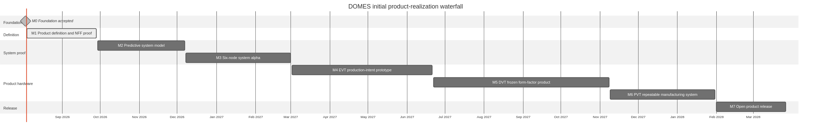

# DOMES Product Realization Framework

This document defines how DOMES moves from development boards to a product that can be built,
tested, sold, supported, and openly reproduced. [`firmware/MILESTONES.md`](../firmware/MILESTONES.md)
records the current phase and evidence. This framework defines the process used to make phase
decisions.

## Tailored Industry Model

DOMES uses a small, evidence-driven subset of established product-development practice:

- [ISO/IEC/IEEE 15288](https://www.iso.org/standard/81702.html) supplies the system life-cycle
  framing.
- [ISO/IEC/IEEE 29148](https://www.iso.org/standard/72089.html) supplies requirements quality and
  traceability.
- A V-model pairs each requirement and design decision with its verification or validation method.
- [IEC 60812](https://webstore.iec.ch/en/publication/26359) supplies failure-mode and risk analysis.
- EVT, DVT, and PVT provide production-intent hardware and manufacturing gates.

This is tailoring, not a claim of certification to those standards. DOMES does not require separate
SRR, PDR, CDR, or audit ceremonies. The AI milestone manager performs the relevant semantic review
at phase entry and exit using direct evidence.

## Four Control Artifacts

Maintain these artifacts and avoid parallel status systems:

| Control artifact | Authority | Purpose |
| --- | --- | --- |
| Product definition and requirements | [`research/PRODUCT_DEFINITION.md`](../research/PRODUCT_DEFINITION.md) and accepted requirement records it links | Defines the user, problem, product boundary, measurable needs, and launch assumptions |
| Phase and delivery ledger | [`firmware/MILESTONES.md`](../firmware/MILESTONES.md) | States the active phase, entry decision, exit evidence, and next gate |
| Verification matrix | Phase acceptance gates and linked test evidence | Maps each required outcome to test, analysis, inspection, or demonstration |
| Risk register | The active decisions and risks in the milestone ledger, with detailed analyses linked as needed | Tracks product, safety, technical, supply, manufacturing, and schedule risk |

Issues and pull requests manage work. They do not replace the phase ledger. Architecture documents
describe targets or as-built boundaries; they do not claim delivery status.

## Lifecycle State Machine

Status and health are separate. No percentage-complete estimate is used.

| Status | Exact meaning |
| --- | --- |
| `Proposed` | The phase contract exists, but its definition audit or entry gate is not yet satisfied. Work may reduce risk but cannot be reported as phase execution. |
| `Ready` | The contract meets intent and every entry condition has current `Pass` evidence. The phase may start. |
| `In progress` | Entry was recorded, an owner is accountable, and work toward the exit gates is active. |
| `Acceptance pending` | Required outputs exist and the exit evidence package is ready for the final semantic audit. |
| `Complete` | The milestone manager found every applicable exit gate passed on direct, current, mutually consistent evidence. |
| `Superseded` | A recorded decision replaced the phase contract or outcome. |

| Health | Exact meaning |
| --- | --- |
| `On track` | No known condition prevents the next gate from being reached by the current plan. |
| `At risk` | A named uncertainty threatens the next gate, but useful work can continue. |
| `Blocked` | A named missing dependency or decision prevents the next gate from being executed. |

### Transition Rules

1. `Proposed` to `Ready`: the contract audit returns `Meets intent`, all predecessor phases required
   for entry are `Complete`, and every phase-specific entry condition is `Pass`.
2. `Ready` to `In progress`: the accountable owner, evidence revision, start date, and first exit gate
   action are recorded.
3. `In progress` to `Acceptance pending`: all deliverables exist and no applicable exit gate remains
   `Not run`; failed or unverified evidence remains visible for the audit.
4. `Acceptance pending` to `Complete`: an AI semantic audit verifies every applicable exit gate as
   `Pass`. Human observations and laboratory measurements may be evidence, but are not approval.
5. `Complete` to `In progress`: a listed invalidation condition makes material evidence stale; the
   reason and affected gates are recorded.

Only one product-realization phase is `In progress` or `Acceptance pending` at a time. Later-phase
experiments are allowed when they retire a named risk, but they do not constitute entry into that
phase. A phase begins only at the `Ready` to `In progress` transition and exits only at `Complete`.

## Requirement And Evidence Rules

Each accepted requirement has a stable identifier, rationale, measurable statement, verification
method, target environment, owner, and linked result. Use one of four verification methods:

- **Test:** measure behavior under controlled conditions.
- **Analysis:** calculate or model a result from validated inputs.
- **Inspection:** examine an artifact, assembly, configuration, or record.
- **Demonstration:** operate the system and observe the required user-visible result.

A requirement is not satisfied by code existence, a successful command, or an aspirational
architecture statement. Evidence names the source revision, artifact identity, hardware identity,
environment, procedure, result, and date. Calibration data cannot also serve as held-out validation
data. A changed requirement, implementation, board, toolchain, or environment reopens affected
evidence.

## Phase Sequence

Build quantities are planning ranges, not quotas. The milestone manager may change them when the
risk model, contract manufacturer, cost, or learning objective supports a different count.

### Initial Waterfall

The initial schedule is a planning baseline, not an acceptance claim or delivery commitment. Each
phase starts only after the preceding exit gate passes. A failed gate, material redesign, unavailable
specialist, or supply constraint requires the milestone manager to record the effect and rebaseline
the remaining dates. Completed work is never moved merely to make the forecast look current.



Diagram source: [`assets/product-realization-waterfall.mmd`](assets/product-realization-waterfall.mmd).
Regenerate the image with:

```bash
npx --yes @mermaid-js/mermaid-cli@11.12.0 \
  -i docs/assets/product-realization-waterfall.mmd \
  -o docs/assets/product-realization-waterfall.png \
  -w 2400 -H 1200 -b white
```

| Phase | Initial planning range | Nominal duration | Start condition |
| --- | --- | --- | --- |
| M0 Foundation | Accepted 2026-08-03 | Complete | Existing accepted evidence |
| M1 Product Definition and NFF Proof | 2026-08-04 to 2026-09-28 | 8 weeks | M0 complete and M1 execution recorded |
| M2 Predictive System Model | 2026-09-29 to 2026-12-07 | 10 weeks | M1 complete and model envelope accepted |
| M3 Six-Node System Alpha | 2026-12-08 to 2027-03-01 | 12 weeks | M2 complete and six suitable nodes available |
| M4 EVT Production-Intent Prototype | 2027-03-02 to 2027-06-21 | 16 weeks | M3 complete and EVT input package accepted |
| M5 DVT Form-Factor Product | 2027-06-22 to 2027-11-08 | 20 weeks | EVT complete and design frozen |
| M6 PVT Manufacturing System | 2027-11-09 to 2028-01-31 | 12 weeks | DVT complete and intended line ready |
| M7 Open Product Release | 2028-02-01 to 2028-03-27 | 8 weeks | PVT complete and immutable candidate selected |

This baseline assumes one primary program stream, four economical alpha nodes sourced during M2,
specialist and contract-manufacturer availability before EVT, one launch-market compliance path, and
no architecture-scale redesign after EVT. Work can be pulled forward to retire a named risk, but the
phase itself cannot start early. Schedule confidence is highest for M1 and deliberately decreases
for later hardware and manufacturing phases.

| Phase | Purpose | Entry decision | Exit decision |
| --- | --- | --- | --- |
| M0 Foundation | Establish trustworthy source, CI, programming, and two-board automation | Project initiated with identified development hardware | Reproducible software CI and automated two-board firmware, transport, update, recovery, peer, and diagnostic flows pass |
| M1 Product Definition and NFF Proof | Decide what should be built and establish a complete physical development-board reference | M0 complete and the two NFF boards are available | Customer and product hypotheses are validated to the stated threshold; requirements, compliance, open-source, and economics baselines are accepted; both NFF boards pass physical peripheral qualification |
| M2 Predictive System Model | Make deterministic Linux simulation trustworthy enough to predict the bounded physical system | M1 complete; accepted requirements and NFF measurements identify the validation envelope | Shared production logic replays exactly and meets held-out functional, safety, timing, and delivery error bounds against two physical pods |
| M3 Six-Node System Alpha | Prove the complete offline product behavior before custom electronics | M2 complete; drill, authority, timing, and recovery requirements accepted | A representative app-driven six-node system passes physical interaction, failure, diagnostics, coexistence, and soak gates; four added nodes may be inexpensive radio reference nodes |
| M4 EVT Production-Intent Prototype | Prove production-intent electrical architecture and the highest hardware risks | M3 complete; preliminary FMEA, compliance plan, ID package, schematic, BOM, and CM feedback accepted | Typically 10-20 electrical prototypes prove power, battery, RF, touch, optics, audio, haptics, firmware, update, testability, and DFM; enclosure may be soft tooling |
| M5 DVT Form-Factor Product | Prove the frozen design meets product and regulatory requirements | EVT complete and electrical, mechanical, firmware, and manufacturing interfaces frozen | Typically 30-100 near-final units pass product, environmental, reliability, security, compliance, customer-use, and full six-pod validation |
| M6 PVT Manufacturing System | Prove the intended factory can repeatedly build and test the product | DVT complete; line, fixtures, work instructions, materials, and yield target ready | Typically 100-300 pilot units meet ratified yield, traceability, process-control, factory-test, packaging, update, and failure-disposition gates |
| M7 Open Product Release | Release and sustain one exact, reproducible product version | PVT complete and one immutable candidate selected | Candidate CI, compliance, product operation, service, security, licensing, source, design, manufacturing, and support packages are accepted |

The M3 economy is intentional: add inexpensive representative ESP32 nodes before committing to
more NFF carriers or a custom PCB. The full six-pod physical product is requalified on form-factor
DVT units in M5.

## Hardware And Compliance Strategy

- Prefer a pre-certified ESP32 radio module and a certified battery pack until volume or packaging
  proves a custom radio or cell integration necessary.
- Define the launch market in M1. Build only its applicable standards matrix first; later markets are
  design inputs, not simultaneous certification projects.
- Expected areas include FCC equipment authorization, Bluetooth qualification, IEC/UL 62368-1,
  IEC 62133-2 and UN 38.3 for batteries, IEC 60529 if an IP claim is retained, and consumer-IoT
  security requirements applicable to the launch market.
- Do not claim a rating, qualification, certification, or open-hardware status until the relevant
  body or evidence package supports it. Use the [OSHWA definition](https://oshwa.org/definition/)
  and [sharing best practices](https://oshwa.org/resources/sharing-best-practices/) when preparing
  M7.

## Required Status Report

Every project-status review reports these fields in this order:

1. **Active phase:** ID, outcome, status, health, actual start, forecast exit, reviewed revision, and
   evidence date.
2. **Entry:** `Pass` or the exact unmet condition; include when phase execution began.
3. **Exit:** accepted gates over total gates and any failed or unverified gate.
4. **Delivered:** accepted results with direct evidence.
5. **Now:** one current gate and its owner.
6. **Next:** the next unmet gate and the concrete action that can change its state.
7. **Risks and decisions:** condition, owner, consequence, mitigation, and decision point.
8. **Following phase:** readiness state and the exact entry condition still missing.

The dashboard in `firmware/MILESTONES.md` is a compact index. The detailed contract and its evidence
remain authoritative when a summary conflicts with it.
