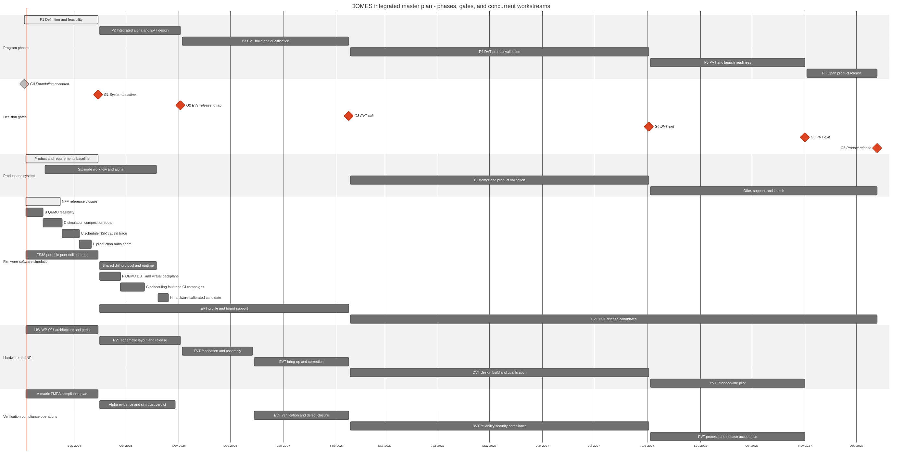

# DOMES Product Realization Framework

This document defines how DOMES converts development-board learning into controlled product
hardware, verified software, repeatable manufacturing, and an open product release. Current
position, evidence, critical path, and decisions live in [`../PROGRAM_STATUS.md`](../PROGRAM_STATUS.md).

## Tailored Industry Model

DOMES uses a lean subset of established practice:

- [ISO/IEC/IEEE 15288](https://www.iso.org/standard/81702.html) for the system life cycle;
- [ISO/IEC/IEEE 29148](https://www.iso.org/standard/72089.html) for requirements and traceability;
- a V-model to pair requirements and design decisions with verification/validation;
- [IEC 60812](https://webstore.iec.ch/en/publication/26359) for failure-mode analysis; and
- EVT, DVT, and PVT for production-intent hardware and manufacturing maturity.

This is process tailoring, not a claim of certification. DOMES uses evidence packages and decision
records rather than separate ceremonial SRR/PDR/CDR meetings.

## Object Model

The program uses five different objects. They must not be called interchangeable milestones.

| Object | Identifier | Purpose |
| --- | --- | --- |
| Program phase | `P0`-`P7` | Bounded cross-functional execution interval between program gates |
| Decision gate | `G0`-`G7` | Zero-duration decision that authorizes a specific commitment |
| Workstream | `PS`, `FS`, `HW`, `VC` | Continuous discipline plan running concurrently inside phases |
| Work package | e.g. `HW-WP-001` | Inspectable assignment with inputs, outputs, owner, timing, acceptance, and stop condition |
| Hardware release | `HR0`-`HR7` | Technical hardware evidence checkpoint feeding a program gate |

One program phase is active at a time. Product/System, Firmware/Software/Simulation, Hardware/NPI,
and Verification/Compliance all run in parallel. A work package may be pulled forward to retire a
named risk when its stop condition prevents premature spend or design freeze.

This distinction answers hardware questions precisely:

- **Definition authorized:** architecture, part selection, suppliers, budgets, coupons, preliminary
  BOM and design inputs may proceed.
- **Schematic authorized:** controlled schematic capture may proceed; PCB routing may not.
- **PCB layout authorized:** HR3 released schematic/interfaces may enter controlled layout;
  fabrication may not.
- **EVT build authorized:** one immutable release package may be fabricated and assembled.
- **DVT authorized:** corrected design is frozen for near-final product validation.
- **PVT authorized:** intended factory and process may run a pilot.
- **Release authorized:** the immutable product may ship and enter sustainment.

Never summarize these states as only “hardware started.”

## Governance

The AI milestone manager is the **Evidence Auditor and Program Secretariat**. It owns evidence
inventory, semantic review, traceability, conflict detection, status maintenance, schedule/risk
analysis, the technical gate verdict, and evidence-driven status transitions. It refuses unsupported
progress claims and does not wait for ceremonial human acceptance of objective results.

Named decision ownership remains explicit:

- the CEO owns budget, vendor, product, and market commitments;
- the hardware design owner owns the controlled design package;
- workstream owners own delivery and corrective action; and
- compliance, quality, supplier, or laboratory evidence identifies its responsible source.

AI does not infer spend, contractual commitment, or professional accountability from technical
evidence. A technical `Go` establishes readiness; the CEO separately authorizes any budget, vendor,
or market action that readiness enables. The qualified design owner remains accountable for the
engineering package without becoming a manual evidence-approval checkpoint.

## State Models

### Program Phase

| State | Exact meaning |
| --- | --- |
| `Not entered` | Entry gate has not authorized execution. This is normal future sequencing, not a health failure. |
| `Ready` | Entry evidence and resources are sufficient; the gate decision may enter the phase. |
| `Active` | Entry is recorded and concurrent workstreams are producing exit evidence. |
| `Gate review` | Exit package is immutable enough for evidence audit and disposition. |
| `Closed` | Exit gate recorded `Go` or an explicitly bounded `Conditional Go`. |
| `Superseded` | A controlled decision replaced the phase objective or boundary. |

### Work Package

| State | Exact meaning |
| --- | --- |
| `Not due` | Planned work is intentionally outside its authorized interval. |
| `Ready` | Inputs and boundaries allow work to begin without premature commitment. |
| `Active` | An owner is executing the package. |
| `Acceptance pending` | Outputs exist and the evidence audit is running. |
| `Complete` | All applicable acceptance criteria pass on direct current evidence. |
| `Blocked` | A named missing input prevents the next package result. |

Health is separately `Green`, `Amber`, `Red`, or `Not rated`. Future work is normally `Not rated`,
not `Red` or `Blocked` simply because its phase has not started.

### Decision Gate

Gate dispositions are:

- `Go`: required evidence passes and the named commitment is authorized.
- `Conditional Go`: only non-architecture-changing exceptions remain, each with consequence, owner,
  risk acceptance, and closure date.
- `Hold`: do not commit; named evidence or capacity must be supplied.
- `Recycle`: return to a prior baseline because the proposed result is not viable.
- `Stop`: discontinue the program or bounded product direction.

The gate record names the audited revision/package, AI technical verdict, exact technical work that
verdict enables, any separate CEO commitment authorization, exceptions, evidence date, and
invalidation conditions.

## Integrated Phase And Gate Plan

| Phase | Exit gate | Product/System (`PS`) | Firmware/Software (`FS`) | Hardware/NPI (`HW`) | Verification/Compliance (`VC`) |
| --- | --- | --- | --- | --- | --- |
| P0 Development Foundation | G0 Development Foundation | Product hypothesis and target gap map | Reproducible CI and automated two-board platform | Identified NFF boards and lab configuration | Evidence policy and automated verification |
| P1 Definition and Feasibility | G1 System Architecture Baseline | Hardware-driving product/system requirements and interfaces | NFF closure, shared protocol/runtime plan, deterministic interfaces | HR0-HR2: characterization, architecture and component baseline | Verification matrix, FMEA, compliance/RF/supply/test plan |
| P2 Integrated Alpha and EVT Design | G2 EVT Release To Fab | Six-node workflow and accepted critical behavior | Unified drill/runtime, alpha, diagnostics, model evidence, EVT profile | HR3-HR4: reviewed schematic/layout/manufacturing package | Alpha faults/soak/timing, design review, DFM/DFT and pre-compliance plan |
| P3 EVT Build and Qualification | G3 EVT Exit / DVT Authorization | Controlled requirements feedback | Product-board bring-up, factory/service tools and corrected firmware | Traceable EVT build, bring-up, correction and design-freeze candidate | EVT electrical/RF/power/peripheral/firmware/testability verification and defect closure |
| P4 DVT Product Validation | G4 DVT Exit / PVT Authorization | Product claims, customer validation, support/warranty baseline | Release candidate on frozen product hardware | Near-final form-factor units, controlled BOM/suppliers/tooling | Full V&V, reliability/environment, security and formal launch-market compliance |
| P5 PVT and Launch Readiness | G5 PVT Exit / Release Candidate | Price, channel, demand, support and launch plan | Reproducible candidate and production/update tooling | Intended-line pilot, yield, traceability, packaging and logistics | Process validation, production sampling, certificates and quality plan |
| P6 Open Product Release | G6 Product Release | Offer, documentation and launch operations | GA firmware, CLI/app, security and update process | Released design/manufacturing package and launch inventory | Candidate regression, approvals, open-source and support evidence |
| P7 Sustainment | G7 Sustainment Handoff | Customer learning and roadmap | Incidents, vulnerabilities and supported updates | Ramp, spares, returns and quality escapes | Post-market monitoring, evidence retention and continuing compliance |

The deterministic virtual platform is an `FS` work-package ladder across P1-P2. It informs decisions
but is not a company-wide phase that blocks product discovery, hardware definition, supplier
engagement, or compliance risk reduction.

### Deterministic Virtual Platform Placement

The target architecture and executable package contracts are defined in
[`../research/architecture/13-deterministic-virtual-platform.md`](../research/architecture/13-deterministic-virtual-platform.md).
Program state and forecasts are controlled in [`../PROGRAM_STATUS.md`](../PROGRAM_STATUS.md).

| Program interval | Simulation packages | Result used by the program |
| --- | --- | --- |
| P1, before G1 | `FS-WP-002A` replay foundation; `B` QEMU feasibility; ordered `D` simulation composition, `C` scheduler/ISR observability, and `E` production radio seam; parallel FS3 input `FS-WP-003A` | Establish whether target execution is viable and freeze only the composition, production protocol, traceability, toolchain, and patch boundaries that can affect product architecture |
| P2, before G2 | `F` one-DUT virtual backplane; `G` scheduling/concurrency/fault campaigns and CI; `H` hardware-calibrated candidate | Exercise the production runtime under controlled target scheduling and faults, then freeze a candidate prediction envelope using measured hardware |
| P2 verification, before G2 | Independent `VC-WP-002A` held-out qualification | Publish the trust verdict; a pass completes FS2 and the simulation criterion inside VC2 and permits claims inside the named prediction envelope; VC2 also requires six-node alpha evidence |

The package dependency is `A -> B -> D -> C -> E`, with `FS-WP-003A` proceeding independently;
then `(E + FS-WP-003A) -> F -> G`, then
`(FS1 + FS3 + G) -> H -> VC-WP-002A`. A `Not viable` result from `B` requires a recorded architecture
disposition before more target-simulation investment. It affects G1 only when that disposition changes a
hardware/firmware interface or resource allocation. A failed independent qualification removes the
predictive claim and blocks FS2 completion and the simulation criterion in VC2; it does not
invalidate correctly bounded deterministic tests or independently passing hardware evidence.

FS2 predictiveness is not a mandatory G2 criterion when direct physical evidence closes the same
critical risks. A failed qualification removes every model prediction from the G2 evidence set;
physical six-node timing, fault, soak, and recovery evidence must then stand alone. An unexplained
simulator/hardware divergence remains a critical design risk and prevents G2 `Go` until resolved.

## Hardware Authorization Ladder

| Release | Evidence result | Program effect |
| --- | --- | --- |
| HR0 NFF Reference Closure | Exact as-built identity and quantitative physical/electrical reference | Closes measured inputs to product architecture |
| HR1 Architecture Downselect | Requirements allocation, ID/mechanical envelope, topology trades, budgets, RF/charging/service strategy, FMEA and risk coupons | Establishes recommended product architecture |
| HR2 Component Baseline | Exact selected/alternate parts with derating, sample/footprint, lifecycle, supply, cost, driver, compliance and manufacturing evidence | Supports G1 schematic authorization |
| HR3 Schematic Release | Controlled schematic/netlist/calculations/interfaces, firmware profile contract, test points, zero unwaived ERC and cross-discipline review | Authorizes PCB layout, not fabrication |
| HR4 PCB Release To Fab | Controlled EDA/fabrication/assembly/test package, zero unwaived DRC, DFM/DFA/DFT and checksums | Supports G2 EVT build decision |
| HR5 EVT Exit | Traceable product-intent units pass electrical, RF, power, peripheral, update/recovery, testability and six-node regression without architecture-changing defect | Supports G3 DVT decision |
| HR6 DVT Exit | Frozen form-factor units meet product, user, reliability, security, service and compliance requirements | Supports G4 PVT decision |
| HR7 PVT Exit | Intended-line yield, capability, traceability, factory test, regression and logistics pass | Supports G5 release-candidate decision |

The active [`HW-WP-001`](../hardware/NEXT_ITERATION_REQUEST.md) request covers HR0-HR2 and explicitly
stops before controlled schematic release, PCB release, or fabrication.

## Integrated Master Schedule

The schedule shows parallel workstreams and cross-functional gates. Dates are a baseline forecast,
not evidence or a delivery guarantee.



Diagram source: [`assets/integrated-master-plan.mmd`](assets/integrated-master-plan.mmd). Regenerate:

```bash
npx --yes @mermaid-js/mermaid-cli@11.12.0 \
  -i docs/assets/integrated-master-plan.mmd \
  -o docs/assets/integrated-master-plan.png \
  -w 2800 -H 1400 -b white
```

Schedule control rules:

1. Baseline and current forecast are separate; variance is never erased by rewriting history.
2. The critical path names dependencies, responsible work packages, resource assumptions, supplier
   lead times, and the next irreversible commitment.
3. A failed gate, material scope/configuration change, resource loss, or supply constraint triggers a
   recorded impact and reforecast.
4. Work may pull forward only within its authorization boundary. Early analysis is not early gate
   passage.
5. Confidence is stated for each near-term gate and decreases when ownership, resources, supplier
   evidence, or upstream measurements are unknown.

## Requirements, Evidence, And Configuration

Each accepted requirement has a stable identifier, rationale, measurable statement, owner,
verification method, target environment, and linked result. Verification methods are Test,
Analysis, Inspection, or Demonstration.

Evidence names source revision, software artifact, hardware/configuration identity, instruments,
environment, procedure, raw/derived results, uncertainty where applicable, date, and invalidation
conditions. Code existence, a successful build, command acceptance, initialization, architecture
prose, or capture-start trace alignment is not physical or synchronized timing proof.

Configuration and interface baselines include hardware revision, schematic/BOM/AVL, firmware board
profile, partitions, protocols/protobuf schemas, app/CLI compatibility, fixture/test software, factory
data and manufacturing package. A frozen-interface change requires compatibility review, ECO impact,
updated verification, and reopening every invalidated release/gate.

Calibration data cannot also be held-out validation data. Simulation evidence additionally names
model version, scenario/config/seed, calibration and held-out dataset identities, normalized trace
hashes, clock-correlation method, error bounds, and prediction envelope.

## Program Control Artifacts

| Concern | Authority now | Required maturation |
| --- | --- | --- |
| CEO status, gates, workstreams, critical path and risks | [`../PROGRAM_STATUS.md`](../PROGRAM_STATUS.md) | Updated on every gate/status/evidence change |
| Product/customer/launch hypothesis | [`../research/PRODUCT_DEFINITION.md`](../research/PRODUCT_DEFINITION.md) | PS1 produces accepted product/system requirements |
| Target system and ID architecture | [`../research/SYSTEM_ARCHITECTURE.md`](../research/SYSTEM_ARCHITECTURE.md), [`../research/ID_REQUIREMENTS.md`](../research/ID_REQUIREMENTS.md) | G1-controlled interface/architecture baseline |
| As-built software and protocols | Implementation, protobuf schemas and [`../research/SOFTWARE_ARCHITECTURE.md`](../research/SOFTWARE_ARCHITECTURE.md) | G2 pins unified runtime/protocol and EVT profile |
| Verification procedures and evidence | [`TESTING.md`](TESTING.md), CI and retained evidence | VC1 traceability matrix and phase evidence packages |
| Hardware definition and NPI | [`../hardware/NEXT_ITERATION_REQUEST.md`](../hardware/NEXT_ITERATION_REQUEST.md), hardware sources | HR releases and controlled manufacturing packages |
| Schedule | [`assets/integrated-master-plan.mmd`](assets/integrated-master-plan.mmd) and CEO status | Baseline/forecast/variance and resource/lead-time basis |
| Risk, decisions, waivers and exceptions | Program status plus linked design records | Immutable gate ledger entries at each decision |

Issues and pull requests manage execution. They do not replace these control artifacts. The control
panel names the next cross-functional program action separately from the next autonomous execution
delivery. Terse continuation can select only a programming or executed-validation delivery under the
milestone-manager filter; requirements, discovery, architecture/part studies, planning matrices,
FMEA/compliance plans, program administration, and documentation-only packages require an explicit
request. The selector confirms or replaces the execution pointer from current evidence before
opening that package's issue and PR.

## Required CEO Status Report

Every report answers in this order:

1. Active program phase, development hardware, NPI stage, evidence revision/date and overall health.
2. Next program gate, baseline/forecast/confidence, exact authorization, critical inputs and AI
   technical verdict.
3. Current execution package, next program action, next autonomous execution delivery, acceptance
   boundary, blocker and execution issue.
4. Immediate hardware authorization level: definition, schematic, PCB layout, EVT, DVT, PVT or
   release.
5. `PS`, `FS`, `HW`, and `VC` outcomes: delivered, now, next, owner, health and forecast.
6. Hardware release-ladder position and next evidence release.
7. Critical path and top risks with owner, mitigation and decision-by date.
8. Decisions required from the CEO with recommendation, alternatives and consequence of delay.
9. Changes to scope, schedule, cost, requirements, configuration, evidence or risk.

Do not report one aggregate completion percentage. Gate readiness, hardware release state, current
evidence, dated workstream outcomes, and explicit decision authority are the program truth.
