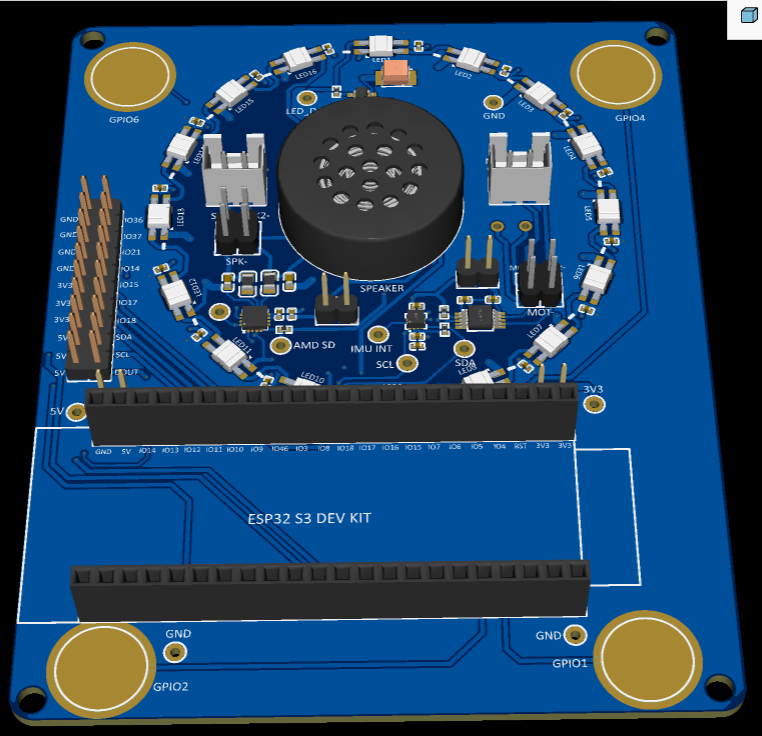
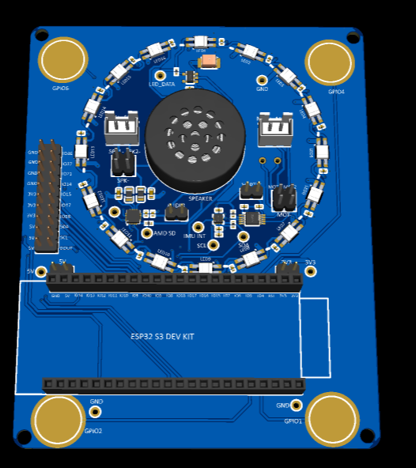
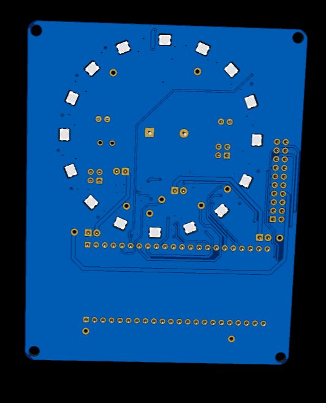

# NFF Development Board

ESP32-S3 sensor development board for the DOMES (Distributed Open-source Motion & Exercise System) project.



## Overview

This development board provides a platform for prototyping the DOMES reaction training pod firmware. It features:

- **ESP32-S3 DevKit** compatibility (plugs in via dual 22-pin headers)
- **16x SK6812MINI-E** RGBW addressable LEDs in a circular array
- **LIS2DW12** 3-axis accelerometer with tap detection
- **DRV2605L** haptic driver for LRA motors
- **MAX98357A** I2S audio amplifier with 23mm speaker
- **GPIO breakouts** at corners for additional sensors/actuators

## Directory Structure

```
nff-devboard/
├── README.md              # This file
├── production/            # Manufacturing files
│   ├── gerbers/           # Gerber files for PCB fabrication
│   ├── assembly/          # Pick-and-place files for SMT assembly
│   └── bom.csv            # Bill of materials with LCSC part numbers
├── docs/                  # Documentation
│   ├── schematic.pdf      # Full schematic
│   └── images/            # Board renders and photos
└── source/                # EDA source files
    └── *.epro             # EasyEDA Pro project file
```

## Specifications

| Parameter | Value |
|-----------|-------|
| Dimensions | ~85mm x 70mm |
| Layers | 2 |
| MCU | ESP32-S3-WROOM-1-N16R8 (via DevKit) |
| LEDs | 16x SK6812MINI-E (RGBW, 3.5x3.5mm) |
| Accelerometer | LIS2DW12 (I2C, LGA-12) |
| Haptic Driver | DRV2605L (I2C, DFN-10) |
| Audio Amp | MAX98357A (I2S, QFN-16) |
| Speaker | 23mm, 8Ω, 1W |

## Pin Assignments

| Function | GPIO | Notes |
|----------|------|-------|
| LED Data | GPIO48 | WS2812B protocol, active via level shifter |
| I2C SDA | GPIO8 | Shared: accelerometer + haptic driver |
| I2C SCL | GPIO9 | Shared: accelerometer + haptic driver |
| IMU INT1 | GPIO3 | Accelerometer interrupt (active low) |
| I2S BCLK | GPIO12 | Audio bit clock |
| I2S LRCLK | GPIO11 | Audio word select |
| I2S DATA | GPIO10 | Audio data out |
| Audio SD | GPIO13 | Amplifier shutdown (active low) |

## Manufacturing

### PCB Fabrication

The `production/gerbers/` folder contains Gerber files ready for upload to PCB manufacturers:

- **JLCPCB**: Upload `Gerber_PCB1_2026-01-14.zip` directly
- **PCBWay**: Upload the zip or individual Gerber files
- **OSH Park**: Upload the zip file

Recommended specifications:
- Layers: 2
- Thickness: 1.6mm
- Surface finish: HASL or ENIG
- Solder mask: Blue (matches renders)

### Assembly

For SMT assembly at JLCPCB:
1. Upload Gerbers
2. Upload `production/bom.csv`
3. Upload `production/assembly/pick-and-place.csv`
4. Select "Economic" assembly (top side only)

**Note**: The ESP32-S3 DevKit module is not included in assembly—it plugs into the female headers.

## Getting Started

1. Order the PCB and have it assembled (or hand-solder)
2. Plug in an ESP32-S3-DevKitC-1 (N16R8 variant recommended)
3. Flash the DOMES firmware:
   ```bash
   cd firmware/domes
   idf.py build flash monitor
   ```

## Design Files

- **Schematic**: `docs/schematic.pdf`
- **EasyEDA Pro source**: `source/ProPrj_ESP32-S3-DEVKIT_Sensor_Project_2026-01-14.epro`

To modify the design, import the `.epro` file into [EasyEDA Pro](https://pro.easyeda.com/).

## Images

| Top 3D View | Bottom View |
|-------------|-------------|
|  |  |

## License

Hardware design files are provided for the DOMES project. See repository root for license information.
