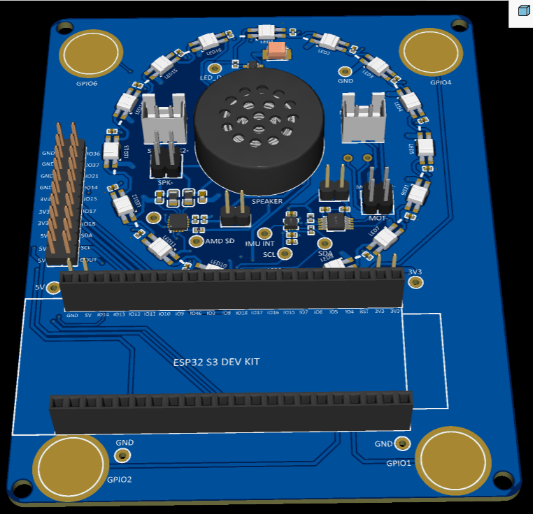

# NFF Development Board

The NFF board is the current full-peripheral DOMES development carrier. An ESP32-S3-DevKitC-1
plugs into its dual headers and drives a 16-device LED ring, LIS2DW12 accelerometer, DRV2605L haptic
driver, and MAX98357A audio amplifier.



## Repository Artifacts

```text
nff-devboard/
  BRING_UP_CHECKLIST.md   Repeatable electrical and firmware validation
  docs/
    schematic.pdf        Exported one-page schematic
    images/              Board renders
  source/
    *.epro               EasyEDA Pro project archive
```

Gerbers, placement files, and a board-specific manufacturing BOM are not checked into this
directory. Generate and review them from the EasyEDA source before ordering. The repository-level
component list is [`../BOM.csv`](../BOM.csv), not a release-ready assembly BOM.

## Hardware

| Peripheral | Device | Interface |
| --- | --- | --- |
| LED ring | 16x SK6812MINI-E | One-wire data through SN74AHCT1G125 level shifter |
| Accelerometer | LIS2DW12 | I2C, address `0x19`, INT1 |
| Haptic | DRV2605L + LD0832AA-0099F | I2C, address `0x5A`, fixed-frequency 235 Hz LRA drive |
| Audio | MAX98357A | I2S, 23 mm 8 ohm / 1 W speaker target |
| Touch | Four carrier pads | ESP32-S3 capacitive touch inputs |

The populated LED part is sold as RGBW-capable, but the current firmware drives this board in RGB
mode based on bring-up behavior. See [`../../docs/PIN_REFERENCE.md`](../../docs/PIN_REFERENCE.md).

## Current Firmware Mapping

Schematic header positions and ESP32 GPIO numbers are different namespaces. The current mapping is:

| Signal | DevKit header | ESP32 GPIO |
| --- | --- | --- |
| LED data | H1 pin 9 | 16 |
| IMU INT1 | H1 pin 5 | 5 |
| Audio shutdown | H1 pin 7 | 7 |
| I2S BCLK | H1 pin 18 | 12 |
| I2S LRCLK | H1 pin 17 | 11 |
| I2S data | H1 pin 19 | 13 |
| I2C SDA / SCL | - | 8 / 9 |
| Touch K1 / K2 / K3 / K4 | - | 1 / 2 / 4 / 6 |

`firmware/domes/main/config.hpp` is authoritative for compiled values. The EasyEDA source and
schematic are authoritative for physical carrier nets.

The EasyEDA source and exported schematic both name `LD0832AA-0099F` for U5. Confirm the actual
populated actuator before haptic testing; substituting a different LRA requires a matching voltage
and frequency profile in the firmware.

## Build And Bring Up

```bash
cd firmware/domes
. ~/esp/esp-idf/export.sh
idf.py build
idf.py -p /dev/ttyACM0 flash
```

Continue with [`BRING_UP_CHECKLIST.md`](BRING_UP_CHECKLIST.md). The reusable repository verification
policy is [`../../docs/TESTING.md`](../../docs/TESTING.md).

## Design Source

Import `source/ProPrj_ESP32-S3-DEVKIT_Sensor_Project_2026-01-14.epro` into EasyEDA Pro to inspect or
modify the board. Regenerate the PDF schematic and manufacturing outputs after design changes, and
reconcile any changed net with `config.hpp` and the pin reference in the same change.
