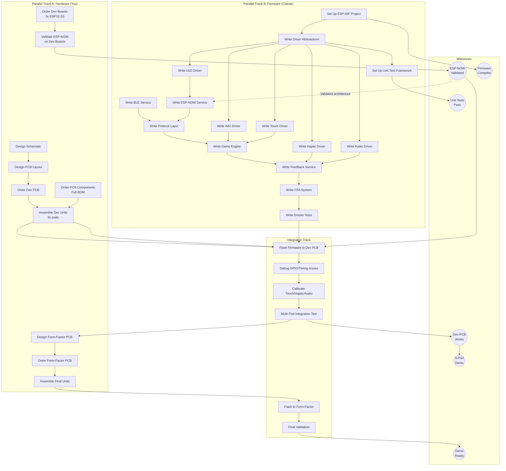

# DOMES Development Roadmap
## Dependency-Based Execution Plan

---

## EXECUTIVE SUMMARY

| Aspect | Decision |
|--------|----------|
| **Strategy** | Parallel dev: Claude writes firmware while you design PCB |
| **Dev Boards** | Minimal - only for ESP-NOW/RF validation (can't unit test) |
| **Breadboarding** | Skip - go straight to PCB |
| **Testing** | POSIX unit tests with CMock, not emulators |
| **CI** | Host-based unit tests only (no hardware CI) |

---

## DEPENDENCY GRAPH



---

## CRITICAL PATH

The **critical path** determines minimum time to completion:

```
Order Dev Boards → Validate ESP-NOW → Order Dev PCB → Assemble → Flash → Debug → Demo
       ↓                                                           ↑
   [Claude writes firmware in parallel, ready when PCB arrives] ───┘
```

**Bottlenecks:**
1. PCB fabrication lead time
2. Component shipping
3. Hardware debugging (unpredictable)

**Not on critical path:** All firmware development (can happen in parallel with PCB)

---

## TASK BREAKDOWN

### Track A: Hardware (You)

| Task | Depends On | Blocks | Parallelizable With |
|------|------------|--------|---------------------|
| **A1: Order Dev Boards** | - | A4 | B1-B15 |
| **A2: Order PCB Components** | - | A7 | Everything |
| **A3: Design Schematic** | - | A5 | B1-B15, A1, A2 |
| **A4: Validate ESP-NOW** | A1 | M1 | A3, B1-B15 |
| **A5: Design PCB Layout** | A3 | A6 | B1-B15 |
| **A6: Order Dev PCB** | A5 | A7 | B1-B15 |
| **A7: Assemble Dev Units** | A2, A6 | C1 | B14, B15 |
| **A8: Design Form-Factor PCB** | M4 | A9 | - |
| **A9: Order Form-Factor PCB** | A8 | A10 | - |
| **A10: Assemble Final Units** | A9 | C5 | - |

### Track B: Firmware (Claude)

| Task | Depends On | Blocks | Notes |
|------|------------|--------|-------|
| **B1: Set Up ESP-IDF Project** | - | B2, M2 | First task |
| **B2: Write Driver Abstractions** | B1 | B3-B8 | Enables mocking |
| **B3: Set Up Unit Test Framework** | B2 | M3 | CMock + Unity |
| **B4: Write LED Driver** | B2 | B9 | SK6812 via RMT |
| **B5: Write Audio Driver** | B2 | B13 | I2S + MAX98357A |
| **B6: Write Haptic Driver** | B2 | B13 | I2C + DRV2605L |
| **B7: Write Touch Driver** | B2 | B12 | ESP32 touch peripheral |
| **B8: Write IMU Driver** | B2 | B12 | I2C + LIS2DW12 |
| **B9: Write ESP-NOW Service** | B4 | B11 | After M1 validates arch |
| **B10: Write BLE Service** | B2 | B11 | NimBLE stack |
| **B11: Write Protocol Layer** | B9, B10 | B12 | Message encoding |
| **B12: Write Game Engine** | B7, B8, B11 | B13 | State machine, drills |
| **B13: Write Feedback Service** | B5, B6, B12 | B14 | Coordinated output |
| **B14: Write OTA System** | B13 | B15 | Partition, rollback |
| **B15: Write Smoke Tests** | B14 | C1 | Hardware validation suite |

### Track C: Integration

| Task | Depends On | Blocks | Notes |
|------|------------|--------|-------|
| **C1: Flash Firmware to Dev PCB** | A7, B15, M1 | C2 | First real HW test |
| **C2: Debug GPIO/Timing Issues** | C1 | C3 | Expect surprises |
| **C3: Calibrate Touch/Haptic/Audio** | C2 | C4 | Tune thresholds |
| **C4: Multi-Pod Integration Test** | C3 | M4, M5 | 6 pods working |
| **C5: Flash to Form-Factor** | A10, M5 | C6 | Final hardware |
| **C6: Final Validation** | C5 | M6 | Demo ready |

---

## MILESTONES

| Milestone | Definition of Done | Unlocks |
|-----------|-------------------|---------|
| **M1: ESP-NOW Validated** | 95th percentile RTT < 2ms on dev boards | Confidence in architecture |
| **M2: Firmware Compiles** | Clean build for ESP32-S3 target | Development velocity |
| **M3: Unit Tests Pass** | >70% coverage, all tests green | Quality gate |
| **M4: Dev PCB Works** | Single pod: touch→LED+sound+haptic | Integration confidence |
| **M5: 6-Pod Demo** | Synchronized drill across 6 pods | Core product works |
| **M6: Demo Ready** | Form-factor prototypes functional | External demos |

---

## PARALLEL EXECUTION MODEL

```
┌─────────────────────────────────────────────────────────────────────────┐
│                     PARALLEL EXECUTION                                   │
├─────────────────────────────────────────────────────────────────────────┤
│                                                                          │
│   YOU                                 CLAUDE                            │
│   ───                                 ──────                            │
│                                                                          │
│   A1: Order dev boards ─────────────► B1: Project setup                 │
│   A2: Order components                B2: Driver abstractions           │
│   A3: Schematic ◄──────────────────── B3: Unit test framework           │
│           │                           B4-B8: All drivers                │
│           │                                  │                          │
│           ▼                                  │                          │
│   A4: Validate ESP-NOW ══════════════════════╪═══► M1                   │
│           │                                  │                          │
│           ▼                                  ▼                          │
│   A5: PCB Layout                      B9-B11: Comms layer               │
│           │                           B12: Game engine                  │
│           ▼                           B13: Feedback service             │
│   A6: Order PCB                       B14: OTA system                   │
│           │                           B15: Smoke tests                  │
│           ▼                                  │                          │
│   [PCB Fabrication]                          │                          │
│           │                                  │                          │
│           ▼                                  ▼                          │
│   A7: Assemble ──────────────────────► C1: Flash & Debug                │
│                                              │                          │
│                                              ▼                          │
│                                        C2-C4: Integration               │
│                                              │                          │
│                                              ▼                          │
│   A8: Form-factor PCB ◄──────────────────── M5: 6-Pod Demo              │
│           │                                                             │
│           ▼                                                             │
│   A9-A10: Final assembly ────────────► C5-C6: Final validation          │
│                                              │                          │
│                                              ▼                          │
│                                        M6: Demo Ready                   │
│                                                                          │
└─────────────────────────────────────────────────────────────────────────┘

Legend:
  ─────►  Enables/unblocks
  ════►   Critical dependency (on critical path)
  ◄─────  Feedback/iteration
```

---

## WHAT NEEDS REAL HARDWARE?

Only things that **cannot** be unit tested:

| Validation | Why Real HW? | Depends On |
|------------|--------------|------------|
| **ESP-NOW latency** | RF timing is physics | A1 (dev boards) |
| **BLE + ESP-NOW coexistence** | RF arbitration | A1 (dev boards) |
| **Touch through diffuser** | Material properties | A7 (assembled PCB) |

**Everything else** (game logic, protocol, state machines, OTA) → Unit tests

---

## WHY NO EMULATOR?

| Option | Verdict | Reason |
|--------|---------|--------|
| **Wokwi** | ❌ Skip | No support for DRV2605L, LIS2DW12, custom audio |
| **QEMU** | ❌ Skip | Limited peripheral emulation, complex setup |
| **Renode** | ❌ Skip | ESP32-S3 support incomplete |
| **POSIX Unit Tests** | ✅ Use | Fast, mock hardware, test business logic |

**Bottom line**: Emulators can't emulate our specific peripherals. Unit tests with mocked drivers give us 80% coverage. Real hardware validation for the remaining 20%.

---

## TESTING STRATEGY

### Unit Tests (Run on Host)

```
firmware/
├── test/
│   ├── test_protocol.cpp      # Message encoding
│   ├── test_state_machine.cpp # Pod states
│   ├── test_drill_engine.cpp  # Game logic
│   ├── test_timing.cpp        # Clock sync
│   └── mocks/
│       ├── mock_led_driver.cpp
│       ├── mock_audio_driver.cpp
│       └── ...
```

**Run tests:**
```bash
cd firmware
idf.py --preview set-target linux
idf.py build
./build/test_app
```

### Hardware Smoke Tests (Run on Device)

```cpp
// Built into firmware, triggered by button hold or BLE command
void runSmokeTests() {
    TEST(led_ring_all_colors);
    TEST(audio_play_tone);
    TEST(haptic_click);
    TEST(touch_detection);
    TEST(espnow_ping);
    TEST(ble_advertise);
    TEST(nvs_read_write);
    TEST(battery_voltage);
}
```

---

## MINIMAL PROCUREMENT

### Dev Boards

| Item | Qty | Purpose |
|------|-----|---------|
| ESP32-S3-DevKitC-1-N16R8 | 3 | ESP-NOW validation only |

**That's it.** No breakout boards - going straight to PCB.

### PCB Components

Order full BOM per System Architecture document.

---

## DECISION GATES

### Gate 1: After M1 (ESP-NOW Validated)
**Question:** Does ESP-NOW meet latency requirements?
- ✅ Yes → Continue with current architecture
- ❌ No → Fallback to BLE-only (higher latency but works)

### Gate 2: After M4 (Dev PCB Works)
**Question:** Does single pod work end-to-end?
- ✅ Yes → Proceed to multi-pod testing
- ❌ No → Debug, potentially respin dev PCB

### Gate 3: After M5 (6-Pod Demo)
**Question:** Do 6 pods work together reliably?
- ✅ Yes → Proceed to form-factor
- ❌ No → Fix issues before investing in form-factor

---

## CLAUDE'S TASK SEQUENCE

### Phase 1: Foundation
1. **B1: Project setup** - ESP-IDF, CMake, directory structure
2. **B2: Driver abstractions** - Interfaces that can be mocked
3. **B3: Unit test framework** - CMock integration

### Phase 2: Drivers
4. **B4: LED driver** - SK6812 via RMT
5. **B5: Audio driver** - I2S + sample playback
6. **B6: Haptic driver** - DRV2605L via I2C
7. **B7: Touch driver** - ESP32 touch peripheral
8. **B8: IMU driver** - LIS2DW12 via I2C

### Phase 3: Communication
9. **B9: ESP-NOW service** - Pod-to-pod messaging
10. **B10: BLE service** - Phone connection
11. **B11: Protocol layer** - Message encoding/decoding

### Phase 4: Application
12. **B12: Game engine** - State machine, drill logic
13. **B13: Feedback service** - Coordinated LED/audio/haptic
14. **B14: OTA system** - Partition management, rollback
15. **B15: Smoke tests** - Hardware validation suite

### Phase 5: Integration (after PCB arrives)
16. **C1-C4:** Flash, debug, calibrate, multi-pod test

---

## RISKS & MITIGATIONS

| Risk | Mitigation |
|------|------------|
| ESP-NOW latency too high | Validate early (M1); fallback to BLE |
| PCB layout errors | Careful review; dev PCB is throwaway |
| Touch through diffuser fails | Test materials; add MPR121 if needed |
| Component availability | Order early; identify alternates |

---

*Document Created: 2026-01-03*
*Project: DOMES*
