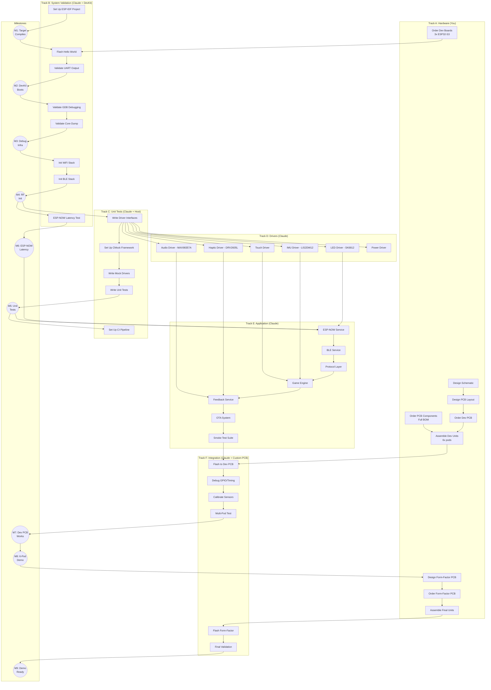

# DOMES Development Roadmap
## Dependency-Based Execution Plan

---

## EXECUTIVE SUMMARY

| Aspect | Decision |
|--------|----------|
| **Strategy** | Parallel dev: Claude writes firmware while you design PCB |
| **Dev Boards** | Required for system validation + ESP-NOW/RF testing |
| **Breadboarding** | Skip - go straight to PCB |
| **Testing** | System validation on DevKit FIRST, then POSIX unit tests |
| **CI** | Host unit tests + target compile (every PR) + DevKit smoke (nightly) |

## Hardware Terminology

| Term | Refers To | Description |
|------|-----------|-------------|
| **Dev Boards** | ESP32-S3-DevKitC-1 | Off-the-shelf boards for initial firmware development |
| **Dev PCB / NFF Devboard** | [`hardware/nff-devboard/`](../hardware/nff-devboard/) | Custom sensor board with all peripherals (LEDs, IMU, haptics, audio) |
| **Form-Factor PCB** | Production PCB | Final integrated design for enclosed pods |

---

## MILESTONE SEQUENCE

```
┌─────────────────────────────────────────────────────────────────────────────┐
│                         MILESTONE SEQUENCE                                   │
├─────────────────────────────────────────────────────────────────────────────┤
│                                                                              │
│   M1: Target Compiles                                                        │
│         │                                                                    │
│         ▼                                                                    │
│   M2: DevKit Boots ─────────────────┐                                        │
│         │                           │                                        │
│         ▼                           │ System Firmware                        │
│   M3: Debug Infrastructure          │ Validation                             │
│         │                           │ (MUST pass before                      │
│         ▼                           │  investing in unit tests)              │
│   M4: RF Stacks Init ───────────────┘                                        │
│         │                                                                    │
│         ▼                                                                    │
│   M5: Unit Tests Pass (host)                                                 │
│         │                                                                    │
│         ▼                                                                    │
│   M6: ESP-NOW Latency Validated                                              │
│         │                                                                    │
│         ▼                                                                    │
│   M7: Dev PCB Works                                                          │
│         │                                                                    │
│         ▼                                                                    │
│   M8: 6-Pod Demo                                                             │
│         │                                                                    │
│         ▼                                                                    │
│   M9: Demo Ready                                                             │
│                                                                              │
└─────────────────────────────────────────────────────────────────────────────┘
```

**Rationale for Sequence:**
1. Debug infrastructure is foundational - every future bug depends on it
2. RF stack *init* is low-risk on ESP32-S3 - coexistence issues only manifest under sustained concurrent load
3. Unit tests are more valuable when target is proven to work
4. Real RF coexistence validation happens during integration (M7/M8) with actual game traffic

---

## DEPENDENCY GRAPH



---

## MILESTONE DEFINITIONS

### Status Summary

| Milestone | Description | Status |
|-----------|-------------|--------|
| M1 | Target Compiles | COMPLETE |
| M2 | DevKit Boots | COMPLETE |
| M3 | Debug Infrastructure | COMPLETE |
| M4 | RF Stacks Init | Not Started |
| M5 | Unit Tests Pass | Not Started |
| M6 | ESP-NOW Latency Validated | Not Started |
| M7 | Dev PCB Works | Not Started |
| M8 | 6-Pod Demo | Not Started |
| M9 | Demo Ready | Not Started |

---

### M1: Target Compiles

**Status:** COMPLETE (January 2026)

| Check | Method | Pass Criteria | Result |
|-------|--------|---------------|--------|
| ESP-IDF installed | `idf.py --version` | Version 5.x | v5.2.2 |
| Project scaffolding | Directory structure | Per SOFTWARE_ARCHITECTURE.md | Done |
| Cross-compile | `idf.py build` | Exit code 0, no errors | Pass |
| Binary size | Check .bin | < 4MB (fits OTA partition) | ~350KB |

**Owner:** Claude
**Depends On:** Nothing
**Blocks:** M2

---

### M2: DevKit Boots

**Status:** COMPLETE (January 2026)

| Check | Method | Pass Criteria | Result |
|-------|--------|---------------|--------|
| Flash succeeds | `idf.py flash` | Exit code 0 | Pass |
| Boot completes | UART monitor | `app_main` log within 5s | Pass |
| UART parseable | Log regex | Timestamps + levels parse correctly | Pass |
| No crash loops | Monitor 60s | No repeated boot messages | Pass |
| Heap OK | `heap_caps_get_info()` | Free heap > 100KB | Pass |
| PSRAM OK | Log check | `Octal SPI RAM enabled` | Pass |

**Owner:** Claude (requires DevKit from You)
**Depends On:** M1, A1 (dev boards ordered/received)
**Blocks:** M3

---

### M3: Debug Infrastructure

**Status:** COMPLETE (January 2026)

| Check | Method | Pass Criteria | Result |
|-------|--------|---------------|--------|
| OpenOCD connects | `openocd -f board/esp32s3-builtin.cfg` | "Listening on port 3333" | Pass |
| GDB connects | `target remote :3333` | Connected, no errors | Pass |
| Breakpoint works | Set BP on `app_main` | Hits breakpoint | Pass |
| Step works | `next`, `step` | Executes, shows source | Pass |
| Variable inspect | `print variable` | Shows correct value | Pass |
| Core dump to flash | Trigger panic via code | Core dump saved | Pass |
| Core dump decode | `idf.py coredump-info` | Stack trace readable | Pass |
| NVS config storage | Boot counter persistence | Increments across reboots | Pass |
| Task Watchdog (TWDT) | 30-second stability test | No watchdog triggers | Pass |
| TaskManager | LED demo task via TaskManager | Task runs with watchdog | Pass |

**Owner:** Claude
**Depends On:** M2
**Blocks:** M4

---

### M4: RF Stacks Init

| Check | Method | Pass Criteria |
|-------|--------|---------------|
| WiFi init | UART log | `wifi:mode : sta`, no errors |
| BLE init | UART log | `NimBLE: GAP` init, no errors |
| BLE advertise | nRF Connect app | Device visible |
| Memory stable | heap check | No leak after WiFi+BLE init |

**Owner:** Claude
**Depends On:** M3
**Blocks:** M5, M6

**Note:** WiFi stack is only initialized as a dependency for ESP-NOW (direct P2P radio).
We don't connect to any AP or use WiFi networking. OTA updates are done via BLE.
Full RF validation happens during M7/M8 integration with actual game traffic.

---

### M5: Unit Tests Pass

| Check | Method | Pass Criteria |
|-------|--------|---------------|
| CMock integrated | Build system | Compiles with mocks |
| Host build works | `idf.py --preview set-target linux` | Exit code 0 |
| Tests run | `./build/test_app` | All tests execute |
| All pass | Test output | 0 failures |
| Coverage > 70% | `gcov` | Line coverage ≥ 70% |
| CI pipeline | GitHub Actions | Runs on every PR |

**Owner:** Claude
**Depends On:** M4
**Blocks:** Application development

---

### M6: ESP-NOW Latency Validated

| Check | Method | Pass Criteria |
|-------|--------|---------------|
| ESP-NOW init | UART log | `ESPNOW: initialized` |
| Peer discovery | 2 DevKits | Devices find each other |
| Ping-pong test | 1000 iterations | All packets received |
| Latency P50 | Measurement | < 1ms |
| Latency P95 | Measurement | < 2ms |
| Latency P99 | Measurement | < 5ms |
| Coex impact | BLE active | Latency still < 5ms P99 |

**Owner:** Claude (requires 2+ DevKits)
**Depends On:** M4
**Blocks:** E1 (ESP-NOW Service)

---

### M7: Dev PCB Works

| Check | Method | Pass Criteria |
|-------|--------|---------------|
| Flash succeeds | `idf.py flash` | Exit code 0 |
| All GPIOs correct | Smoke test | LEDs, audio, haptic respond |
| Touch works | Smoke test | Touch detected |
| IMU works | Smoke test | Acceleration reads |
| Power circuit | Multimeter | 3.3V stable, battery charges |
| Full smoke test | Built-in suite | All 8 tests pass |

**Owner:** Claude + You
**Depends On:** A7 (assembled PCB), E7 (smoke tests)
**Blocks:** M8

---

### M8: 6-Pod Demo

| Check | Method | Pass Criteria |
|-------|--------|---------------|
| 6 pods boot | UART | All 6 show `app_main` |
| All connect | ESP-NOW | Master sees 6 peers |
| Drill runs | Trigger drill | LEDs light in sequence |
| Touch response | Hit each pod | < 50ms visual feedback |
| Audio sync | Listen | No noticeable delay |
| 10 min soak | Run drills | No crashes, no desyncs |
| RF coexistence | BLE + ESP-NOW | No packet loss under game load |

**Owner:** Claude + You
**Depends On:** M7
**Blocks:** M9, A8 (form-factor design)

**Note:** This is where real RF coexistence validation happens - with actual game traffic
patterns (ESP-NOW mesh active, BLE connected to phone, sustained drill sequences).
If issues surface here, tune BLE scan params per Espressif guidelines.

---

### M9: Demo Ready

| Check | Method | Pass Criteria |
|-------|--------|---------------|
| Form-factor boots | Flash | Exit code 0 |
| Enclosure fits | Physical | PCB in shell |
| Battery life | Runtime test | > 10 hours standby |
| OTA works | Push update | New version boots |
| Demo script | Run through | Looks professional |

**Owner:** Claude + You
**Depends On:** A10 (final assembly)
**Blocks:** External demos

---

## CI PIPELINE STRATEGY

### Pipeline Tiers

| Tier | Trigger | Hardware | Tests | Duration |
|------|---------|----------|-------|----------|
| **Tier 1** | Every PR | None (GitHub-hosted) | Host unit tests | < 2 min |
| **Tier 2** | Every PR | None (GitHub-hosted) | Target compile check | < 5 min |
| **Tier 3** | Nightly | Self-hosted + DevKit | DevKit smoke test | < 10 min |
| **Tier 4** | Manual/Release | Self-hosted + DevKit | Full validation suite | < 30 min |

### Tier 1: Host Unit Tests (Every PR)

```yaml
# .github/workflows/unit-tests.yml
name: Unit Tests
on: [push, pull_request]
jobs:
  test:
    runs-on: ubuntu-latest
    steps:
      - uses: actions/checkout@v4
      - name: Set up ESP-IDF
        uses: espressif/esp-idf-ci-action@v1
        with:
          esp_idf_version: v5.2
      - name: Build for Linux target
        run: |
          cd firmware
          idf.py --preview set-target linux
          idf.py build
      - name: Run tests
        run: ./firmware/build/test_app
      - name: Upload coverage
        uses: codecov/codecov-action@v3
```

### Tier 2: Target Compile (Every PR)

```yaml
# .github/workflows/build.yml
name: Build
on: [push, pull_request]
jobs:
  build:
    runs-on: ubuntu-latest
    steps:
      - uses: actions/checkout@v4
      - name: Set up ESP-IDF
        uses: espressif/esp-idf-ci-action@v1
      - name: Build for ESP32-S3
        run: |
          cd firmware
          idf.py set-target esp32s3
          idf.py build
      - name: Check binary size
        run: |
          SIZE=$(stat -c%s firmware/build/domes.bin)
          if [ $SIZE -gt 4194304 ]; then
            echo "Binary too large: $SIZE bytes (max 4MB)"
            exit 1
          fi
```

### Tier 3: DevKit Smoke Test (Nightly)

```yaml
# .github/workflows/devkit-smoke.yml
name: DevKit Smoke Test
on:
  schedule:
    - cron: '0 3 * * *'  # 3 AM daily
  workflow_dispatch:  # Manual trigger

jobs:
  smoke:
    runs-on: [self-hosted, devkit]
    steps:
      - uses: actions/checkout@v4
      - name: Flash firmware
        run: |
          cd firmware
          idf.py flash -p /dev/ttyUSB0
      - name: Capture UART (30s)
        run: |
          timeout 30 cat /dev/ttyUSB0 > uart_log.txt || true
      - name: Validate boot
        run: |
          grep -q "app_main" uart_log.txt || exit 1
          grep -q "wifi:mode" uart_log.txt || exit 1
          grep -q "NimBLE" uart_log.txt || exit 1
          ! grep -q "Guru Meditation" uart_log.txt || exit 1
      - name: GDB sanity check
        run: |
          # Start OpenOCD in background
          openocd -f board/esp32s3-builtin.cfg &
          sleep 2
          # Connect GDB and verify
          echo -e "target remote :3333\ninfo reg\nquit" | \
            xtensa-esp32s3-elf-gdb -batch firmware/build/domes.elf
          killall openocd
      - name: Upload logs
        uses: actions/upload-artifact@v3
        with:
          name: uart-logs
          path: uart_log.txt
```

### Self-Hosted Runner Setup

```bash
# On your CI machine with DevKit connected:

# 1. Install GitHub Actions runner
mkdir actions-runner && cd actions-runner
curl -o actions-runner-linux-x64.tar.gz -L https://github.com/actions/runner/releases/download/v2.311.0/actions-runner-linux-x64.tar.gz
tar xzf actions-runner-linux-x64.tar.gz
./config.sh --url https://github.com/your-org/domes --token YOUR_TOKEN --labels devkit

# 2. Grant USB access
sudo usermod -aG dialout $USER
sudo chmod 666 /dev/ttyUSB0

# 3. Start runner as service
sudo ./svc.sh install
sudo ./svc.sh start
```

---

## TASK BREAKDOWN BY OWNER

### Track A: Hardware (You)

| Task | Depends On | Blocks | Notes |
|------|------------|--------|-------|
| **A1: Order Dev Boards** (3x ESP32-S3-DevKitC) | - | M2 | Off-the-shelf boards |
| **A2: Order PCB Components** | - | A7 | BOM from `hardware/nff-devboard/production/bom.csv` |
| **A3: Design Schematic** | - | A5 | ✅ Complete - see `hardware/nff-devboard/docs/schematic.pdf` |
| **A5: Design PCB Layout** | A3 | A6 | ✅ Complete - NFF devboard |
| **A6: Order Dev PCB** | A5 | A7 | Upload `hardware/nff-devboard/production/gerbers/` to JLCPCB |
| **A7: Assemble Dev Units** | A2, A6 | M7 | NFF devboard + DevKit modules |
| **A8: Design Form-Factor PCB** | M8 | A9 | Production PCB (future) |
| **A9: Order Form-Factor PCB** | A8 | A10 | - |
| **A10: Assemble Final Units** | A9 | M9 | - |

### Track B: System Validation (Claude + DevKit)

| Task | Depends On | Blocks | Validation Method |
|------|------------|--------|-------------------|
| **B1: Set Up ESP-IDF Project** | - | M1 | `idf.py build` succeeds |
| **B2: Flash Hello World** | M1, A1 | B3 | Binary runs on DevKit |
| **B3: Validate UART Output** | B2 | M2 | Logs parse correctly |
| **B4: Validate GDB Debugging** | M2 | B5 | Breakpoints work |
| **B5: Validate Core Dump** | B4 | M3 | Panic decoded correctly |
| **B6: Init WiFi Stack** | M3 | B7 | `wifi:mode` in logs |
| **B7: Init BLE Stack** | B6 | M4 | `NimBLE` init OK |
| **B9: ESP-NOW Latency Test** | M4 | M6 | P95 < 2ms |

### Track C: Unit Tests (Claude + Host)

| Task | Depends On | Blocks |
|------|------------|--------|
| **C1: Write Driver Interfaces** | M4 | C2, D1-D6 |
| **C2: Set Up CMock Framework** | C1 | C3 |
| **C3: Write Mock Drivers** | C2 | C4 |
| **C4: Write Unit Tests** | C3 | M5 |
| **C5: Set Up CI Pipeline** | M5 | - |

### Track D: Drivers (Claude)

| Task | Depends On | Blocks |
|------|------------|--------|
| **D1: LED Driver** | C1 | E1 |
| **D2: Audio Driver** | C1 | E5 |
| **D3: Haptic Driver** | C1 | E5 |
| **D4: Touch Driver** | C1 | E4 |
| **D5: IMU Driver** | C1 | E4 |
| **D6: Power Driver** | C1 | E7 |

### Track E: Application (Claude)

| Task | Depends On | Blocks |
|------|------------|--------|
| **E1: ESP-NOW Service** | M5, M6, D1 | E2 |
| **E2: BLE Service** | E1 | E3 |
| **E3: Protocol Layer** | E2 | E4 |
| **E4: Game Engine** | D4, D5, E3 | E5 |
| **E5: Feedback Service** | D2, D3, E4 | E6 |
| **E6: OTA System** | E5 | E7 |
| **E7: Smoke Test Suite** | E6, D6 | M7 |

### Track F: Integration (Claude + Custom PCB)

| Task | Depends On | Blocks |
|------|------------|--------|
| **F1: Flash to Dev PCB** | A7, E7 | F2 |
| **F2: Debug GPIO/Timing** | F1 | F3 |
| **F3: Calibrate Sensors** | F2 | F4 |
| **F4: Multi-Pod Test** | F3 | M7 |
| **F5: Flash Form-Factor** | A10, M8 | F6 |
| **F6: Final Validation** | F5 | M9 |

---

## CRITICAL PATH

```
A1 (Order DevKits) ──► B2 (Flash) ──► B3-B7 (System Validation) ──► M4
                                                                      │
┌─────────────────────────────────────────────────────────────────────┘
│
▼
C1-C4 (Unit Tests) ──► M5 ──► E1-E7 (Application) ──► F1 ◄── A7 (Assemble)
                                                        │
                                                        ▼
                                                   F2-F4 ──► M7 ──► M8
                                                                     │
                                                                     ▼
                                                              A8-A10 ──► M9
```

**Bottlenecks:**
1. A1 (Dev boards) - blocks all hardware validation
2. M4 (RF init) - gates unit test development (low risk, just needs hardware)
3. A7 (PCB assembly) - blocks integration

---

## PARALLEL EXECUTION

```
YOU                              CLAUDE
───                              ──────

A1: Order dev boards ──────────► [Wait for delivery]
A2: Order components                    │
A3: Design schematic                    │
        │                               │
        │                    [DevKit arrives]
        │                               │
        │                        B1: Project setup
        │                        B2: Flash hello world
        │                        B3: Validate UART
        │                        B4: Validate GDB
        │                        B5: Validate core dump
        │                        B6-B7: RF stacks init ► M4
        │                               │
        ▼                               ▼
A5: PCB Layout               C1-C4: Unit tests ────► M5
        │                               │
        ▼                               ▼
A6: Order PCB                D1-D6: Drivers
        │                    E1-E7: Application
        ▼                               │
[PCB fabrication]                       │
        │                               │
        ▼                               ▼
A7: Assemble ──────────────────► F1: Flash
                                 F2-F4: Integration
                                        │
                                        ▼
                                  M7: Dev PCB Works
                                        │
                                        ▼
                                  M8: 6-Pod Demo
                                        │
A8: Form-factor design ◄────────────────┘
A9: Order
A10: Assemble ─────────────────► F5-F6 ──► M9
```

---

## DECISION GATES

### Gate 1: After M4 (RF Init)
**Question:** Do WiFi and BLE stacks initialize without errors?
- ✅ Yes → Proceed with unit tests and drivers
- ❌ No → Debug RF init issues (likely sdkconfig or partition table)

### Gate 2: After M6 (ESP-NOW Latency)
**Question:** Is ESP-NOW latency acceptable (P95 < 2ms)?
- ✅ Yes → Use ESP-NOW for pod-to-pod comms
- ❌ No → Fallback to BLE mesh (higher latency but works)

### Gate 3: After M7 (Dev PCB Works)
**Question:** Does custom PCB work end-to-end?
- ✅ Yes → Proceed to multi-pod testing
- ❌ No → Debug, potentially respin PCB

### Gate 4: After M8 (6-Pod Demo)
**Question:** Do 6 pods work reliably together?
- ✅ Yes → Proceed to form-factor design
- ❌ No → Fix issues before form-factor investment

---

## RISKS & MITIGATIONS

| Risk | Probability | Impact | Mitigation |
|------|-------------|--------|------------|
| RF coexistence under load | Low | Medium | ESP32-S3 STA+BLE is stable per Espressif; tune BLE scan params if needed |
| DevKit delayed | Medium | Medium | Order from multiple suppliers |
| PCB layout errors | Medium | Medium | Careful review; dev PCB is throwaway |
| CI DevKit flaky | Medium | Low | Retry logic; manual fallback |
| Touch through diffuser | Low | Medium | Test materials early |
| ESP-NOW latency spikes | Low | High | Validate P99 < 5ms; fallback to time-sliced BLE if needed |

**Note on RF coexistence:** Init code is low-risk. Real issues surface under sustained load
with specific patterns (e.g., BLE scan window = scan interval starves WiFi). These are
config issues, not fundamental blockers. Validated during M7/M8 integration.

---

*Document Updated: 2026-01-11*
*Project: DOMES*
