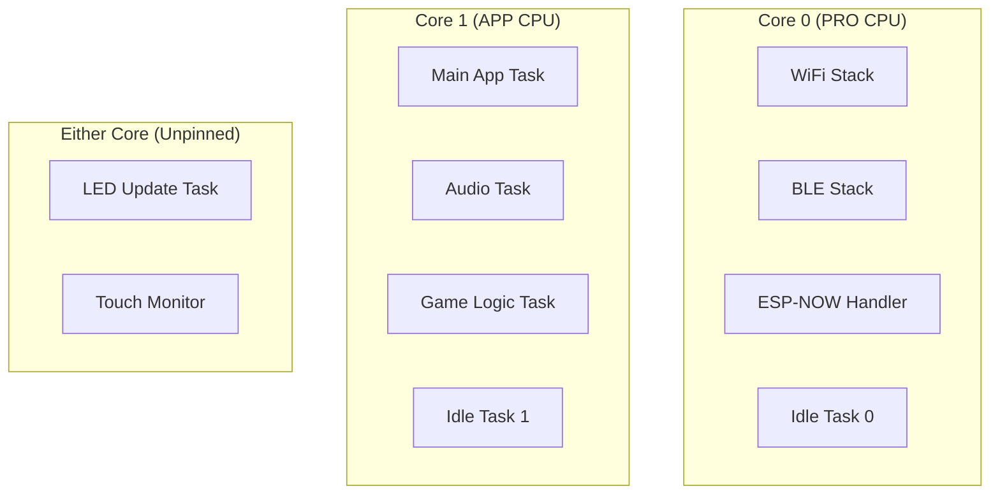
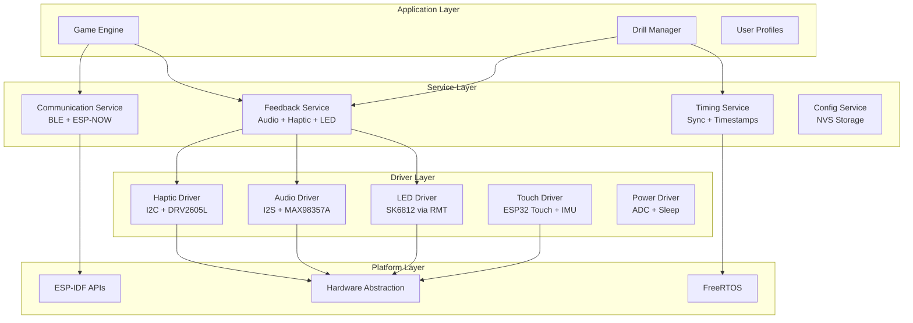
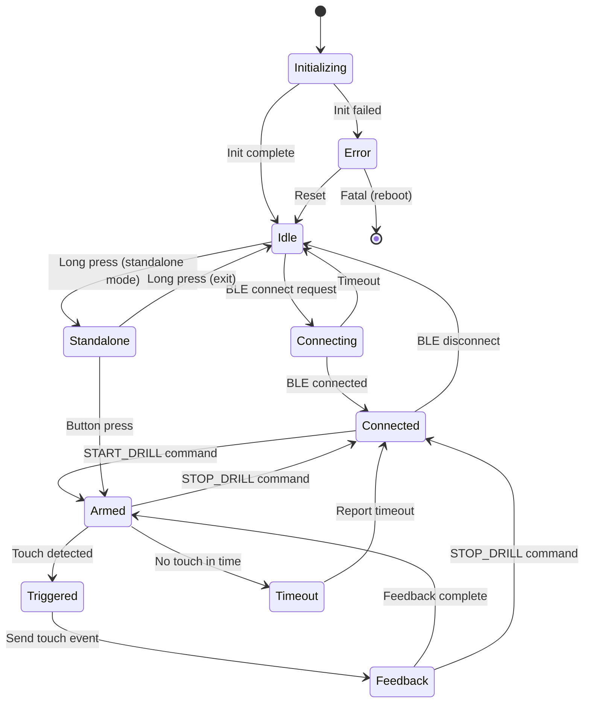
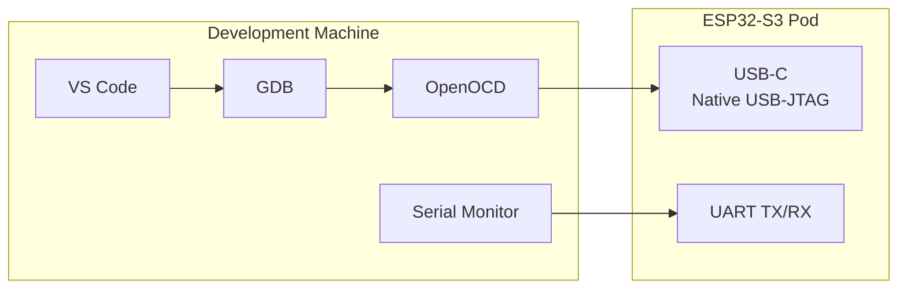
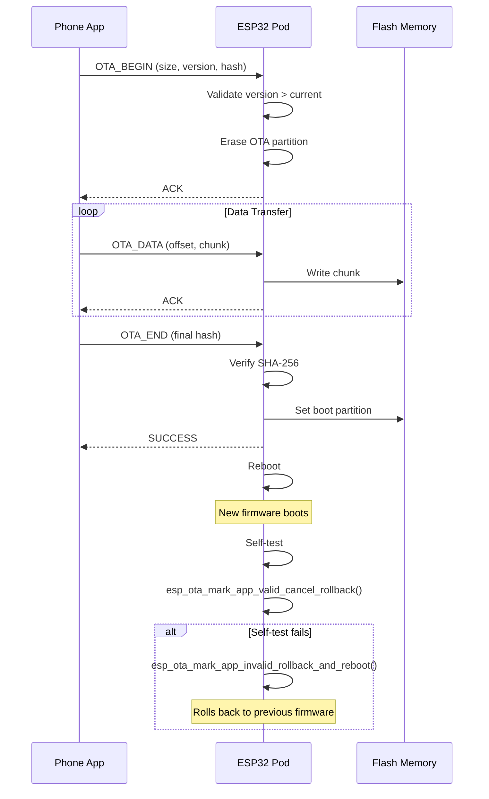

# DOMES Pod - Software Architecture Document
## Firmware Design Specification

---

## 1. EXECUTIVE SUMMARY

### 1.1 Key Decisions (TL;DR)

| Decision | Choice | Rationale |
|----------|--------|-----------|
| **RTOS** | ESP-IDF (FreeRTOS) | Best ESP32 support, vendor-maintained, production-proven |
| **Language** | C++20 (with C for drivers) | Modern features, ESP-IDF native support, your experience |
| **Build System** | ESP-IDF + CMake | Industry standard for ESP32, excellent tooling |
| **Debug** | OpenOCD + GDB via USB-JTAG | Native USB on ESP32-S3, no extra hardware |
| **OTA** | ESP-IDF OTA with rollback | Battle-tested, secure, supports anti-rollback |

### 1.2 Why NOT Alternatives

| Alternative | Why Not |
|-------------|---------|
| **Zephyr** | Incomplete ESP32-S3 support, I2C slave issues, steep learning curve, less community examples |
| **Rust (esp-rs)** | Promising but still maturing; WiFi/BLE stack not as stable as ESP-IDF; team velocity risk |
| **Baremetal** | Reinventing the wheel; ESP32 peripherals (WiFi, BLE) require OS anyway |
| **Arduino** | Limited to C++11, less control, harder to optimize power |

---

## 2. RTOS & FRAMEWORK ANALYSIS

### 2.1 Options Comparison

```
┌─────────────────────────────────────────────────────────────────────────────┐
│                        RTOS / FRAMEWORK OPTIONS                              │
├─────────────────────────────────────────────────────────────────────────────┤
│                                                                              │
│  ┌─────────────┐   ┌─────────────┐   ┌─────────────┐   ┌─────────────┐     │
│  │  ESP-IDF    │   │   Zephyr    │   │   Rust      │   │  Arduino    │     │
│  │ (FreeRTOS)  │   │   RTOS      │   │  (esp-rs)   │   │   Core      │     │
│  └──────┬──────┘   └──────┬──────┘   └──────┬──────┘   └──────┬──────┘     │
│         │                 │                 │                 │             │
│    Vendor-backed    Linux Foundation    Community       Hobbyist-focused   │
│    Production-ready Some ESP32 issues   Maturing        Limited features   │
│    Best ESP support Portable code       Memory-safe     Easy prototyping   │
│                                                                              │
└─────────────────────────────────────────────────────────────────────────────┘
```

### 2.2 Detailed Analysis

#### ESP-IDF with FreeRTOS (RECOMMENDED)

| Aspect | Assessment |
|--------|------------|
| **ESP32-S3 Support** | ✅ Excellent - first-party, all features |
| **BLE + WiFi + ESP-NOW** | ✅ Full coexistence support |
| **Documentation** | ✅ Extensive, well-maintained |
| **Community** | ✅ Large, active forums |
| **Production Use** | ✅ Millions of devices shipped |
| **Debugging** | ✅ Native USB-JTAG, OpenOCD, GDB |
| **OTA** | ✅ Built-in, secure, rollback |
| **C++ Support** | ✅ C++20 default in IDF 5.x |
| **Learning Curve** | Medium - FreeRTOS knowledge helps |

**ESP-IDF FreeRTOS Specifics:**
- Modified FreeRTOS v10.4.3 for dual-core SMP
- Tasks can be pinned to cores via `xTaskCreatePinnedToCore()`
- Protocol tasks (WiFi, BLE) run on Core 0 by default
- App tasks typically on Core 1

#### Zephyr RTOS

| Aspect | Assessment |
|--------|------------|
| **ESP32-S3 Support** | ⚠️ Partial - some drivers incomplete |
| **BLE + WiFi** | ⚠️ Works but less tested than ESP-IDF |
| **I2C Issues** | ❌ Slave mode broken on ESP32 |
| **Documentation** | ⚠️ Generic Zephyr docs, less ESP-specific |
| **Portability** | ✅ Code portable to other MCUs |
| **Learning Curve** | High - devicetree, Kconfig, West tool |

**Known Zephyr Issues on ESP32:**
- I2C slave mode not fully functional
- Only ESP32 Rev 3+ supported
- HAL based on older ESP-IDF versions
- Smaller community for ESP32-specific issues

#### Rust (esp-rs)

| Aspect | Assessment |
|--------|------------|
| **ESP32-S3 Support** | ⚠️ Good and improving rapidly |
| **esp-hal** | ✅ Unified HAL as of 2024 |
| **WiFi/BLE** | ⚠️ esp-wifi released, still maturing |
| **Memory Safety** | ✅ Rust's key advantage |
| **Production Use** | ⚠️ Some companies using (STABL Energy) |
| **Tooling** | ⚠️ probe-rs improving, not as mature |
| **Learning Curve** | High if team not Rust-proficient |

**Real-World Rust Experience:**
> "We spent a bit more time writing the software to achieve the same functionality but spent basically zero time debugging since there weren't that many bugs." - STABL Energy (2024)

**Recommendation**: Consider Rust for v2.0 after ESP-IDF prototype proves the concept.

### 2.3 Decision: ESP-IDF with FreeRTOS

**Rationale:**
1. You have FreeRTOS experience
2. Best ESP32-S3 support (first-party)
3. WiFi + BLE + ESP-NOW coexistence well-tested
4. Production-proven at scale
5. C++20 supported natively
6. Fastest path to working prototype

---

## 3. LANGUAGE CHOICE

### 3.1 Options Analysis

| Language | ESP-IDF Support | Modern Features | Safety | Team Velocity |
|----------|-----------------|-----------------|--------|---------------|
| **C (C11)** | ✅ Native | ❌ Limited | ❌ Manual | ✅ Fast |
| **C++20** | ✅ Native (IDF 5.x) | ✅ Excellent | ⚠️ Better than C | ✅ Fast |
| **Rust** | ⚠️ Via esp-rs | ✅ Excellent | ✅ Memory-safe | ⚠️ Slower initially |

### 3.2 C++20 on ESP-IDF

**Default in ESP-IDF 5.x**: Compiles with `-std=gnu++20`

**Supported Features:**
- `std::optional`, `std::variant`, `std::string_view`
- Structured bindings
- `constexpr` improvements
- `std::span` (C++20)
- Designated initializers (with limitations)
- `concepts` (C++20)
- Lambda improvements

**Limitations:**
- `<ranges>` not fully supported (GCC 13 issue)
- `<iostream>` adds ~200KB binary size (avoid)
- Some `<chrono>` features need GCC 14
- Exceptions disabled by default (enable if needed)

### 3.3 Recommended Approach: Hybrid C/C++20

```
┌─────────────────────────────────────────────────────────────────┐
│                    LANGUAGE STRATEGY                             │
├─────────────────────────────────────────────────────────────────┤
│                                                                  │
│  ┌─────────────────────────────────────────────────────────┐    │
│  │              APPLICATION LAYER (C++20)                   │    │
│  │  • Game logic, state machines                           │    │
│  │  • Protocol handlers                                     │    │
│  │  • Configuration management                              │    │
│  │  • Unit-testable business logic                         │    │
│  └─────────────────────────────────────────────────────────┘    │
│                           │                                      │
│                           ▼                                      │
│  ┌─────────────────────────────────────────────────────────┐    │
│  │              DRIVER LAYER (C with C++ wrappers)          │    │
│  │  • LED driver (thin C++ wrapper over RMT)               │    │
│  │  • Audio driver (I2S + DMA)                             │    │
│  │  • Touch driver (ESP-IDF touch API)                     │    │
│  │  • IMU driver (I2C)                                     │    │
│  │  • Haptic driver (I2C)                                  │    │
│  └─────────────────────────────────────────────────────────┘    │
│                           │                                      │
│                           ▼                                      │
│  ┌─────────────────────────────────────────────────────────┐    │
│  │              ESP-IDF APIs (C)                            │    │
│  │  • FreeRTOS                                             │    │
│  │  • ESP-NOW, BLE, WiFi                                   │    │
│  │  • NVS, OTA, Logging                                    │    │
│  └─────────────────────────────────────────────────────────┘    │
│                                                                  │
└─────────────────────────────────────────────────────────────────┘
```

### 3.4 C++20 Code Style Guidelines

```cpp
// Use modern C++ features where beneficial

// 1. std::optional for nullable returns
std::optional<TouchEvent> pollTouch();

// 2. std::span for array views (no copies)
void setLEDs(std::span<const Color> colors);

// 3. Structured bindings
auto [success, timestamp] = waitForTouch(timeout_ms);

// 4. constexpr for compile-time computation
constexpr uint32_t LED_COUNT = 16;
constexpr auto DEFAULT_COLOR = Color{255, 0, 0, 0};

// 5. enum class for type safety
enum class PodState : uint8_t {
    Idle,
    Armed,
    Triggered,
    Feedback
};

// 6. RAII wrappers for resources
class I2CTransaction {
public:
    I2CTransaction(i2c_port_t port);
    ~I2CTransaction();  // Automatically ends transaction
    // ...
};

// 7. Avoid:
// - <iostream> (use ESP_LOG macros instead)
// - Exceptions (disabled by default, use error codes)
// - RTTI (disabled by default)
// - Heavy STL containers in ISRs
```

---

## 4. ESP32-S3 SPECIFIC CONSIDERATIONS

### 4.1 Dual-Core Best Practices



**Task Pinning Recommendations:**

| Task | Core | Reason |
|------|------|--------|
| WiFi/BLE callbacks | Core 0 | ESP-IDF requirement |
| ESP-NOW TX/RX | Core 0 | Radio coexistence |
| Audio playback | Core 1 | Deterministic timing |
| Game logic | Core 1 | User-responsive |
| LED updates | Any | Low priority |
| Touch polling | Any | Interrupt-driven |
| IMU monitoring | Any | Interrupt-driven |

**Code Example:**
```cpp
// Pin audio task to Core 1 for determinism
xTaskCreatePinnedToCore(
    audioTask,          // Task function
    "audio",            // Name
    4096,               // Stack size
    nullptr,            // Parameters
    configMAX_PRIORITIES - 1,  // High priority
    &audioTaskHandle,   // Handle
    1                   // Core 1 (APP CPU)
);

// Let LED task float between cores
xTaskCreate(
    ledTask,
    "led",
    2048,
    nullptr,
    5,                  // Medium priority
    &ledTaskHandle
);
```

### 4.2 RF Coexistence (WiFi + BLE + ESP-NOW)

**The Problem:** Single 2.4GHz radio shared by WiFi, BLE, and ESP-NOW.

**Solution: Time-Division Multiplexing**

```
┌──────────────────────────────────────────────────────────┐
│                COEXISTENCE TIME SLICING                   │
├──────────────────────────────────────────────────────────┤
│                                                           │
│  Time ──────────────────────────────────────────────►    │
│                                                           │
│  ┌─────────┬─────────┬─────────┬─────────┬─────────┐    │
│  │  WiFi   │   BT    │   BLE   │  WiFi   │   BT    │    │
│  │  Slice  │  Slice  │  Slice  │  Slice  │  Slice  │    │
│  └─────────┴─────────┴─────────┴─────────┴─────────┘    │
│                                                           │
│  ESP-NOW uses WiFi time slices                           │
│                                                           │
└──────────────────────────────────────────────────────────┘
```

**Configuration Requirements:**

```cpp
// 1. Enable software coexistence
// In menuconfig: Component config → Wi-Fi → Software controls WiFi/Bluetooth coexistence

// 2. Use APSTA mode for best coexistence
esp_wifi_set_mode(WIFI_MODE_APSTA);

// 3. Configure BLE scan parameters to not starve WiFi
esp_ble_gap_set_scan_params(&scan_params);
// scan_window < scan_interval (e.g., window=0x10, interval=0x80)

// 4. Set coexistence preference
esp_coex_preference_set(ESP_COEX_PREFER_BALANCE);
// Options: ESP_COEX_PREFER_WIFI, ESP_COEX_PREFER_BT, ESP_COEX_PREFER_BALANCE
```

**Tested Working Configuration:**
> "espnow and ble and wifi (STA mode only) can all co-exist and are stable" - ESP32 Forum

### 4.3 Memory Considerations

**ESP32-S3-WROOM-1-N16R8:**
- 16MB Flash
- 8MB PSRAM (octal SPI)
- 512KB SRAM

**Memory Map:**
```
┌─────────────────────────────────────────┐
│              FLASH (16MB)               │
├─────────────────────────────────────────┤
│ Bootloader (32KB)                       │
│ Partition Table (4KB)                   │
│ NVS - Config storage (24KB)             │
│ OTA Data (8KB)                          │
│ OTA_0 - Firmware A (4MB)                │
│ OTA_1 - Firmware B (4MB)                │
│ SPIFFS - Audio samples (6MB)            │
│ Factory - Recovery image (2MB)          │
└─────────────────────────────────────────┘

┌─────────────────────────────────────────┐
│              PSRAM (8MB)                │
├─────────────────────────────────────────┤
│ Audio buffers                           │
│ Large data structures                   │
│ Heap overflow                           │
└─────────────────────────────────────────┘

┌─────────────────────────────────────────┐
│              SRAM (512KB)               │
├─────────────────────────────────────────┤
│ Stack (per task)                        │
│ Static variables                        │
│ Heap (default)                          │
│ DMA buffers (must be in SRAM)           │
└─────────────────────────────────────────┘
```

**Key Considerations:**
- DMA buffers (I2S audio, SPI) must be in internal SRAM
- PSRAM access is slower (use for non-critical data)
- WiFi/BLE stacks use significant SRAM (~50-80KB)

### 4.4 Power Management

```cpp
// Light sleep - CPU paused, peripherals active, fast wake
esp_pm_config_esp32s3_t pm_config = {
    .max_freq_mhz = 240,
    .min_freq_mhz = 80,
    .light_sleep_enable = true
};
esp_pm_configure(&pm_config);

// Deep sleep - everything off except RTC, slowest wake
esp_sleep_enable_touchpad_wakeup();  // Wake on touch
esp_deep_sleep_start();
```

---

## 5. SOFTWARE ARCHITECTURE

### 5.1 High-Level Architecture



### 5.2 Directory Structure

```
firmware/
├── CMakeLists.txt
├── sdkconfig.defaults          # Default menuconfig options
├── partitions.csv              # Flash partition table
│
├── main/
│   ├── CMakeLists.txt
│   ├── main.cpp                # Entry point
│   ├── config.hpp              # Pin definitions, constants
│   │
│   ├── infra/                      # Infrastructure services
│   │   ├── logging.hpp             # ESP_LOG wrappers, log tags
│   │   ├── nvsConfig.hpp/cpp       # NVS-backed configuration storage
│   │   ├── taskConfig.hpp          # Task configuration (priority, stack, core)
│   │   ├── taskManager.hpp/cpp     # FreeRTOS task lifecycle management
│   │   └── watchdog.hpp/cpp        # Task Watchdog Timer (TWDT) management
│   │
│   ├── interfaces/                 # Abstract interfaces for dependency injection
│   │   ├── iConfigStorage.hpp      # Configuration storage interface
│   │   ├── iLedDriver.hpp          # LED driver interface
│   │   └── iTaskRunner.hpp         # Runnable task interface
│   │
│   ├── drivers/
│   │   ├── led_driver.hpp/cpp      # SK6812 control
│   │   ├── audio_driver.hpp/cpp    # I2S audio
│   │   ├── haptic_driver.hpp/cpp   # DRV2605L
│   │   ├── touch_driver.hpp/cpp    # Capacitive + IMU
│   │   ├── imu_driver.hpp/cpp      # LIS2DW12
│   │   └── power_driver.hpp/cpp    # Battery, sleep
│   │
│   ├── services/
│   │   ├── feedback_service.hpp/cpp    # Coordinated feedback
│   │   ├── comm_service.hpp/cpp        # BLE + ESP-NOW
│   │   ├── timing_service.hpp/cpp      # Clock sync
│   │   └── config_service.hpp/cpp      # NVS persistence
│   │
│   ├── game/
│   │   ├── game_engine.hpp/cpp     # Main game logic
│   │   ├── drill_manager.hpp/cpp   # Drill definitions
│   │   ├── state_machine.hpp/cpp   # Pod states
│   │   └── protocol.hpp/cpp        # Message encoding
│   │
│   └── utils/
│       ├── mutex.hpp               # RAII FreeRTOS mutex wrapper
│       ├── error_codes.hpp         # Error definitions
│       └── ring_buffer.hpp         # Lock-free buffer
│
├── components/
│   ├── esp_now_wrapper/            # ESP-NOW C++ wrapper
│   ├── ble_wrapper/                # BLE C++ wrapper
│   └── audio_samples/              # SPIFFS audio files
│
├── test/
│   ├── test_touch.cpp
│   ├── test_espnow_latency.cpp
│   ├── test_audio.cpp
│   └── ...
│
└── tools/
    ├── flash_factory.sh            # Production flash script
    ├── generate_samples.py         # Audio sample generator
    └── analyze_coredump.py         # Core dump decoder
```

### 5.3 Task Architecture

```cpp
// Task priorities (higher = more important)
constexpr UBaseType_t PRIORITY_CRITICAL = configMAX_PRIORITIES - 1;  // 24
constexpr UBaseType_t PRIORITY_HIGH     = 15;
constexpr UBaseType_t PRIORITY_MEDIUM   = 10;
constexpr UBaseType_t PRIORITY_LOW      = 5;
constexpr UBaseType_t PRIORITY_IDLE     = 0;

// Task definitions
struct TaskConfig {
    const char* name;
    uint32_t stack_size;
    UBaseType_t priority;
    BaseType_t core;  // 0, 1, or tskNO_AFFINITY
};

constexpr TaskConfig TASKS[] = {
    {"audio",     4096,  PRIORITY_CRITICAL, 1},              // Core 1, highest
    {"esp_now",   4096,  PRIORITY_HIGH,     0},              // Core 0 (radio)
    {"ble",       4096,  PRIORITY_HIGH,     0},              // Core 0 (radio)
    {"game",      8192,  PRIORITY_MEDIUM,   1},              // Core 1
    {"feedback",  4096,  PRIORITY_MEDIUM,   tskNO_AFFINITY}, // Either
    {"led",       2048,  PRIORITY_LOW,      tskNO_AFFINITY}, // Either
    {"touch",     2048,  PRIORITY_HIGH,     tskNO_AFFINITY}, // Interrupt-driven
};
```

### 5.4 State Machine



---

## 6. COMMUNICATION PROTOCOL

### 6.1 ESP-NOW Message Format

```cpp
// Maximum ESP-NOW payload: 250 bytes
// Keep messages small for <1ms latency

#pragma pack(push, 1)

struct MessageHeader {
    uint8_t  version;       // Protocol version
    uint8_t  type;          // Message type
    uint16_t sequence;      // For ordering/dedup
    uint32_t timestamp_us;  // Microsecond timestamp
};

enum class MessageType : uint8_t {
    // Control (Master → Pod)
    SYNC_CLOCK      = 0x01,
    SET_COLOR       = 0x02,
    ARM_TOUCH       = 0x03,
    PLAY_SOUND      = 0x04,
    HAPTIC_PULSE    = 0x05,
    STOP_ALL        = 0x06,

    // Events (Pod → Master)
    TOUCH_EVENT     = 0x10,
    TIMEOUT_EVENT   = 0x11,
    STATUS_REPORT   = 0x12,
    ERROR_REPORT    = 0x13,

    // System
    OTA_BEGIN       = 0x20,
    OTA_DATA        = 0x21,
    OTA_END         = 0x22,
    REBOOT          = 0x2F,
};

struct SetColorMsg {
    MessageHeader header;
    uint8_t r, g, b, w;
    uint16_t duration_ms;
    uint8_t transition;  // 0=instant, 1=fade
};

struct TouchEventMsg {
    MessageHeader header;
    uint8_t pod_id;
    uint32_t reaction_time_us;
    uint8_t touch_strength;  // 0-255
};

#pragma pack(pop)
```

### 6.2 BLE Service Definition

```cpp
// Custom GATT Service for DOMES
// Service UUID: 0x1234xxxx-0000-1000-8000-00805F9B34FB (custom base)

constexpr uint16_t DOMES_SERVICE_UUID        = 0x1234;
constexpr uint16_t CHAR_POD_STATUS_UUID      = 0x1235;  // Read, Notify
constexpr uint16_t CHAR_DRILL_CONTROL_UUID   = 0x1236;  // Write
constexpr uint16_t CHAR_TOUCH_EVENT_UUID     = 0x1237;  // Notify
constexpr uint16_t CHAR_CONFIG_UUID          = 0x1238;  // Read, Write
constexpr uint16_t CHAR_OTA_CONTROL_UUID     = 0x1239;  // Write (OTA commands)
constexpr uint16_t CHAR_OTA_DATA_UUID        = 0x123A;  // Write (OTA data)
```

---

## 7. DEBUGGING & DEVELOPMENT

### 7.1 Debug Setup



### 7.2 VS Code Configuration

**`.vscode/launch.json`:**
```json
{
    "version": "0.2.0",
    "configurations": [
        {
            "name": "ESP-IDF Debug",
            "type": "espidf",
            "request": "launch",
            "mode": "auto",
            "debugPort": 9998,
            "initGdbCommands": [
                "target remote :3333",
                "set remote hardware-watchpoint-limit 2",
                "mon reset halt",
                "maintenance flush register-cache",
                "thb app_main",
                "c"
            ],
            "env": {
                "IDF_PATH": "${config:idf.espIdfPath}"
            }
        }
    ]
}
```

**`.vscode/settings.json`:**
```json
{
    "idf.port": "/dev/ttyUSB0",
    "idf.flashType": "UART",
    "idf.openOcdDebugLevel": 2,
    "C_Cpp.default.compilerPath": "${config:idf.toolsPath}/xtensa-esp32s3-elf/bin/xtensa-esp32s3-elf-gcc"
}
```

### 7.3 ESP32-S3 Native USB-JTAG

**Advantage:** No external debugger needed!

```cpp
// ESP32-S3 has built-in USB-JTAG on GPIO19/20
// Enable in menuconfig:
// Component config → ESP System Settings → Channel for console output → USB Serial/JTAG Controller
```

**OpenOCD Command (auto-started by VS Code):**
```bash
openocd -f board/esp32s3-builtin.cfg
```

### 7.4 Logging Strategy

```cpp
// Use ESP-IDF logging macros (not iostream!)
#include "esp_log.h"

static const char* TAG = "touch";

// Log levels: Error, Warn, Info, Debug, Verbose
ESP_LOGE(TAG, "Touch init failed: %s", esp_err_to_name(err));
ESP_LOGW(TAG, "Touch threshold adjusted to %d", new_threshold);
ESP_LOGI(TAG, "Touch detected on pad %d", pad_num);
ESP_LOGD(TAG, "Raw touch value: %d", raw_value);
ESP_LOGV(TAG, "Touch ISR triggered");

// Configure log level per tag in menuconfig or at runtime:
esp_log_level_set("touch", ESP_LOG_DEBUG);
esp_log_level_set("*", ESP_LOG_INFO);  // Default for all
```

### 7.5 Core Dump Configuration

```cpp
// menuconfig settings:
// Component config → Core dump → Core dump destination → Flash
// Component config → ESP System Settings → Panic handler → Print registers and reboot

// After crash, retrieve core dump:
// idf.py coredump-info
// idf.py coredump-debug

// Decode in GDB:
// espcoredump.py info_corefile --gdb /path/to/xtensa-esp32s3-elf-gdb build/domes.elf core.bin
```

---

## 8. OTA UPDATE SYSTEM

### 8.1 Partition Layout

```
# partitions.csv
# Name,    Type, SubType,  Offset,   Size,    Flags
nvs,       data, nvs,      0x9000,   0x6000,
otadata,   data, ota,      0xf000,   0x2000,
ota_0,     app,  ota_0,    0x20000,  0x400000,
ota_1,     app,  ota_1,    0x420000, 0x400000,
spiffs,    data, spiffs,   0x820000, 0x600000,
factory,   app,  factory,  0xE20000, 0x1E0000,
```

### 8.2 OTA Flow



### 8.3 OTA Security

```cpp
// Enable in menuconfig:
// Security features → Enable signed app verification

// Generate signing keys:
// espsecure.py generate_signing_key --version 2 secure_boot_signing_key.pem

// Sign firmware:
// espsecure.py sign_data --version 2 --keyfile secure_boot_signing_key.pem build/domes.bin

// Anti-rollback (optional, uses eFuse):
// Security features → Enable anti-rollback
```

### 8.4 OTA Code Implementation

```cpp
#include "esp_ota_ops.h"
#include "esp_https_ota.h"

class OTAManager {
public:
    esp_err_t beginUpdate(size_t image_size) {
        partition_ = esp_ota_get_next_update_partition(nullptr);
        if (!partition_) return ESP_ERR_NOT_FOUND;

        esp_err_t err = esp_ota_begin(partition_, image_size, &handle_);
        if (err != ESP_OK) {
            ESP_LOGE(TAG, "OTA begin failed: %s", esp_err_to_name(err));
        }
        return err;
    }

    esp_err_t writeChunk(const uint8_t* data, size_t len) {
        return esp_ota_write(handle_, data, len);
    }

    esp_err_t finishUpdate() {
        esp_err_t err = esp_ota_end(handle_);
        if (err != ESP_OK) return err;

        err = esp_ota_set_boot_partition(partition_);
        if (err != ESP_OK) return err;

        ESP_LOGI(TAG, "OTA complete, rebooting...");
        esp_restart();
        return ESP_OK;  // Never reached
    }

private:
    static constexpr const char* TAG = "ota";
    const esp_partition_t* partition_ = nullptr;
    esp_ota_handle_t handle_ = 0;
};
```

---

## 9. WATCHDOG & CRASH HANDLING

### 9.1 Watchdog Configuration

```cpp
// Task Watchdog (TWDT) - monitors task execution
// menuconfig: Component config → ESP System Settings → Task Watchdog

#include "esp_task_wdt.h"

// Subscribe a task to watchdog
esp_task_wdt_add(xTaskGetCurrentTaskHandle());

// Feed the watchdog in your task loop
void myTask(void* param) {
    while (true) {
        // Do work...
        esp_task_wdt_reset();  // Feed the dog
        vTaskDelay(pdMS_TO_TICKS(10));
    }
}

// Unsubscribe when task ends
esp_task_wdt_delete(xTaskGetCurrentTaskHandle());
```

### 9.2 Panic Handler Configuration

```cpp
// menuconfig:
// Component config → ESP System Settings → Panic handler behavior
//   → Print registers and reboot (recommended for production)
//   → Invoke GDBStub (for debugging)

// Enable core dump to flash:
// Component config → Core Dump → Data destination → Flash
```

### 9.3 Custom Watchdog Handler

```cpp
// Optional: Custom handler for watchdog timeout
extern "C" void esp_task_wdt_isr_user_handler(void) {
    // WARNING: This is in ISR context!
    // Cannot use ESP_LOG, malloc, or blocking calls

    // Example: Set a flag for post-mortem analysis
    // The system will still reset after this
}
```

---

## 10. SMOKE TESTS & VALIDATION

### 10.1 Smoke Test Suite

```cpp
// test/smoke_test.cpp
// Run before every release

namespace smoke_test {

// Test 1: Basic hardware functionality
bool test_led_ring() {
    led_driver::init();
    led_driver::setAll(Color::RED);
    vTaskDelay(pdMS_TO_TICKS(100));
    led_driver::setAll(Color::GREEN);
    vTaskDelay(pdMS_TO_TICKS(100));
    led_driver::setAll(Color::BLUE);
    vTaskDelay(pdMS_TO_TICKS(100));
    led_driver::setAll(Color::OFF);
    return true;  // Visual verification
}

// Test 2: Touch detection
bool test_touch() {
    touch_driver::init();
    ESP_LOGI(TAG, "Touch the pad within 5 seconds...");

    auto event = touch_driver::waitForTouch(5000);
    if (!event) {
        ESP_LOGE(TAG, "No touch detected!");
        return false;
    }
    ESP_LOGI(TAG, "Touch detected! Strength: %d", event->strength);
    return true;
}

// Test 3: Audio output
bool test_audio() {
    audio_driver::init();
    audio_driver::playTone(1000, 500);  // 1kHz for 500ms
    return true;  // Audible verification
}

// Test 4: Haptic feedback
bool test_haptic() {
    haptic_driver::init();
    haptic_driver::playEffect(DRV2605_EFFECT_STRONG_CLICK);
    return true;  // Tactile verification
}

// Test 5: ESP-NOW latency
bool test_espnow_latency() {
    // Requires second device
    espnow::init();

    uint32_t total_us = 0;
    constexpr int ITERATIONS = 100;

    for (int i = 0; i < ITERATIONS; i++) {
        uint32_t start = esp_timer_get_time();
        espnow::sendPing(PEER_MAC);
        espnow::waitForPong(100);  // 100ms timeout
        uint32_t end = esp_timer_get_time();
        total_us += (end - start);
    }

    uint32_t avg_us = total_us / ITERATIONS;
    ESP_LOGI(TAG, "ESP-NOW avg RTT: %lu us", avg_us);

    return avg_us < 2000;  // Pass if < 2ms
}

// Test 6: BLE connectivity
bool test_ble() {
    ble::init();
    ble::startAdvertising();

    ESP_LOGI(TAG, "Connect via nRF Connect within 30 seconds...");
    bool connected = ble::waitForConnection(30000);

    if (!connected) {
        ESP_LOGE(TAG, "No BLE connection!");
        return false;
    }

    ESP_LOGI(TAG, "BLE connected!");
    return true;
}

// Test 7: NVS read/write
bool test_nvs() {
    nvs_handle_t handle;
    esp_err_t err = nvs_open("test", NVS_READWRITE, &handle);
    if (err != ESP_OK) return false;

    uint32_t test_val = 0xDEADBEEF;
    err = nvs_set_u32(handle, "test_key", test_val);
    if (err != ESP_OK) return false;

    uint32_t read_val = 0;
    err = nvs_get_u32(handle, "test_key", &read_val);
    nvs_close(handle);

    return (err == ESP_OK && read_val == test_val);
}

// Test 8: Power measurement
bool test_power() {
    power_driver::init();
    float voltage = power_driver::getBatteryVoltage();
    float percentage = power_driver::getBatteryPercentage();

    ESP_LOGI(TAG, "Battery: %.2fV (%.0f%%)", voltage, percentage);

    return voltage > 3.0f && voltage < 4.3f;  // Sane range
}

// Run all smoke tests
void runAll() {
    struct TestCase {
        const char* name;
        bool (*func)();
    };

    TestCase tests[] = {
        {"LED Ring", test_led_ring},
        {"Touch", test_touch},
        {"Audio", test_audio},
        {"Haptic", test_haptic},
        {"ESP-NOW", test_espnow_latency},
        {"BLE", test_ble},
        {"NVS", test_nvs},
        {"Power", test_power},
    };

    int passed = 0, failed = 0;

    for (const auto& test : tests) {
        ESP_LOGI(TAG, "Running: %s", test.name);
        bool result = test.func();
        if (result) {
            ESP_LOGI(TAG, "  ✓ PASS");
            passed++;
        } else {
            ESP_LOGE(TAG, "  ✗ FAIL");
            failed++;
        }
    }

    ESP_LOGI(TAG, "Results: %d passed, %d failed", passed, failed);
}

}  // namespace smoke_test
```

### 10.2 Production Test Mode

```cpp
// Enter production test mode via:
// 1. Hold button during boot
// 2. Special BLE command
// 3. Serial command

void productionTestMode() {
    ESP_LOGI(TAG, "=== PRODUCTION TEST MODE ===");

    // Run automated tests
    smoke_test::runAll();

    // Wait for manual verification
    ESP_LOGI(TAG, "Press button to indicate PASS, or wait 30s for FAIL");

    if (waitForButtonPress(30000)) {
        // Mark device as tested in NVS
        nvs_set_u8(handle, "prod_test", 1);
        led_driver::setAll(Color::GREEN);  // Visual pass indicator
    } else {
        led_driver::setAll(Color::RED);    // Visual fail indicator
    }
}
```

---

## 11. BUILD & FLASH PROCEDURES

### 11.1 Development Build

```bash
# Setup ESP-IDF environment
. $IDF_PATH/export.sh

# Configure (first time or after changes)
idf.py set-target esp32s3
idf.py menuconfig

# Build
idf.py build

# Flash and monitor
idf.py -p /dev/ttyUSB0 flash monitor

# Just monitor (Ctrl+] to exit)
idf.py -p /dev/ttyUSB0 monitor
```

### 11.2 Production Flash Script

```bash
#!/bin/bash
# tools/flash_factory.sh

set -e

PORT=${1:-/dev/ttyUSB0}
FIRMWARE="build/domes.bin"
BOOTLOADER="build/bootloader/bootloader.bin"
PARTITION_TABLE="build/partition_table/partition-table.bin"

echo "=== DOMES Production Flash ==="
echo "Port: $PORT"

# Erase flash completely (optional, for clean slate)
# esptool.py --port $PORT erase_flash

# Flash all components
esptool.py --port $PORT \
    --baud 921600 \
    --chip esp32s3 \
    write_flash \
    --flash_mode dio \
    --flash_freq 80m \
    --flash_size 16MB \
    0x0 $BOOTLOADER \
    0x8000 $PARTITION_TABLE \
    0x20000 $FIRMWARE

echo "=== Flash complete ==="

# Optional: Enter test mode
# idf.py -p $PORT monitor
```

### 11.3 OTA Update Script

```bash
#!/bin/bash
# tools/ota_update.sh

# For testing OTA via HTTP server
FIRMWARE="build/domes.bin"
PORT=8080

echo "Starting OTA server on port $PORT..."
echo "Point device to: http://$(hostname -I | awk '{print $1}'):$PORT/domes.bin"

# Simple HTTP server
python3 -m http.server $PORT --directory build/
```

---

## 12. APPENDIX

### A. Recommended menuconfig Settings

```
# sdkconfig.defaults

# Compiler
CONFIG_COMPILER_OPTIMIZATION_PERF=y
CONFIG_COMPILER_CXX_EXCEPTIONS=n
CONFIG_COMPILER_CXX_RTTI=n
CONFIG_COMPILER_STACK_CHECK_MODE_STRONG=y

# FreeRTOS
CONFIG_FREERTOS_HZ=1000
CONFIG_FREERTOS_TIMER_TASK_STACK_DEPTH=3072

# ESP System
CONFIG_ESP_TASK_WDT_TIMEOUT_S=10
CONFIG_ESP_TASK_WDT_CHECK_IDLE_TASK_CPU0=y
CONFIG_ESP_TASK_WDT_CHECK_IDLE_TASK_CPU1=y

# Core Dump
CONFIG_ESP_COREDUMP_ENABLE_TO_FLASH=y
CONFIG_ESP_COREDUMP_DATA_FORMAT_ELF=y
CONFIG_ESP_COREDUMP_CHECKSUM_SHA256=y

# Log Level
CONFIG_LOG_DEFAULT_LEVEL_INFO=y
CONFIG_LOG_MAXIMUM_LEVEL_DEBUG=y

# Power Management
CONFIG_PM_ENABLE=y
CONFIG_PM_POWER_DOWN_CPU_IN_LIGHT_SLEEP=y

# WiFi / BLE
CONFIG_ESP32_WIFI_SW_COEXIST_ENABLE=y
CONFIG_BT_ENABLED=y
CONFIG_BT_NIMBLE_ENABLED=y

# Partition Table
CONFIG_PARTITION_TABLE_CUSTOM=y
CONFIG_PARTITION_TABLE_CUSTOM_FILENAME="partitions.csv"
```

### B. Reference Links

**ESP-IDF Documentation:**
- [FreeRTOS SMP](https://docs.espressif.com/projects/esp-idf/en/latest/esp32/api-guides/freertos-smp.html)
- [C++ Support](https://docs.espressif.com/projects/esp-idf/en/latest/esp32/api-guides/cplusplus.html)
- [RF Coexistence](https://docs.espressif.com/projects/esp-idf/en/stable/esp32/api-guides/coexist.html)
- [OTA Updates](https://docs.espressif.com/projects/esp-idf/en/latest/esp32/api-reference/system/ota.html)
- [Core Dump](https://docs.espressif.com/projects/esp-idf/en/latest/esp32/api-guides/core_dump.html)
- [JTAG Debugging](https://docs.espressif.com/projects/esp-idf/en/latest/esp32/api-guides/jtag-debugging/index.html)

**Rust on ESP32 (for future reference):**
- [esp-rs GitHub](https://github.com/esp-rs/awesome-esp-rust)
- [STABL Energy Case Study](https://blog.lohr.dev/embedded-rust)

**Community:**
- [ESP32 Forum](https://esp32.com/)
- [ESP-IDF GitHub Issues](https://github.com/espressif/esp-idf/issues)

---

*Document Created: 2026-01-03*
*Project: DOMES*
*Status: Draft for Review*
