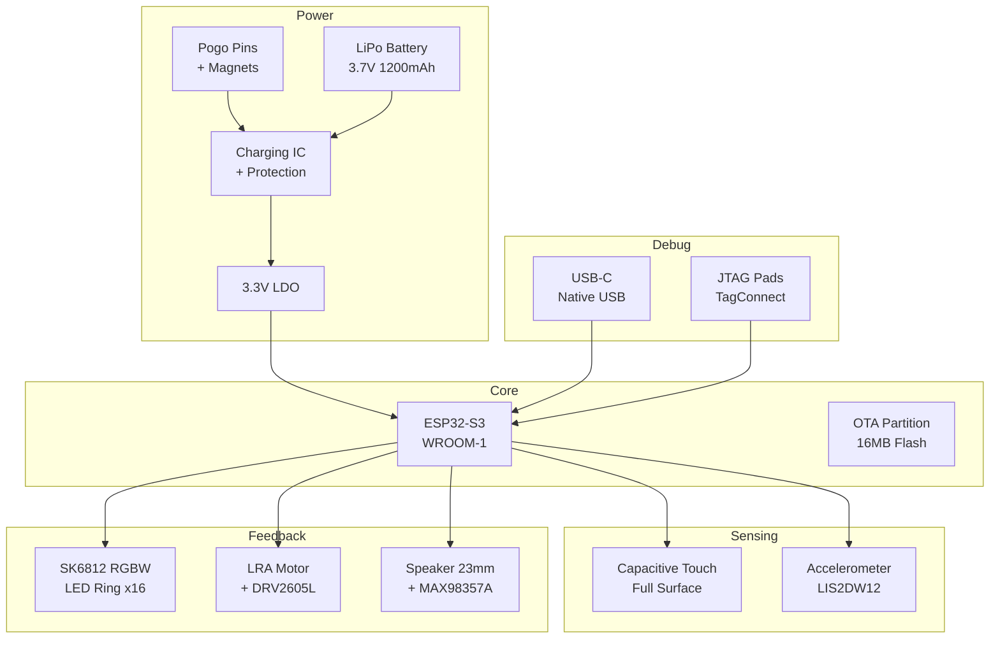
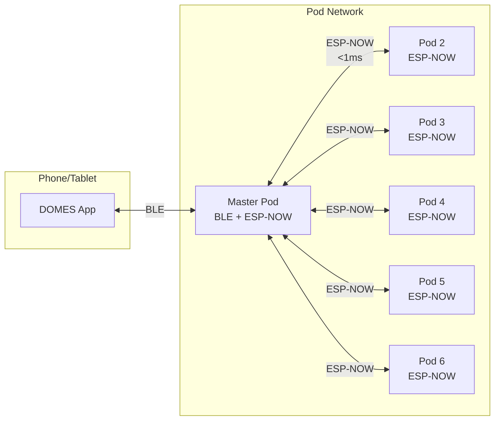
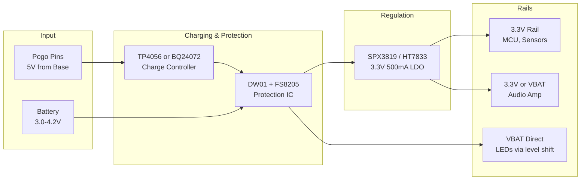
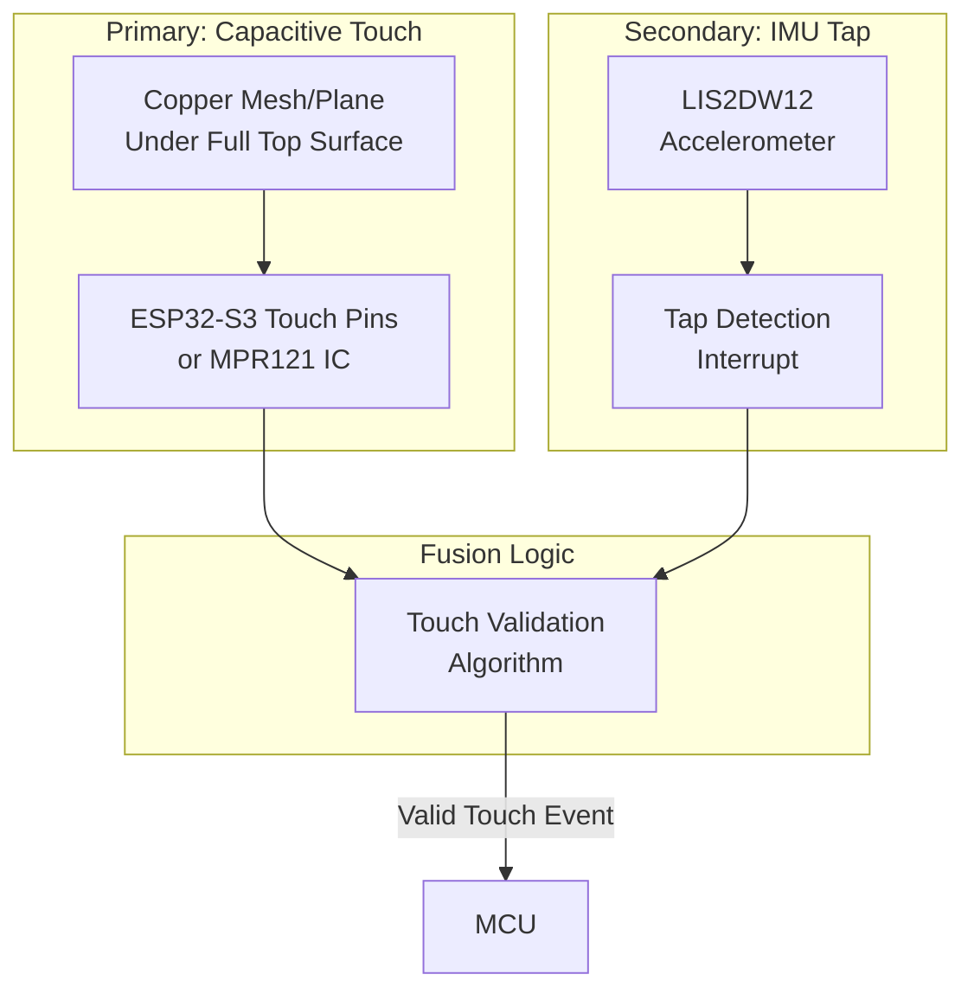
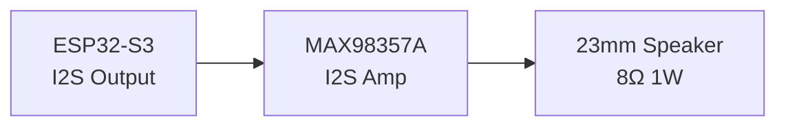
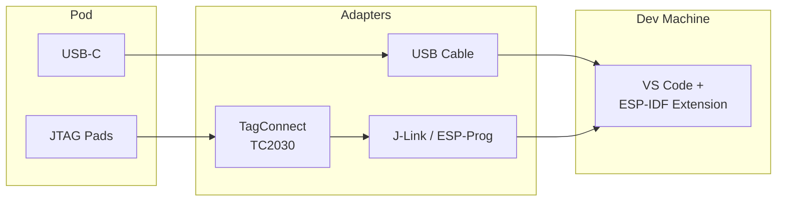
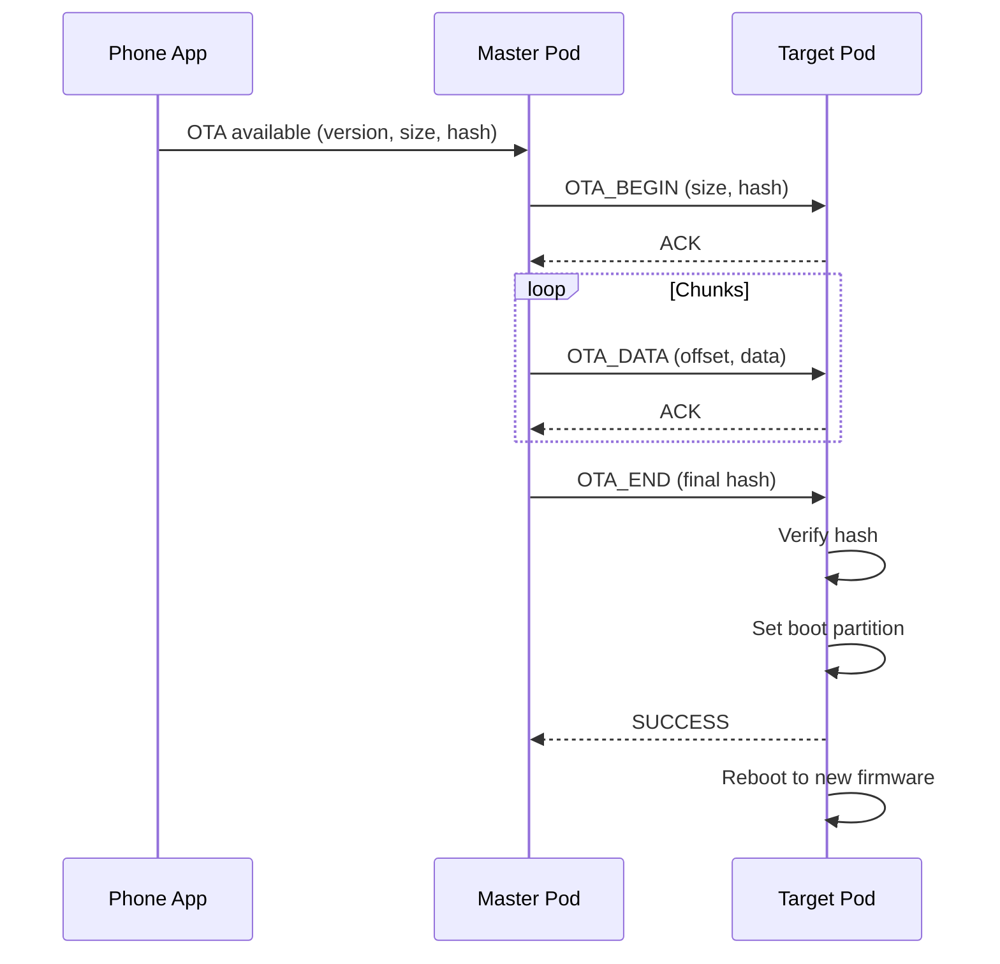

# DOMES Pod - System Architecture Document
## Hardware & Firmware Design Specification

---

## 1. SYSTEM OVERVIEW

### 1.1 Design Philosophy
- **Single PCB**: All components on one board
- **Simple Assembly**: Connect battery, close case, done
- **Full Debugability**: Prototype must be an excellent development platform
- **Production Ready**: Design for manufacturability from day one

### 1.2 High-Level Block Diagram



---

## 1.3 Development Board Variants

The firmware supports multiple hardware platforms during development:

| Platform | Form Factor | Features | Primary Use |
|----------|-------------|----------|-------------|
| **ESP32-S3-DevKitC-1** | Bare dev board | 1x WS2812 LED, USB, GPIO access | Initial bring-up, CI testing |
| **NFF Development Board** | Custom PCB + DevKit | 16x SK6812 RGBW, LIS2DW12 IMU, DRV2605L haptics, MAX98357A audio, speaker | Full feature development |
| **Production PCB** | Integrated (planned) | All features in final enclosure | End-user devices |

### NFF Development Board

The NFF devboard is the primary platform for feature development. It provides all sensors and actuators from the production design in a development-friendly form factor.

**Key Differences from DevKitC-1:**
- 16x SK6812MINI-E RGBW LEDs (vs 1x WS2812 on DevKit)
- LED data on GPIO48 via level shifter (vs GPIO38 direct on DevKit v1.1)
- LIS2DW12 accelerometer on I2C bus
- DRV2605L haptic driver on I2C bus
- MAX98357A I2S audio amplifier with 23mm speaker
- GPIO breakouts at corners for expansion

**Pin Mapping (NFF Devboard):**
| Function | GPIO | Notes |
|----------|------|-------|
| LED Data | 48 | Via SN74AHCT1G125 level shifter |
| I2C SDA | 8 | Shared: LIS2DW12, DRV2605L |
| I2C SCL | 9 | Shared: LIS2DW12, DRV2605L |
| IMU INT1 | 3 | Accelerometer interrupt |
| I2S BCLK | 12 | Audio bit clock |
| I2S LRCLK | 11 | Audio word select |
| I2S DATA | 10 | Audio data out |
| Audio SD | 13 | Amplifier shutdown |

See [`hardware/nff-devboard/README.md`](../hardware/nff-devboard/README.md) for full specifications and fabrication files.

---

## 2. CONNECTIVITY ARCHITECTURE

### 2.1 Protocol Options Analysis

| Protocol | Latency | Range | Max Nodes | Power | Phone Compat | Complexity |
|----------|---------|-------|-----------|-------|--------------|------------|
| **ESP-NOW** | <1ms | 100m+ | 20 peers | Low | ❌ Needs bridge | Low |
| **BLE Point-to-Point** | 15-40ms | 40m | 7 connections | Medium | ✅ Native | Low |
| **BLE Mesh** | 50-200ms+ | Unlimited (hops) | 32,767 | High | ⚠️ Proxy needed | High |
| **WiFi Direct** | 5-10ms | 50m | ~8 | High | ⚠️ Complex | Medium |

### 2.2 Recommended Architecture: Hybrid ESP-NOW + BLE



**Rationale:**
- Phone connects via standard BLE to one "master" pod
- Master pod relays commands to other pods via ESP-NOW
- ESP-NOW delivers <1ms latency for synchronized lighting/timing
- Any pod can be master (user selects in app, or auto-elect)
- Fallback: All pods can connect directly via BLE if needed

### 2.3 Communication Protocol Design

```
┌─────────────────────────────────────────────────────────┐
│                    PACKET STRUCTURE                      │
├─────────────────────────────────────────────────────────┤
│ Header (2B) │ Cmd (1B) │ Target (1B) │ Payload (≤20B)  │
├─────────────────────────────────────────────────────────┤
│ Commands:                                                │
│   0x01 - SET_COLOR (RGB, duration)                      │
│   0x02 - PLAY_SOUND (sound_id, volume)                  │
│   0x03 - HAPTIC_PULSE (pattern_id, intensity)           │
│   0x04 - ARM_TOUCH (timeout_ms, callback_mode)          │
│   0x05 - TOUCH_EVENT (pod_id, timestamp_us, force)      │
│   0x06 - SYNC_CLOCK (master_timestamp)                  │
│   0x07 - OTA_BEGIN / OTA_DATA / OTA_END                 │
└─────────────────────────────────────────────────────────┘
```

### 2.4 Synchronization Strategy

For reaction time accuracy:
- Master broadcasts `SYNC_CLOCK` every 100ms
- Pods maintain local offset from master
- Touch events include microsecond timestamps
- Target accuracy: ±1ms across all pods

---

## 3. POWER ARCHITECTURE

### 3.1 Battery Selection

| Option | Capacity | Size | Weight | Replaceability | Cost | Recommendation |
|--------|----------|------|--------|----------------|------|----------------|
| **LiPo Pouch 103040** | 1200mAh | 40x30x10mm | 25g | ❌ Soldered | $3-5 | ✅ **Selected** |
| **LiPo Pouch 804030** | 1000mAh | 40x30x8mm | 20g | ❌ Soldered | $3-5 | Alternative |
| **18650 Cell** | 2500-3000mAh | 65x18mm | 45g | ✅ User-swap | $3-5 | Too tall |

**Selected: 103040 LiPo (1200mAh)**
- Fits form factor (40x30x10mm in 110mm hex puck)
- 8+ hours runtime achievable
- Thin enough for low-profile design

### 3.2 Power Budget Analysis

| Component | Active (mA) | Sleep (µA) | Duty Cycle | Avg (mA) |
|-----------|-------------|------------|------------|----------|
| ESP32-S3 (CPU active) | 80 | - | 10% | 8.0 |
| ESP32-S3 (radio TX) | 240 | - | 5% | 12.0 |
| ESP32-S3 (light sleep) | 2000µA | 130 | 85% | 1.7 |
| LEDs (16x SK6812 @ 50%) | 160 | 0 | 30% | 48.0 |
| Accelerometer (LIS2DW12) | 0.05 | 1 | 100% | 0.05 |
| Haptic Driver (DRV2605L) | 0.25 | 2 | 1% | 0.01 |
| LRA Motor (active) | 100 | 0 | 2% | 2.0 |
| Audio Amp (MAX98357A) | 2.4 | 0.01 | 10% | 0.24 |
| Speaker (1W active) | 300 | 0 | 5% | 15.0 |
| LDO Quiescent | - | 4 | 100% | 0.004 |
| **TOTAL (Active Training)** | - | - | - | **~87 mA** |
| **TOTAL (Idle/Armed)** | - | - | - | **~5 mA** |

**Runtime Estimates:**
- Active training: 1200mAh / 87mA ≈ **14 hours**
- Idle/armed: 1200mAh / 5mA ≈ **240 hours** (10 days)
- Deep sleep: 1200mAh / 0.15mA ≈ **8000 hours** (333 days)

### 3.3 Power Rail Architecture



### 3.4 Voltage Rails Summary

| Rail | Voltage | Max Current | Source | Components |
|------|---------|-------------|--------|------------|
| VBAT | 3.0-4.2V | 1A peak | Battery | LED data (level shifted), charging |
| 3V3 | 3.3V | 500mA | LDO | MCU, sensors, haptic driver |
| 5V | 5V | 2A | Pogo input | Charging IC input |

### 3.5 Charging System

**Recommended IC: TP4056 (simple) or BQ24072 (feature-rich)**

| Feature | TP4056 | BQ24072 |
|---------|--------|---------|
| Cost | $0.10 | $1.50 |
| Charge Current | Fixed 1A | Programmable |
| Status Pins | 2 (STDBY, CHRG) | More options |
| Input Current Limit | No | Yes |
| Power Path | No | Yes |

**Recommendation**: Start with TP4056 for prototype simplicity, upgrade to BQ24072 if needed.

---

## 4. LED SUBSYSTEM

### 4.1 LED Options Analysis

| LED Type | Data Rate | PWM Freq | Protocol | RGBW | Cost/LED | Latency |
|----------|-----------|----------|----------|------|----------|---------|
| **WS2812B** | 800kbps | 400Hz | 1-wire | ❌ | $0.05 | ~30µs/LED |
| **SK6812** | 800kbps | 1.1kHz | 1-wire | ✅ | $0.08 | ~30µs/LED |
| **SK6812-E** | 800kbps | 4.7kHz | 1-wire | ✅ | $0.10 | ~30µs/LED |
| **APA102** | 30MHz | 19kHz | SPI 2-wire | ❌ | $0.15 | <1µs/LED |

### 4.2 Recommendation: SK6812 RGBW (Mini 3535)

**Rationale:**
- RGBW for true white diffusion (not mixing RGB)
- Higher PWM than WS2812B (less flicker at low brightness)
- 1-wire protocol = fewer GPIOs needed
- Mini 3535 package fits LED ring PCB
- Good balance of cost and performance

### 4.3 LED Ring Configuration

```
        ┌─────────────────────┐
       ╱    ○ ○ ○ ○ ○ ○ ○ ○    ╲      16 LEDs in ring
      │     ○             ○     │     Under diffuser
      │   ○                 ○   │     ~8mm from edge
      │     ○             ○     │
       ╲    ○ ○ ○ ○ ○ ○ ○ ○    ╱
        └─────────────────────┘
```

**Specifications:**
- 16x SK6812 RGBW Mini (3535 package)
- Ring diameter: ~80mm
- Power: 16 LEDs × 60mA max = 960mA peak (full white)
- Typical use: 50% brightness = ~500mA
- Data pin: 1 GPIO from ESP32-S3
- Voltage: VBAT direct (3.7V nominal works, 4.2V peak OK)

### 4.4 LED Control

**Library**: ESP-IDF RMT peripheral (hardware timed) or FastLED
**Update Rate**: 60 FPS easily achievable (16 LEDs × 30µs = 480µs per frame)

---

## 5. TOUCH DETECTION

### 5.1 Approach Options Analysis

| Method | Sensitivity | Force Sensing | Power | Complexity | Reliability |
|--------|-------------|---------------|-------|------------|-------------|
| **Capacitive Touch (ESP32 native)** | High | ❌ No | Ultra-low | Low | ✅ Very high |
| **Capacitive Touch (Dedicated IC)** | Very High | ❌ No | Low | Medium | ✅ Very high |
| **IMU Tap Detection** | Medium | ⚠️ Indirect | Low | Low | ⚠️ Tuning needed |
| **Piezo Sensor** | High | ✅ Yes | Ultra-low | Medium | ⚠️ Temperature sensitive |
| **Strain Gauge / FSR** | Medium | ✅ Yes | Low | Medium | ⚠️ Calibration needed |

### 5.2 Recommended Architecture: Capacitive + IMU Fusion



**Rationale:**
- Capacitive for primary detection (instant, reliable)
- IMU confirms physical impact (rejects false triggers)
- OR logic: Either sensor = valid touch (no missed touches)
- AND logic optional: Both sensors = confirmed hard hit

### 5.3 Capacitive Touch Implementation

**Option A: ESP32-S3 Native Touch**
- ESP32-S3 has 14 touch-capable GPIOs
- Use multiple pads under diffuser, wired in parallel
- Touch threshold tuning in firmware
- Wake from deep sleep on touch

**Option B: Dedicated IC (MPR121 or CAP1188)**

| IC | Channels | Interface | Features | Cost |
|----|----------|-----------|----------|------|
| MPR121 | 12 | I2C | Auto-calibration, proximity | $1.50 |
| CAP1188 | 8 | I2C/SPI | LED driver built-in | $1.20 |
| AT42QT1070 | 7 | I2C | Low power, simple | $0.80 |

**Recommendation**: Start with ESP32-S3 native touch, add MPR121 if sensitivity issues.

### 5.4 IMU Selection

| Accelerometer | Interface | Power (LP) | Tap Detection | Cost |
|---------------|-----------|------------|---------------|------|
| **LIS2DW12** | I2C/SPI | 0.5µA | ✅ Single/Double | $0.90 |
| LIS3DH | I2C/SPI | 2µA | ✅ Single/Double | $1.00 |
| LIS2DH12 | I2C/SPI | 2µA | ⚠️ Less reliable | $0.85 |
| ADXL345 | I2C/SPI | 23µA | ✅ Single/Double | $1.20 |

**Recommendation: LIS2DW12**
- Lowest power with reliable tap detection
- Dedicated tap detection engine (offloads MCU)
- I2C interface (shared bus)
- Interrupt pin wakes ESP32 from sleep

---

## 6. HAPTIC & AUDIO SUBSYSTEM

### 6.1 Haptic Motor Options

| Motor Type | Response | Feel | Driver Needed | Cost | Size |
|------------|----------|------|---------------|------|------|
| **ERM (Eccentric)** | 50-100ms | Buzzy | Simple PWM or DRV2605L | $0.50 | 8-12mm |
| **LRA (Linear)** | 5-15ms | Crisp, localized | DRV2605L required | $1.50 | 8-10mm |
| **Piezo** | <1ms | Sharp click | High voltage driver | $2.00 | Flat |

### 6.2 Recommendation: LRA + DRV2605L

**Rationale:**
- Crisp, satisfying haptic feel (not buzzy)
- DRV2605L has 123 built-in effects
- I2C control (simple integration)
- Auto-resonance tracking for consistent feel

**DRV2605L Specifications:**
- Interface: I2C (address 0x5A)
- Supply: 2.0-5.2V
- 6 effect libraries (1 for LRA)
- Audio-to-vibe mode available

### 6.3 Audio System



**MAX98357A I2S Amplifier:**
- Digital input (I2S) = clean signal path
- 3.2W into 4Ω, ~1.5W into 8Ω
- No external DAC needed
- Filterless Class D (simple, compact)
- Shutdown pin for power saving
- 3 I2S pins: BCLK, LRCLK, DIN

**Speaker Selection:**
- 23mm diameter, 8Ω impedance
- 0.5-1W power handling
- Frequency response: 300Hz - 10kHz minimum
- Downward-firing with acoustic port

### 6.4 Audio Quality Considerations

- MAX98357A is "good enough" for feedback sounds
- Not hi-fi, but adequate for tones, jingles, voice
- Pre-rendered audio samples stored in flash
- Sample rate: 16kHz sufficient for feedback sounds

### 6.5 I2C Bus Summary

| Device | Address | Function |
|--------|---------|----------|
| LIS2DW12 | 0x18/0x19 | Accelerometer |
| DRV2605L | 0x5A | Haptic driver |
| MPR121 (optional) | 0x5A-0x5D | Touch controller |

⚠️ **Address Conflict**: DRV2605L and MPR121 can conflict at 0x5A.
- Solution: Use different MPR121 address (AD pin) or ESP32 native touch

---

## 7. MICROCONTROLLER SELECTION

### 7.1 Options Analysis

| MCU | CPU | Flash | RAM | BLE | WiFi | GPIOs | USB | I2S | Touch | Price |
|-----|-----|-------|-----|-----|------|-------|-----|-----|-------|-------|
| **ESP32-S3-WROOM-1 (N16R8)** | 240MHz Dual | 16MB | 8MB | 5.0 | ✅ | 45 | ✅ Native | ✅ | ✅ 14ch | $3.50 |
| ESP32-S3-WROOM-1 (N8R2) | 240MHz Dual | 8MB | 2MB | 5.0 | ✅ | 45 | ✅ Native | ✅ | ✅ 14ch | $2.80 |
| ESP32-C3-WROOM | 160MHz Single | 4MB | 400KB | 5.0 | ✅ | 22 | ✅ | ❌ | ❌ | $1.80 |
| nRF52840 | 64MHz | 1MB | 256KB | 5.0 | ❌ | 48 | ✅ | ✅ | ❌ | $4.00 |
| STM32WB55 | 64MHz | 1MB | 256KB | 5.0 | ❌ | 72 | ✅ | ❌ | ❌ | $5.00 |

### 7.2 Recommendation: ESP32-S3-WROOM-1-N16R8

**Rationale:**
- **16MB Flash**: Ample space for OTA (dual partition), audio samples, firmware
- **8MB PSRAM**: Room for audio buffers, future features
- **Native USB**: Debug/programming without UART chip
- **I2S**: Direct digital audio to MAX98357A
- **Touch Sensing**: Built-in capacitive touch
- **ESP-NOW**: Ultra-low latency pod-to-pod communication
- **WiFi**: Required for ESP-NOW (P2P radio mode); not used for networking
- **Dual Core**: Audio/haptics on one core, comms on other
- **Community**: Extensive libraries, documentation, examples

### 7.3 Pin Allocation (Preliminary)

| Function | GPIO(s) | Notes |
|----------|---------|-------|
| USB D+/D- | 19, 20 | Native USB |
| I2C SDA/SCL | 8, 9 | Shared bus (IMU, haptic) |
| I2S BCLK | 12 | Audio to MAX98357A |
| I2S LRCLK | 11 | Audio to MAX98357A |
| I2S DOUT | 13 | Audio to MAX98357A |
| LED Data | 14 | SK6812 ring |
| Touch Pads | 1, 2, 3, 4 | Capacitive touch inputs |
| IMU Interrupt | 5 | Wake from sleep |
| Haptic Enable | 6 | DRV2605L EN (optional) |
| Speaker Enable | 7 | MAX98357A SD pin |
| JTAG TMS | 42 | Debug |
| JTAG TDI | 41 | Debug |
| JTAG TDO | 40 | Debug |
| JTAG TCK | 39 | Debug |
| Battery ADC | 10 | Voltage divider for SOC |

---

## 8. DEBUG & DEVELOPMENT INTERFACE

### 8.1 Debug Port Philosophy

For prototype = development platform, include:
1. **USB-C**: Programming, serial debug, power
2. **JTAG**: Full hardware debug with breakpoints
3. **Serial**: Backup if USB issues
4. **Test Points**: Key signals for scope/probe

### 8.2 USB-C Implementation

```
┌─────────────────────────┐
│       USB-C Port        │
│  (Side of pod base)     │
├─────────────────────────┤
│ Functions:              │
│ • Native USB CDC/JTAG   │
│ • Firmware upload       │
│ • Serial console        │
│ • Power input (5V/500mA)│
│ • Fallback charging     │
└─────────────────────────┘
```

**ESP32-S3 Native USB Features:**
- USB CDC: Virtual COM port for serial
- USB JTAG: Debug without external adapter (OpenOCD compatible)
- DFU: Device Firmware Upgrade mode
- No external USB-UART chip needed!

### 8.3 JTAG Debug Port

**Option A: TagConnect TC2030-CTX-NL (Recommended)**
```
     ┌──┬──┬──┐
     │ 1│ 2│ 3│    6-pin footprint
     ├──┼──┼──┤    No connector cost
     │ 4│ 5│ 6│    Pogo-pin adapter
     └──┴──┴──┘

Pin 1: VTREF (3.3V)
Pin 2: TMS (GPIO42)
Pin 3: GND
Pin 4: TCK (GPIO39)
Pin 5: TDO (GPIO40)
Pin 6: TDI (GPIO41)
```

**Option B: 0.1" Header (1x6 or 2x5)**
- More accessible for development
- Takes more board space
- Can be depopulated for production

### 8.4 Test Points

| Signal | Purpose |
|--------|---------|
| 3V3 | Power rail verification |
| GND | Ground reference |
| VBAT | Battery voltage |
| EN | Enable/reset |
| GPIO0 | Boot mode / UART download |
| TX/RX | Serial backup |

### 8.5 Development Setup



**Debugging Options:**
1. **USB only**: Serial logs + built-in JTAG (slower but simple)
2. **USB + External JTAG**: Full speed debugging via J-Link/ESP-Prog
3. **Serial fallback**: If USB stack crashes

---

## 9. OTA & PRODUCTION PROGRAMMING

### 9.1 Partition Scheme

```
┌────────────────────────────────────────────────┐
│              16MB Flash Layout                  │
├────────────────────────────────────────────────┤
│ Bootloader (0x1000)              │    32KB     │
├────────────────────────────────────────────────┤
│ Partition Table (0x8000)         │     4KB     │
├────────────────────────────────────────────────┤
│ NVS (config storage)             │    24KB     │
├────────────────────────────────────────────────┤
│ OTA Data (boot selection)        │     8KB     │
├────────────────────────────────────────────────┤
│ OTA_0 (Firmware Slot A)          │    4MB      │
├────────────────────────────────────────────────┤
│ OTA_1 (Firmware Slot B)          │    4MB      │
├────────────────────────────────────────────────┤
│ Audio Samples (SPIFFS/LittleFS)  │    6MB      │
├────────────────────────────────────────────────┤
│ Factory Reset Image              │    2MB      │
└────────────────────────────────────────────────┘
```

### 9.2 OTA Update Flow



### 9.3 OTA Security Features

| Feature | Implementation |
|---------|----------------|
| **Signed Firmware** | RSA-3072 or ECDSA signature verification |
| **Encrypted Transport** | BLE encryption + app-level encryption |
| **Rollback Protection** | Version number check, anti-rollback fuse (optional) |
| **Integrity Check** | SHA-256 hash verification |
| **Recovery Mode** | Hold button during boot = recovery |

### 9.4 Production Programming

**Initial Flash (Factory):**
1. Jig with pogo pins connects to USB-C or JTAG pads
2. esptool.py flashes bootloader, partition table, factory firmware
3. NVS pre-loaded with serial number, calibration data
4. Takes ~30 seconds per unit

**Field Updates:**
- OTA via BLE from phone app
- Cascade: App → Master Pod → All Pods
- Background download, confirm, then apply

---

## 10. ADDITIONAL CONSIDERATIONS

### 10.1 Antenna Design

**ESP32-S3-WROOM-1 has onboard PCB antenna**
- Keep-out zone required around module
- Ground plane clearance: 15mm from antenna end
- No metal/battery near antenna

**Alternative: WROOM-1U with external antenna**
- Better range if enclosure is RF-blocking
- U.FL connector for external antenna
- Adds cost and assembly step

**Recommendation**: Start with onboard antenna, test in enclosure. Switch to U.FL if range issues.

### 10.2 ESD Protection

| Interface | Protection |
|-----------|------------|
| USB-C | TVS diode array (TPD2EUSB30) |
| Pogo Pins | TVS diode on VBUS |
| Touch Surface | Built into ESP32 touch pins |

### 10.3 Thermal Considerations

- ESP32-S3 can run warm under heavy load
- LED ring generates heat at high brightness
- Enclosure should allow some airflow
- Consider thermal pad to case for heat spreading

### 10.4 Moisture/Ingress Protection

- Target: IP54 (dust protected, splash resistant)
- USB-C port: Consider rubber flap or waterproof connector
- Pogo pins: Recessed, unlikely water entry point
- Speaker port: Mesh + waterproof membrane

### 10.5 Manufacturing Considerations

| Aspect | Recommendation |
|--------|----------------|
| PCB Layers | 4-layer (signal, GND, power, signal) |
| PCB Size | ~80mm diameter (fits hex form) |
| SMD Components | 0603 minimum (0402 for dense areas) |
| Assembly | Single-sided preferred, double-sided OK |
| Test Points | All power rails, key signals |
| Fiducials | 3 per side for pick-and-place |

### 10.6 Regulatory Considerations

| Certification | Scope | Notes |
|---------------|-------|-------|
| FCC Part 15 | USA RF emissions | Required for WiFi/BLE |
| CE RED | EU RF | Required for EU sales |
| IC | Canada | Similar to FCC |
| RoHS | Lead-free | Standard for components |
| Battery UN38.3 | Lithium battery shipping | Required for LiPo |

**Note**: Using pre-certified ESP32-S3 module simplifies FCC/CE (modular approval).

---

## 11. BILL OF MATERIALS (PRELIMINARY)

| Component | Part Number | Qty | Unit Cost | Ext Cost |
|-----------|-------------|-----|-----------|----------|
| ESP32-S3-WROOM-1-N16R8 | - | 1 | $3.50 | $3.50 |
| SK6812 Mini RGBW | - | 16 | $0.10 | $1.60 |
| LIS2DW12 Accelerometer | - | 1 | $0.90 | $0.90 |
| DRV2605L Haptic Driver | - | 1 | $1.50 | $1.50 |
| LRA Motor (10mm) | - | 1 | $1.50 | $1.50 |
| MAX98357A Audio Amp | - | 1 | $1.00 | $1.00 |
| Speaker 23mm 8Ω | - | 1 | $1.00 | $1.00 |
| TP4056 Charger | - | 1 | $0.20 | $0.20 |
| LDO 3.3V (SPX3819) | - | 1 | $0.30 | $0.30 |
| LiPo Battery 1200mAh | - | 1 | $4.00 | $4.00 |
| USB-C Connector | - | 1 | $0.30 | $0.30 |
| Pogo Pins (3-pin set) | - | 2 | $0.50 | $1.00 |
| Magnets (6mm x 3mm) | - | 6 | $0.10 | $0.60 |
| PCB (4-layer, 80mm) | - | 1 | $2.00 | $2.00 |
| Passives, connectors | - | - | $1.50 | $1.50 |
| **TOTAL (Electronics)** | | | | **~$21** |

**Note**: Enclosure, packaging, labor not included. At volume (10k+), electronics cost ~$15-18/unit achievable.

---

## 12. OPEN DECISIONS

### 12.1 Needs Further Analysis

| Question | Options | Recommendation |
|----------|---------|----------------|
| Touch: Native vs IC? | ESP32 native vs MPR121 | Start native, add MPR121 if issues |
| Audio amp location? | On main PCB vs flex PCB | Main PCB (simpler assembly) |
| Antenna: Onboard vs external? | WROOM-1 vs WROOM-1U | Start with onboard, test |
| Charging IC: Simple vs smart? | TP4056 vs BQ24072 | TP4056 for prototype |

### 12.2 Prototype Variants

Consider building 2-3 prototype variants:
1. **Full feature**: All sensors, haptics, audio
2. **Minimal**: Touch + LEDs only (baseline validation)
3. **Audio focus**: Better speaker, test sound quality

---

## APPENDIX A: REFERENCE DESIGNS

### Relevant ESP32-S3 Reference Designs
- Adafruit ESP32-S3 Feather (power management)
- ESP32-S3-DevKitC (basic layout)
- LilyGo T-Display S3 (battery management)

### Audio Reference
- Adafruit MAX98357A breakout
- ESP32-audioI2S library examples

### Touch Reference
- ESP-IDF touch sensor examples
- MPR121 Arduino library

---

## APPENDIX B: RESEARCH SOURCES

### Connectivity
- [ESP-NOW vs BLE Comparison](https://coolplaydev.com/esp-now-vs-bluetooth-which-wireless-protocol-is-best-for-your-iot-projects)
- [Wireless Latency Benchmarks](https://hackaday.com/2024/02/11/benchmarking-latency-across-common-wireless-links-for-mcus/)
- [ESP-BLE-MESH Documentation](https://docs.espressif.com/projects/esp-idf/en/stable/esp32/api-guides/esp-ble-mesh/ble-mesh-index.html)

### Power
- [LiPo vs 18650 Comparison](https://www.grepow.com/blog/lipo-vs-18650-battery.html)
- [ESP32 LDO Selection](https://www.esp32.com/viewtopic.php?t=34952)

### LEDs
- [Addressable LED Comparison](https://www.espboards.dev/blog/addressable-led-strips-esp32/)
- [SK6812 vs WS2812B](https://www.shiji-leds.com/blog/sk6812-vs-ws2812b-which-led-strip-offers-better-performance/)

### Touch & IMU
- [LIS2DW12 vs LIS2DH12](https://medium.com/@8829426/lis2dw12-vs-lis2dh12-choosing-the-ideal-accelerometer-07d2687d01b0)

### Haptics & Audio
- [DRV2605L Datasheet](https://www.ti.com/lit/ds/symlink/drv2605l.pdf)
- [MAX98357A with ESP32](https://dronebotworkshop.com/esp32-i2s/)

### Debug & OTA
- [ESP32 JTAG Debugging](https://docs.espressif.com/projects/esp-idf/en/stable/esp32/api-guides/jtag-debugging/index.html)
- [ESP32 OTA Updates](https://docs.espressif.com/projects/esp-idf/en/stable/esp32/api-reference/system/ota.html)

---

*Document Created: 2026-01-03*
*Project: DOMES*
*Status: Draft for Review*
