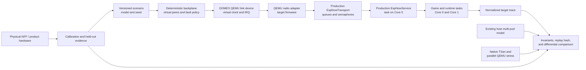

# 13 - Deterministic Firmware Virtual Platform

> **Document status: Target design, accepted for bounded execution but not yet implemented.** The existing host simulator is
> the current deterministic functional model. The QEMU target-execution tier, virtual radio device,
> scheduler campaigns, and predictive qualification defined here remain future work. Delivery state
> and authorization are recorded in [`../../PROGRAM_STATUS.md`](../../PROGRAM_STATUS.md).
> Acceptance of this design does not assert that QEMU is viable: engine adoption is conditional on
> the bounded FS-WP-002B feasibility result.

Last architecture review: 2026-08-04.

## Decision

DOMES will use a **layered, QEMU-centered deterministic virtual platform**. No single simulator is
treated as a product oracle:

1. The existing native host simulator remains the fast multi-pod functional and fault-exploration
   tier.
2. If FS-WP-002B is `Viable`, a pinned Espressif QEMU becomes the target-execution tier for the
   ESP32-S3 Xtensa image, IDF FreeRTOS SMP, task affinities, target context switches, timers, and
   interrupt delivery. A failed feasibility result recycles this target tier before further
   integration.
3. Native sanitizer and parallel-stress runs cover concurrency classes that deterministic
   single-thread QEMU cannot expose.
4. Physical NFF and later product hardware remain authoritative for ESP-NOW/WiFi, BLE, peripheral,
   RF, power, and real-time claims.

The architecture is intended to catch most software-defined state, protocol, scheduler,
concurrency, and transport failures on Linux. It cannot justify a claim that Linux catches almost
all product failures. Every prediction is limited to a measured, versioned validation envelope.

## Authorities And Current Boundary

| Concern | Authority |
| --- | --- |
| Current host simulator | [`10-host-simulation.md`](10-host-simulation.md) and `firmware/test_app/` |
| Current firmware composition and task topology | [`../SOFTWARE_ARCHITECTURE.md`](../SOFTWARE_ARCHITECTURE.md), `firmware/domes/main/main.cpp`, and `firmware/domes/main/infra/taskConfig.hpp` |
| Current ESP-NOW transport behavior | `firmware/domes/main/transport/espNowTransport.*` |
| Current peer protocol | `firmware/domes/main/services/espNowProtocol.hpp` |
| Target virtual-platform design | This document |
| Required verification | [`../../docs/TESTING.md`](../../docs/TESTING.md) |
| Delivery state and milestone authority | [`../../PROGRAM_STATUS.md`](../../PROGRAM_STATUS.md) |

The current host simulator explicitly does not model FreeRTOS scheduling, watchdogs, ESP-IDF
integration, target interrupts, or radio timing. Its FreeRTOS compatibility layer is a compile/test
stub, not a scheduler. This design extends that verification stack; it does not relabel current host
results as target execution.

## Decision Drivers

The target platform must satisfy these constraints:

- Execute production-owned firmware logic using the pinned ESP-IDF v5.4.4 toolchain.
- Exercise IDF FreeRTOS dual-core priorities, affinities, queues, semaphores, timeouts, and callback
  ownership instead of reproducing them in a test-only scheduler.
- Decouple simulated time from Linux wall time and reproduce an accepted run exactly.
- Inject transport timing and faults before production receive queues and completion semaphores.
- Preserve one live peer wire contract; do not add a simulator-only protocol implementation.
- Run a useful subset on every pull request and broader campaigns without attached hardware.
- Record enough configuration and trace identity to compare simulation with held-out hardware runs.
- Fail closed when the simulator consumes unexpected traffic, exhausts a replay, or exceeds its
  declared fidelity boundary.

The platform is not required to emulate the closed Espressif WiFi/BLE implementation, RF waveforms,
analog peripherals, exact cache/bus timing, power integrity, or physical device output.

## Selected Topology



### Fast Functional Tier

The existing `firmware/test_app` remains the primary high-volume engine for state-machine,
distributed-protocol, timeout, and packet-fault scenarios. It owns explicit virtual time and exact
network replay. It should remain fast enough for large seed sets and should continue linking
production source where host dependencies can be represented faithfully.

This tier must not acquire a second RTOS implementation. Scheduler-sensitive assertions move to the
target-execution tier instead of expanding the current FreeRTOS stubs into a competing kernel.

### ESP32-S3 Target-Execution Tier

The target tier builds a simulation profile for `IDF_TARGET=esp32s3` and runs it in a pinned
Espressif QEMU release. The profile is a real Xtensa/ESP-IDF image using the production IDF FreeRTOS
kernel. It is not byte-identical to the product image because unavailable hardware/vendor drivers
are replaced at controlled adapter boundaries.

The following must remain production-owned in the first useful vertical slice:

- IDF FreeRTOS kernel and target port;
- production task creation, priorities, affinities, queues, semaphores, and timeouts;
- `EspNowTransport` receive ring, completion semaphore, recovery, and counters;
- `EspNowService`, peer packet encoding, lifecycle, and game/runtime logic under test;
- trace recording and invariant evaluation.

Peripheral services may use simulation board-profile adapters when QEMU lacks their hardware. Every
adapter, disabled component, and synthetic workload must be declared in a machine-readable fidelity
manifest. A run without that manifest is not accepted evidence.

### Simulation Composition Root

A radio adapter alone cannot boot the current `app_main()`: the physical composition initializes
WiFi, BLE, RMT, I2C, I2S, USB/config, storage, and services that the ESP32-S3 QEMU profile does not
implement. `EspNowService` also obtains identity and its initial round-token entropy directly from
ESP-IDF. The target therefore uses two build-selected composition roots, not scattered
simulation-only conditionals:

- the **physical root** retains the current initialization order and concrete production drivers;
- the **QEMU root** initializes trace and infrastructure, deterministic profile identity/config,
  feature and mode management, declared peripheral adapters, the production game/runtime services,
  `EspNowTransport`, `EspNowService`, and the production task topology under test; and
- a shared runtime assembly function owns only the service/task wiring common to both roots. It may
  not make a simulation decision at runtime.

Exactly one root is selected by a mutually exclusive Kconfig board profile. The profile name and
configuration hash are part of image and replay identity. A physical image must fail its link/build
check if a QEMU adapter is reachable; the QEMU image must fail startup if an enabled production
component has no `production`, `adapter`, `modeled`, `synthetic-load`, or `disabled` manifest entry.

The narrow platform inputs required by shared runtime code are:

- `IPlatformIdentity`, which supplies the six-byte device identity; the physical implementation
  reads the WiFi STA MAC and the QEMU implementation reads an immutable scenario identity;
- `IRandomSource`, which supplies recorded deterministic values in QEMU and `esp_random()` values on
  hardware; and
- existing driver/storage interfaces for only the peripherals and persisted state present in the
  selected profile. QEMU uses a pinned NVS flash image where the emulated flash path is production;
  otherwise the adapter and its behavioral limits are declared.

Target timeouts continue to use the ESP-IDF/FreeRTOS timer path driven by QEMU virtual time. Do not
replace `esp_timer_get_time()` or the target tick with a host clock abstraction in this tier. LED,
touch, audio, haptic, and sensor adapters may provide deterministic inputs/observable sinks needed by
the runtime; unsupported WiFi, BLE, I2C, I2S, RMT, USB, OTA, or config stacks are disabled rather
than initialized. Every omitted task is declared, and any synthetic CPU/IRQ load is versioned input.

### Radio Driver Seam

The simulation seam belongs **below `EspNowTransport`**, not between `EspNowTransport` and
`EspNowService`. Refactor only the vendor-facing operations used by `EspNowTransport` into a narrow
project-owned `IEspNowRadio` contract. The physical implementation continues to call `esp_now_*`;
the QEMU implementation talks to the DOMES virtual link device. This is intentionally narrower than
the generic `ITransport` interface because peer registration, source/RSSI metadata, and asynchronous
completion are part of the behavior under test.

The seam must preserve the production transport's:

- peer and MAC addressing behavior;
- send submission and synchronous error result;
- asynchronous send-completion callback;
- receive callback metadata and payload ownership;
- receive ring-buffer capacity and counting semaphore;
- TX mutex, completion timeout, poisoned-session recovery, and lifecycle;
- callback-to-service task transition.

`IEspNowRadio` owns only vendor lifecycle and I/O: initialize/deinitialize, register a project-owned
receive/send callback sink, submit a bounded frame to a destination MAC, add/remove/query peers, and
report synchronous driver errors. Its receive metadata contains source MAC, optional RSSI, and an
opaque trace-correlation token; its completion contains destination MAC, success/failure, and the
submitted token. The physical adapter allocates a monotonic token at RX callback entry and maps the
single in-flight TX token across the vendor callback. The QEMU adapter uses the backplane event
sequence. Tokens are trace metadata only and never enter the peer wire payload.

`EspNowTransport` carries the token beside source/RSSI through its internal receive record and emits
it at callback, enqueue, semaphore, dequeue, and dispatch boundaries. The refactor must preserve or
increase the proven number of maximum-size pending frames and retain the counting-semaphore bound;
if metadata grows, the byte buffer grows from a named frame-capacity calculation rather than silently
reducing queue depth. Token allocation and storage remain bounded when tracing is disabled.

`IEspNowRadio` must not own FreeRTOS queues, semaphores, retries, completion timeouts,
poisoning/recovery, transport counters, or peer packet encoding. Those remain in `EspNowTransport`
and above. No interface signature may expose QEMU types, host containers, or a second
simulation-only packet type.

Direct injection into `EspNowService`, a second `SimMessage` wire contract, or a simulator-only copy
of retry/state logic is prohibited. Those approaches produce attractive tests while bypassing the
failures this tier exists to find.

### Deterministic Link Device And Backplane

The target design is a small QEMU MMIO device with an interrupt line and a deterministic event
backplane. The device must schedule against QEMU virtual time, never host arrival time. A scenario is
loaded before execution; spontaneous peer events are known to the event queue before their virtual
deadline. Synchronous requests to a peer model may calculate future events but cannot advance time
outside the central event queue.

The first qualified implementation keeps the device and functional peer backplane in the same QEMU
process and virtual-clock domain. Runtime sockets, host network packets, wall-clock callbacks, and
interactive input are prohibited in deterministic mode. Host tooling may supply immutable scenario
and configuration files before reset and collect artifacts after termination. An explicitly
non-qualifying interactive mode may be added later for debugging.

The versioned device ABI must provide bounded little-endian registers or shared windows for:

- capability and ABI-version discovery;
- TX destination, payload length/data, submit sequence, and synchronous acceptance status;
- asynchronous TX completion sequence and status;
- RX delivery sequence/correlation token, source, optional RSSI, payload length/data, and consume
  acknowledgment;
- interrupt status, mask, and acknowledgment; and
- sticky overflow, invalid-access, exhausted-scenario, and model-failure status.

The MMIO base, interrupt source, queue/window sizes, and exact register layout are constrained by the
FS-WP-002B adoption budget and fixed by FS-WP-002F, recorded in the simulation-profile manifest, and
guarded by target-side compile-time checks. The firmware adapter rejects unknown ABI versions and all
over-length or out-of-sequence traffic; silent truncation or overwrite is prohibited.

The firmware adapter converts device interrupts into work on a WiFi-equivalent high-priority
FreeRTOS task before invoking the production transport callbacks. This preserves the documented
ESP-NOW callback ownership without pretending the QEMU interrupt itself is the vendor callback.

The QEMU patch or fork must be pinned to an immutable upstream revision. DOMES owns only the smallest
device/board patch required for this interface. Floating Espressif QEMU branches are not acceptable
CI dependencies.

## Simulated Time Contract

There is one time authority per run. In deterministic target mode it is QEMU virtual time derived
from instruction counting. Host wall-clock time may measure CI duration but cannot affect firmware
timers, packet delivery, peer behavior, random values, or assertions.

Every DOMES backplane/model event has this total ordering key:

```text
(deadline_ns, event_class_priority, source_id, destination_id, sequence)
```

The class priority and all tie-breaking rules are versioned model inputs. Equal-deadline model events
may not depend on container iteration order, process scheduling, pointer values, or filesystem order.
This device does not redefine ordering inside QEMU's vCPU, timer, bottom-half, or interrupt core.
That ordering is an engine property pinned by QEMU revision/options and accepted only through the
fixed-probe and full-trace repeatability checks; a failure recycles the engine/profile decision.

An accepted replay artifact contains at least:

- firmware ELF and flash-image hashes;
- ESP-IDF, compiler, QEMU, QEMU-patch, and simulator revisions;
- board/simulation profile and fidelity-manifest hashes;
- scenario schema, model version, seed, and complete resolved configuration;
- instruction-count, virtual-clock, vCPU scheduling, and initial-core settings;
- input/fault event record and normalized trace hash;
- assertion result, termination reason, and any unconsumed event/replay count.

Replay fails if any identity differs unless an explicit migration tool creates a new artifact.

## CPU And Scheduling Modes

No one execution mode is sufficient.

| Mode | Purpose | Required behavior | Claim boundary |
| --- | --- | --- | --- |
| Deterministic target | Reproduce task, timeout, IRQ, and callback interleavings | Single-thread TCG, instruction-count virtual time, VM clock, fixed event ordering, record/replay | Two target vCPUs are serialized by QEMU; not simultaneous execution or cycle accuracy |
| Schedule exploration | Search nearby deterministic interleavings | Sweep vCPU quantum/initial core where supported, tick phase, IRQ phase, callback phase, workload, and scenario seed | Coverage is the explored schedule set, not all possible schedules |
| Parallel target stress | Exercise actual dual-vCPU execution concurrently | Multi-threaded TCG without instruction counting, repeated invariant checks | Non-deterministic and not replay/prediction evidence |
| Native sanitizer | Detect C/C++ memory, undefined behavior, and data races in portable production code | ASan/UBSan and true pthread concurrency under TSan; perturb synchronization scheduling | Host ABI and synchronization adapters are not ESP32 timing semantics |
| Physical differential | Validate behavior omitted or approximated above | Exact firmware/hardware identity, synchronized observability where required, retained raw evidence | Hardware sample and measured environment only |

Deterministic QEMU must execute the real target scheduler and context-switch code, but instruction
count is not a cycle model. Latency prediction must use hardware calibration and error bounds; it
must not convert instruction counts directly into ESP32 clock cycles.

## Scheduler, ISR, And Causality Observability

Target execution is not evidence merely because the firmware boots in QEMU. A retained run must
show which task ran on which core, what made it runnable or blocked, which interrupt/callback caused
the transition, and how that work reached the transport and runtime outcome.

The current trace ABI is a useful 16-byte event envelope, but it is not yet this evidence. The
FreeRTOS task/ISR event names and values in `firmware/common/proto/trace.proto` are reserved because
their producers were never active, and managed tasks are not currently assigned stable FreeRTOS
task numbers. Therefore an agent must not infer scheduler coverage from application spans or a QEMU
console log.

The target observability contract is:

- assign stable, nonzero trace IDs to every DOMES-managed task at creation and retain a task
  ID/name/priority/affinity table in session metadata;
- emit task create/delete, ready/block, switch-in/switch-out, core, ISR enter/exit, queue, semaphore,
  timeout, and callback-boundary events from the target kernel/integration hooks;
- allocate stable IDs to traced queues, semaphores, interrupts, callbacks, and transport operations;
  pointer values and host-dependent hashes are prohibited;
- carry a monotonically allocated causal ID from virtual-link delivery or send completion through
  the callback, production ring/semaphore, service dequeue, and resulting runtime action;
- keep the existing 16-byte `TraceEvent` unless measured evidence proves it inadequate; use the low
  flag bits for a versioned core/context encoding and the event arguments for type-specific stable
  IDs and causal data;
- add any new event types to `trace.proto` first, generate firmware/CLI/app bindings through the
  existing paths, and never reuse its reserved names or numeric values;
- write hook events into bounded, allocation-free, per-core buffers that are safe in ISR context;
  export and normalize them after capture rather than streaming or formatting inside a hook;
- record overflow, discontinuity, missing-object, and unbalanced ISR/switch conditions as hard
  evidence failures; and
- measure disabled and enabled trace overhead on both QEMU and physical NFF hardware. A trace whose
  overhead changes the tested outcome cannot qualify that outcome.

Normalized traces must support invariants for task affinity, priority order, illegal blocking from
ISR context, queue/semaphore ownership, timeout cause, callback-to-task handoff, causal completion,
and balanced interrupt/context-switch lifecycles. The same schema and normalization must be used for
QEMU and hardware comparison; target-specific console text is diagnostic only.

### Raw Trace And Normalization Contract

Every run retains and hashes the unmodified raw trace before interpretation. A versioned normalizer
then produces two explicitly different artifacts:

- a **replay-normalized trace** for equality within one firmware/QEMU/profile configuration; and
- a **cross-target semantic projection** for thresholded comparison with hardware. The projection is
  never compared by whole-file hash and cannot turn latency measurements into equality.

The normalizer may translate stable manifest tables, remove an absolute session start offset, and
canonicalize declared artifact paths or build addresses that have no behavioral meaning. It may not
drop or reorder events or remove event count, relative virtual-time deltas, event type, task/core,
ISR context, task lifecycle, queue/semaphore identity, causal edges, transport outcome, overflow,
discontinuity, assertion, or termination state. Physical correlation tokens may be renumbered only
by preserving their complete causal graph and first-observed order.

The artifact records the raw hash, normalizer version, ordered transforms, input/output schema,
field mapping, and zero exclusions by default. Any new exclusion or transform requires an
architecture review, invalidates affected replay baselines and qualification, and must demonstrate
that a seeded failure cannot be hidden by the change.

## Transport Timing And Fault Model

Transport delay is modeled as a pipeline, not one arbitrary sleep:

```text
application submit
  -> TX ownership/queue delay
  -> modeled MAC/channel access and airtime
  -> send completion callback delay/status
  -> peer processing/reply delay
  -> RX callback delay
  -> production ring/semaphore delay
  -> service-task dequeue and dispatch
```

The target scheduler naturally contributes the firmware portions. The backplane owns only the
unavailable radio/peer portions and must expose their components separately in traces.

Required deterministic fault dimensions are:

- pass, loss, duplication, and reordering;
- latency and bounded jitter at each modeled pipeline stage;
- payload corruption and truncation before production validation;
- immediate submit failure, delayed completion failure, and missing completion;
- callback bursts and send-completion order changes;
- queue saturation, backpressure, and recovery;
- peer join, disappearance, restart, stale traffic, and identity mismatch;
- channel/interference state represented by calibrated packet outcomes, not an unsupported RF claim.

The active production ESP-NOW wire bytes at the tested revision are always the payload presented to
the model. Model metadata travels out of band and cannot alter that wire contract.

### Functional Peer Contract

The current physical peer protocol and host `SimMessage` hierarchy are divergent, so neither may be
copied into the QEMU backplane. Before stateful target-peer scenarios, FS-WP-003A must establish one
portable, production-owned protobuf codec and shared drill/peer semantics from
`firmware/common/proto/*.proto`, using the repository's nanopb, prost, and Dart generation paths.
Replay identity pins the schema and generated-code revisions, and migration requires two-board wire
compatibility/regression evidence.

Functional peers are deterministic test actors, not simulated firmware. They consume and produce
the production codec and follow versioned scenario transitions, but they may not reimplement DUT
retry, timeout, recovery, role-election, or game state and then claim it as target coverage. Exercise
each production role by rotating the real QEMU DUT. A scenario needing two simultaneously real
firmware state machines is outside this one-DUT tier and must be covered on hardware, in the fast
shared-runtime tier after FS3, or by a separately authorized multi-QEMU design.

## Multi-Device Strategy

The first target tier runs **one real firmware device under test plus deterministic functional peer
models**. Each important role is rerun with a different pod as the real DUT. This provides target
scheduler coverage without the virtual-clock risk and maintenance cost of coordinating six QEMU
processes.

Multi-QEMU lockstep is not authorized by this design. It may be proposed later only when retained
mutants or hardware divergences demonstrate a critical failure class that one-DUT role rotation
cannot expose. That proposal must define a conservative global-time grant protocol, deterministic
same-time ordering, deadlock detection, and a measured CI cost before implementation.

## Fidelity Manifest

Each target run records every relevant component in one of these states:

| State | Meaning |
| --- | --- |
| `production` | Same production source and target implementation as the physical profile |
| `adapter` | Production interface with a simulation-specific target implementation |
| `modeled` | Behavioral model with declared inputs, outputs, timing, and calibration |
| `synthetic-load` | Workload included only to approximate missing CPU/IRQ pressure |
| `disabled` | Not present in the run; resulting defect classes are outside the claim |

The manifest covers at least CPU cores, IDF FreeRTOS, tick/timers, interrupt matrix, watchdog,
WiFi/ESP-NOW vendor layer, BLE, serial/config, LED/RMT, touch, IMU/I2C, audio/I2S, haptic, flash/NVS,
trace, random source, and every production task. An agent may not describe a run as "full firmware"
when a material component is adapted, modeled, synthetic, or disabled.

## Detection And Claim Envelope

| Failure class | Primary Linux evidence | Physical evidence still required |
| --- | --- | --- |
| State/protocol invariants, stale events, retries, timeout logic | Fast model and deterministic target | Representative end-to-end confirmation |
| Task priority, affinity, blocking, queue/semaphore ownership, ISR/task order | Deterministic target and schedule sweeps | Target latency and silicon-specific behavior |
| Unsynchronized C/C++ memory access | Native TSan plus parallel target stress | Weak-memory and rare target-only races |
| Target ABI, stack/context path, interrupt masks, target panic behavior | Deterministic target | Silicon errata and exact interrupt latency |
| ESP-NOW callback, loss, duplicate, reorder, queue pressure | Virtual link model calibrated from hardware | Closed driver/MAC, coexistence, RF, antennas, environment |
| BLE, USB, RMT, I2C, I2S, analog touch, sensors, sound, light, haptic | Narrow models or none | Physical hardware |
| Power, battery, charger, thermal, EMC, RF compliance, manufacturing | None | Product-intent hardware and controlled test |

"Predictive" applies only to outcomes and measurements whose held-out error bounds pass. Other
results remain deterministic test evidence, not real-world predictions.

## Calibration And Qualification

Calibration and held-out validation data are disjoint. A model is qualified only for a named
firmware/hardware/configuration and scenario envelope.

The qualification package must include:

1. A hardware trace clock-correlation method with measured uncertainty.
2. Raw calibration dataset identities and the parameters derived from them.
3. Separately selected held-out dataset identities that were not used to tune the model.
4. Declared outcome, ordering, timeout, queue-depth, and latency error metrics with thresholds fixed
   before held-out evaluation.
5. A fault/mutation corpus covering known scheduler, transport, stale-event, recovery, and
   concurrency failures.
6. Sensitivity results showing which parameter ranges can change a product decision.
7. A prediction envelope and explicit exclusions.

Minimum architectural acceptance is 100 percent detection of critical seeded faults, at least 95
percent detection of the complete independently constructed in-envelope mutation corpus, and no
unexplained held-out hardware divergence. A lower result keeps the platform useful for testing but
prohibits the predictive label.

Any change to task topology, priority/affinity, transport lifecycle, peer protocol, timing source,
ESP-IDF/QEMU version, board profile, relevant hardware, or calibrated environment invalidates the
affected qualification until impact analysis and rerun are complete.

## CI Architecture

The intended CI tiers are:

| Trigger | Required target after implementation | Purpose |
| --- | --- | --- |
| Every pull request | Existing host suite, sanitizers, and a bounded deterministic QEMU smoke/scenario set | Fast invariant, target-boot, replay, and representative scheduling protection |
| Nightly/scheduled | Broad scenario/phase/seed sweeps, mutation corpus, native TSan, and parallel QEMU stress | Coverage growth and rare-interleaving discovery |
| Hardware workflow | Selected two-board differential scenarios and model-drift checks | Calibration and physical boundary validation |
| Release candidate | Pinned qualification suite plus applicable product-hardware regression | Re-establish the declared prediction envelope |

The QEMU lane is not added to required pull-request CI until its toolchain is pinned, its cache and
runtime are measured, failures are reproducible locally, and the aggregate `CI Gate` reports it. A
cloud-only or manually interpreted result cannot become a required gate.

Admission to required pull-request CI additionally requires:

- zero test flakes or replay/signature mismatches across 20 consecutive shadow CI jobs and at least
  1,000 repetitions of the fixed deterministic smoke corpus;
- cached p95 job duration no greater than 8 minutes and cold p95 no greater than 12 minutes across
  those shadow jobs;
- one command that reproduces every test locally with the same pinned container/tool identities; and
- retained replay identity, raw/normalized traces, manifest, assertion, and termination artifacts on
  every failure.

Infrastructure outages are reported separately but do not lower the zero test-flake threshold. If a
required lane later exceeds either runtime bound or produces one unexplained nondeterministic result,
it remains visible but is removed from merge blocking until the cause is fixed and the shadow window
passes again.

## FS2 Delivery Sequence

The authoritative state is in [`../../PROGRAM_STATUS.md`](../../PROGRAM_STATUS.md). These packages
are bounded technical outcomes inside FS2; they are not new company phases or hardware gates. The
dependency order is:

```text
FS-WP-002A -> FS-WP-002B -> FS-WP-002D -> FS-WP-002C -> FS-WP-002E
(E + FS-WP-003A) -> FS-WP-002F -> FS-WP-002G
(FS1 + FS3 + G) -> FS-WP-002H -> VC-WP-002A -> FS2 complete
```

`D`, `C`, and `E` execute in that order because the common QEMU composition must exist before its
trace path can be proved, and the stable trace contract must exist before the radio seam carries
correlation through it. The independent FS3 package `FS-WP-003A` may execute in parallel. Each
package must be selected explicitly; a later package may not be collapsed into an earlier one merely
because one agent can edit both areas.

### FS-WP-002A: Deterministic Clock And Network Replay

**State at design acceptance:** Complete through PR 97.

**Outcome:** Explicit host virtual time, deterministic pass/delay/drop/duplicate decisions, complete
delivery identity checking, and exact delivery-record replay form the functional foundation.

**Boundary:** This package provides no target-scheduler or predictive evidence.

### FS-WP-002B: ESP32-S3 QEMU Feasibility

**Entry:** FS-WP-002A is complete; ESP-IDF v5.4.4 and the official ESP32-S3 QEMU support hypothesis
are available; no predictive claim is required.

**Required result:**

- Boot a bounded ESP-IDF ESP32-S3 feasibility application using the candidate QEMU without a custom
  DOMES device or production transport refactor.
- Run pinned tasks on both target CPUs plus a blocking/wakeup exchange, tick counter, and one
  controlled supported interrupt. Retain per-core/task/tick/ISR counters, termination reason, IDF
  logs, and QEMU monitor/GDB evidence. These are feasibility probes, not scheduler-coverage traces.
- Demonstrate 100 identical deterministic run signatures from one fixed feasibility probe; the
  normalized scheduler trace contract is delivered by FS-WP-002C.
- Inventory every production, adapter, modeled, synthetic-load, and disabled component.
- Select and pin an immutable QEMU revision; measure build and execution time.
- Publish an adoption budget that fixes allowed new/modified QEMU paths, maximum non-generated
  changed files and lines, prohibited CPU/TCG/timer/interrupt/record-replay edits, maintenance effort
  and version-update trigger. A package without numeric and structural limits is not `Viable`.
- Produce a binary `Viable` or `Not viable` package result with an architecture disposition. A
  `Viable` result authorizes selection of FS-WP-002D; it does not select or activate that package.

**Stop condition:** Stop before a QEMU fork, production transport refactor, required CI job, or broad
peripheral model if the target cannot reach the bounded operational state without replacing core
kernel, transport, service, or runtime logic.

### FS-WP-002D: Simulation Composition And Platform Inputs

**Entry:** FS-WP-002B is complete with a `Viable` result; current physical startup order and the
QEMU peripheral inventory are recorded.

**Required result:**

- Implement mutually exclusive physical and QEMU composition roots plus the shared runtime assembly
  boundary described above; scattered simulation conditionals are prohibited.
- Inject `IPlatformIdentity` and `IRandomSource` into shared services and bind deterministic profile
  inputs without replacing target timers or FreeRTOS.
- Bind every unsupported peripheral/service to a declared adapter, synthetic load, or disabled state
  and generate a complete fidelity manifest at build/run time.
- Boot the QEMU profile to a bounded service-ready state with radio disabled while preserving every
  claimed production task's configuration.
- Prove the physical root's build map, init order, enabled features, and two-board behavior are
  unchanged, and prove no QEMU implementation is reachable from the physical image.

**Stop condition:** Stop before making the physical root conditional at runtime, initializing an
unsupported vendor stack, replacing target time with host time, or claiming a disabled/adapted task
as production.

### FS-WP-002C: Scheduler, ISR, And Causality Observability

**Entry:** FS-WP-002D passes and the target trace-hook mechanisms are identified in both composition
roots.

**Required result:**

- Assign stable task and synchronization-object IDs and publish their session mappings.
- Capture the required per-core task, ISR, queue, semaphore, timeout, and callback-boundary events
  using the same trace ABI on QEMU and physical hardware.
- Correlate a synthetic interrupt through callback handoff and production task execution without
  missing, unbalanced, or ambiguous events.
- Implement the raw-trace and versioned normalization contract above; prove deterministic identity
  across 100 consecutive fixed runs without excluding event order, relative time, task/core, ISR,
  lifecycle, synchronization, or causal data, and fail on overflow or unresolved identity.
- Measure trace overhead and demonstrate that disabled tracing preserves production behavior.

**Stop condition:** Stop before replacing the FreeRTOS scheduler, emitting unbounded work from a
kernel/ISR hook, reusing reserved protobuf values, or changing the 16-byte ABI without an explicit
migration and measured need.

### FS-WP-002E: Production Radio Driver Seam And Correlation

**Entry:** FS-WP-002C passes; the physical ESP-NOW regression suite, callback ownership, and current
pending-frame capacity are measured.

**Required result:**

- Introduce the narrow `IEspNowRadio` vendor seam below `EspNowTransport` with project-owned callback
  metadata and opaque correlation tokens.
- Preserve the physical `esp_now_*` implementation, callback ownership, peer semantics, queue and
  semaphore behavior, recovery, packet bytes, and runtime configuration.
- Carry RX/TX correlation through callback, ring/semaphore, dequeue, dispatch, and completion traces
  without changing the wire payload or reducing the proven pending-frame capacity.
- Pass host, firmware-build, and two-board ESP-NOW/transport regression evidence with no QEMU
  implementation linked into a physical image.

**Stop condition:** Stop before moving the seam above `EspNowTransport`, changing the production wire
contract, using an unbounded correlation sidecar, or maintaining duplicated retry, lifecycle, or peer
logic.

### FS-WP-003A: Portable Production Peer And Drill Contract

This is an FS3 delivery and may proceed independently after its own selection. It is listed here
because FS-WP-002F cannot create stateful peers without it.

**Entry:** The current packed `espNowProtocol.hpp`, divergent host `SimMessage` types, generated
protocol paths, app control contract, and two-board compatibility baseline are identified.

**Required result:**

- Define the peer/drill wire messages in `firmware/common/proto/*.proto` and generate nanopb, prost,
  and Dart types through existing repository paths.
- Make physical firmware, native functional peers, CLI/app surfaces, and tests consume one portable
  production-owned codec and shared message/role semantics.
- Remove the second `SimMessage` semantic contract or reduce it to a lossless view over generated
  production types with equivalence tests for every variant.
- Pass migration compatibility, malformed-message, generated-drift, host, app/CLI, firmware build,
  and two-board peer/drill regression evidence.

**Stop condition:** Stop before hand-copying generated enums/messages, adding a simulator-only wire
format, or changing live wire behavior without a versioned migration and physical compatibility
evidence.

### FS-WP-002F: QEMU DUT And Deterministic Virtual Backplane

**Entry:** FS-WP-002E and FS-WP-003A pass; the preceding `D` and `C` evidence, FS-WP-002B's pinned
engine, and its numeric/structural patch budget remain valid; the fidelity-manifest schema is fixed.

**Required result:**

- Implement the bounded QEMU link device, interrupt path, target radio adapter, and one-DUT
  in-process deterministic peer backplane within the adopted patch budget.
- Exercise production queues, semaphores, callback ownership, timeouts, recovery, production codec,
  causal tokens, and Core 0/Core 1 task topology under explicit virtual time.
- Cover pass, loss, delay, jitter, duplicate, reorder, corruption, submit/completion failure,
  completion loss, burst, saturation, restart, and stale-peer scenarios.
- Produce self-contained replay artifacts, raw hashes, and identical replay-normalized traces for
  accepted fixed runs.
- Demonstrate role rotation with production-codec test actors and no multi-QEMU lockstep.

**Stop condition:** Stop before bypassing production transport ownership, accepting host-time event
injection, expanding beyond the adopted QEMU patch budget, copying production peer state into an
actor, or claiming calibrated radio/timing accuracy.

### FS-WP-002G: Scheduling, Concurrency, Fault Campaigns, And CI

**Entry:** FS-WP-002F passes; the CI admission corpus and artifact command are fixed.

**Required result:**

- Add deterministic schedule/phase/IRQ sweeps, native ASan/UBSan/TSan coverage, and parallel-QEMU
  stress as distinct evidence modes.
- Demonstrate 100 percent detection of a predeclared critical scheduler/transport mutation set and
  report overall mutation score without suppressing surviving mutants.
- Pass the explicit 1,000-repetition, 20-shadow-job, zero-flake, cached-p95, cold-p95, local
  reproduction, and failure-artifact admission limits above before becoming required CI.
- Run broad seed, mutation, sanitizer, and parallel campaigns on scheduled CI and retain compact
  failure artifacts.

**Stop condition:** Stop before treating MTTCG or sanitizer runs as deterministic evidence, making a
cloud-only failure required, or weakening an invariant to remove a retained failure.

### FS-WP-002H: Hardware-Calibrated Model

**Entry:** FS-WP-002G passes; FS1 provides identified NFF evidence; FS3 production drill/runtime
semantics are stable; separate calibration and held-out datasets can be collected.

**Required result:**

- Correlate target and hardware trace clocks with measured uncertainty.
- Calibrate only declared link, peer, workload, and timing parameters from the calibration dataset.
- Freeze thresholds, model identity, prediction envelope, and exclusions before opening held-out
  results.
- Establish scheduled hardware drift detection and explicit qualification invalidation rules.

**Stop condition:** Stop before tuning on held-out data, converting instruction count directly to
silicon cycles, hiding divergence in an aggregate score, or promoting NFF bounds to product hardware.

### VC-WP-002A: Independent Predictive Qualification

**Entry:** FS-WP-002H is frozen; an independent AI verification role has selected the in-envelope
mutation corpus, held-out scenarios, metrics, and pass thresholds without seeing calibration tuning
or held-out results.

**Required result:**

- Independently reproduce artifacts and audit the fidelity manifest and excluded failure classes.
- Detect 100 percent of critical seeded faults and at least 95 percent of the complete independently
  constructed in-envelope mutation corpus.
- Pass fixed outcome, ordering, timeout, queue-depth, and latency bounds with no unexplained held-out
  hardware divergence.
- Publish a binary `Pass` or `Fail` trust verdict naming the exact prediction envelope and
  invalidation triggers; a narrowed envelope must be frozen and rerun as a new qualification.

**Stop condition:** Any failed held-out threshold leaves FS2 incomplete and labels the platform
deterministic test infrastructure only. The implementation owner may diagnose a failure but may not
change the frozen acceptance corpus or verdict.

FS2 completes only when `VC-WP-002A` passes. That pass satisfies only the simulation-qualification
criterion within VC2; VC2 also requires its separately controlled six-node alpha, fault, soak, and
timing evidence. `FS-WP-002A` through `FS-WP-002G` may materially improve testing without
establishing predictiveness; `FS-WP-002H` is a calibrated candidate, not its own trust verdict.

## Agent Implementation Contract

A future agent starting simulation work must:

1. Read this document, `PROGRAM_STATUS.md`, `10-host-simulation.md`, `SOFTWARE_ARCHITECTURE.md`, and
   `docs/TESTING.md`, then inspect current implementation and CI rather than trusting copied status.
2. Select one highest-priority `Ready` package at the earliest dependency frontier; account for the
   FS-WP-003A cross-workstream input and do not start later qualification or multi-QEMU work early.
3. Create an execution plan under `docs/plans/` before a cross-boundary implementation.
4. Preserve the physical production path and add a simulation adapter only at the documented seam.
5. Commit the package-required fidelity manifest, replay identity, raw/normalized traces, tests, and
   failure artifacts with each executable slice; feasibility-only packages must not fabricate later
   evidence types.
6. Run the strongest feasible host, ESP-IDF/QEMU, sanitizer, and hardware checks and state every
   omitted claim explicitly.
7. Update as-built architecture only after implementation evidence passes; update program status on
   every package-state or qualification change.

An agent must stop and raise an architecture decision when the required patch surface grows beyond
the bounded device/profile adapter, when QEMU cannot reproduce a run, or when a requested claim lies
outside the fidelity manifest.

## Alternatives Rejected

- **nRF BabbleSim/Zephyr native simulation:** strong deterministic BLE/802.15.4 and protocol testing,
  but it does not run ESP32-S3/ESP-IDF firmware, treats software execution as zero simulated time,
  assumes one executing thread per simulated MCU, and does not implement WiFi/ESP-NOW.
- **ESP-IDF/FreeRTOS POSIX target as timing authority:** useful for native tools, but current host
  scheduling is single-core/cooperative and does not reproduce target interrupt or SMP behavior.
- **Renode as the immediate target engine:** its time-domain and multi-machine design is useful prior
  art, but the maintained tree does not provide an ESP32-S3 platform.
- **Wokwi as the evidence authority:** useful for firmware/peripheral smoke testing, but its CPU
  scheduling/replay contract is not public and one project cannot coordinate multiple MCUs.
- **A new DOMES FreeRTOS scheduler:** would create a second kernel semantics implementation and a
  long-lived validation burden while remaining less target-faithful than QEMU.

Primary design references:

- [ESP-IDF v5.4.4 QEMU guide](https://docs.espressif.com/projects/esp-idf/en/v5.4.4/esp32s3/api-guides/tools/qemu.html)
- [Espressif QEMU ESP32-S3 feature matrix](https://github.com/espressif/esp-toolchain-docs/blob/main/qemu/README.md)
- [QEMU instruction counting](https://www.qemu.org/docs/master/devel/tcg-icount.html)
- [QEMU record/replay](https://www.qemu.org/docs/master/system/replay.html)
- [Zephyr BabbleSim nRF52 target and time model](https://docs.zephyrproject.org/latest/boards/native/nrf_bsim/doc/nrf52_bsim.html)
- [Zephyr POSIX architecture execution model](https://docs.zephyrproject.org/latest/boards/native/doc/arch_soc.html)
- [Renode maintained board-platform tree](https://github.com/renode/renode/tree/master/platforms/boards)
- [Wokwi multi-controller limitation](https://docs.wokwi.com/faq#how-do-i-use-multiple-microcontrollers-in-a-single-project)
- [ESP-IDF host-application limitations](https://docs.espressif.com/projects/esp-idf/en/latest/esp32s3/api-guides/host-apps.html)
- [BabbleSim architecture](https://babblesim.github.io/architecture.html)
- [Renode virtual-time framework](https://renode.readthedocs.io/en/latest/advanced/time_framework.html)
