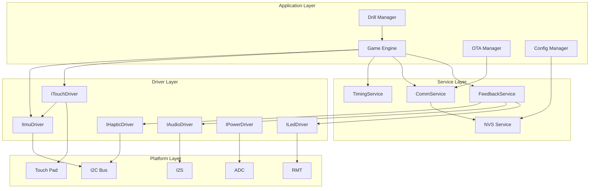

# DOMES Firmware Architecture Review

**Review Date:** 2026-01-05
**Reviewer:** Claude (Expert Architect)
**Documents Reviewed:** 03-driver-development.md, 04-communication.md, 05-game-engine.md, 09-reference.md, SYSTEM_ARCHITECTURE.md, DEVELOPMENT_ROADMAP.md, firmware/GUIDELINES.md

---

## Executive Summary

The DOMES firmware architecture is **well-designed for its intended purpose** with solid foundational choices (ESP-IDF, FreeRTOS, hybrid ESP-NOW+BLE). However, several gaps and risks need attention before implementation:

| Aspect | Rating | Summary |
|--------|--------|---------|
| Interface Design | ⚠️ Good with gaps | Missing critical methods, some interfaces need expansion |
| Dependency Management | ✅ Good | Clean layering, no circular dependencies |
| Communication | ⚠️ Needs work | Master election undefined, clock sync needs improvement |
| State Machine | ⚠️ Incomplete | Missing error recovery, no battery-low state |
| Memory Budget | ✅ Adequate | Within constraints, but need PSRAM policy |
| Testability | ✅ Good | Interfaces enable mocking, needs mock specs |
| Overall | ⚠️ Ready with caveats | Address gaps before M5 milestone |

---

## 1. Dependency Diagram

### Component Dependency Graph

```
┌─────────────────────────────────────────────────────────────────────────────┐
│                            APPLICATION LAYER                                  │
│  ┌─────────────┐  ┌─────────────┐  ┌─────────────┐  ┌─────────────┐         │
│  │ Game Engine │  │ Drill Mgr   │  │ OTA Manager │  │ Config Mgr  │         │
│  └──────┬──────┘  └──────┬──────┘  └──────┬──────┘  └──────┬──────┘         │
│         │                │                │                │                 │
│         └────────────────┼────────────────┼────────────────┘                 │
│                          ▼                ▼                                  │
├─────────────────────────────────────────────────────────────────────────────┤
│                            SERVICE LAYER                                      │
│  ┌───────────────┐  ┌───────────────┐  ┌───────────────┐  ┌──────────────┐  │
│  │FeedbackService│  │  CommService  │  │ TimingService │  │ NVS Service  │  │
│  │  (LED+Audio+  │  │  (ESP-NOW +   │  │ (Clock Sync)  │  │  (Config)    │  │
│  │   Haptic)     │  │     BLE)      │  │               │  │              │  │
│  └───────┬───────┘  └───────┬───────┘  └───────┬───────┘  └──────┬───────┘  │
│          │                  │                  │                  │          │
├──────────┼──────────────────┼──────────────────┼──────────────────┼──────────┤
│          ▼                  ▼                  ▼                  ▼          │
│                            DRIVER LAYER                                       │
│  ┌─────────┐ ┌─────────┐ ┌─────────┐ ┌─────────┐ ┌─────────┐ ┌─────────┐    │
│  │   LED   │ │  Audio  │ │ Haptic  │ │  Touch  │ │   IMU   │ │  Power  │    │
│  │ Driver  │ │ Driver  │ │ Driver  │ │ Driver  │ │ Driver  │ │ Driver  │    │
│  └────┬────┘ └────┬────┘ └────┬────┘ └────┬────┘ └────┬────┘ └────┬────┘    │
│       │          │          │          │          │          │              │
├───────┼──────────┼──────────┼──────────┼──────────┼──────────┼──────────────┤
│       ▼          ▼          ▼          ▼          ▼          ▼              │
│                           PLATFORM LAYER                                      │
│  ┌─────────┐ ┌─────────┐ ┌─────────┐ ┌─────────┐ ┌─────────┐ ┌─────────┐    │
│  │   RMT   │ │   I2S   │ │   I2C   │ │  Touch  │ │   I2C   │ │   ADC   │    │
│  │ (GPIO48)│ │(GP15-17)│ │(GP1-2)  │ │(GPIO4)  │ │(GP1-2)  │ │(GPIO5)  │    │
│  └─────────┘ └─────────┘ └─────────┘ └─────────┘ └─────────┘ └─────────┘    │
│                                                                              │
│  ┌──────────────────────────────────────────────────────────────────────┐   │
│  │                         ESP-IDF / FreeRTOS                            │   │
│  │  WiFi Stack │ BLE Stack (NimBLE) │ ESP-NOW │ NVS │ SPIFFS │ OTA      │   │
│  └──────────────────────────────────────────────────────────────────────┘   │
└─────────────────────────────────────────────────────────────────────────────┘
```

### Mermaid Diagram (for rendering)



### Shared Resources

| Resource | Components Sharing | Arbitration |
|----------|-------------------|-------------|
| I2C Bus (I2C0) | IMU + Haptic | Mutex required |
| WiFi Radio | ESP-NOW + WiFi scan | ESP-IDF coex |
| RF Radio | WiFi/ESP-NOW + BLE | ESP-IDF coex |
| NVS | All services | NVS API handles |
| Core 0 | Protocol tasks | FreeRTOS scheduler |
| Core 1 | App tasks | FreeRTOS scheduler |

### Initialization Order (Critical Path)

```
1. NVS Flash Init        ─┬─ Required by WiFi/BLE config
2. I2C Bus Init          ─┤  Shared bus for IMU + Haptic
3. Power Driver          ─┤  ADC for battery monitoring
4. LED Driver            ─┤  Visual boot feedback
5. IMU Driver            ─┤  Uses I2C
6. Haptic Driver         ─┤  Uses I2C (after IMU to avoid bus contention)
7. Audio Driver          ─┤  I2S, independent
8. Touch Driver          ─┤  Depends on IMU for fusion
9. WiFi Stack            ─┤  Required for ESP-NOW
10. ESP-NOW Init         ─┤  After WiFi
11. BLE Stack (NimBLE)   ─┤  Coexists with WiFi
12. CommService          ─┤  Uses ESP-NOW + BLE
13. TimingService        ─┤  Uses CommService
14. FeedbackService      ─┤  Uses LED + Audio + Haptic
15. GameEngine           ─┘  Uses all services
```

**No circular dependencies detected.**

---

## 2. Interface Design Critique

### ILedDriver - ⚠️ Missing Methods

**Current Interface:**
```cpp
virtual esp_err_t init() = 0;
virtual esp_err_t setAll(Color color) = 0;
virtual esp_err_t setLed(uint8_t index, Color color) = 0;
virtual esp_err_t setBrightness(uint8_t brightness) = 0;
virtual esp_err_t refresh() = 0;
virtual bool isInitialized() const = 0;
```

**Missing Methods Needed:**

| Method | Rationale |
|--------|-----------|
| `esp_err_t setRange(uint8_t start, uint8_t end, Color color)` | Common pattern for animations |
| `esp_err_t setMultiple(const Color* colors, uint8_t count)` | Batch update efficiency |
| `esp_err_t deinit()` | Clean shutdown for deep sleep |
| `Color getLed(uint8_t index) const` | State query for animations |
| `uint8_t getBrightness() const` | State query |

**Recommendation:**
```cpp
// Add to ILedDriver
virtual esp_err_t setRange(uint8_t start, uint8_t count, Color color) = 0;
virtual esp_err_t setBuffer(etl::span<const Color> colors) = 0;
virtual esp_err_t deinit() = 0;
virtual Color getLed(uint8_t index) const = 0;
virtual uint8_t getBrightness() const = 0;
```

### IAudioDriver - ⚠️ Missing Methods

**Current Issues:**
1. No way to queue sounds
2. No callback on completion
3. No way to check what's playing

**Recommended Additions:**
```cpp
// Add to IAudioDriver
virtual esp_err_t queueSound(const char* filename) = 0;  // Queue for sequential play
virtual void onComplete(std::function<void()> callback) = 0;  // Completion callback
virtual esp_err_t deinit() = 0;  // Clean shutdown
virtual uint8_t getVolume() const = 0;  // State query
```

### IHapticDriver - ✅ Adequate

Current interface is sufficient for MVP. Consider adding later:
- `esp_err_t playSequence(const uint8_t* effects, size_t count)` for complex patterns
- `esp_err_t deinit()` for shutdown

### ITouchDriver - ⚠️ Critical Gap

**Issue:** `std::optional` is discouraged in embedded (heap implications on some implementations).

**Recommended Change:**
```cpp
// Replace std::optional with tl::expected or out-parameter
virtual tl::expected<TouchEvent, esp_err_t> getEvent() = 0;
virtual tl::expected<TouchEvent, esp_err_t> waitForTouch(uint32_t timeoutMs) = 0;

// Or use out-parameter pattern
virtual esp_err_t getEvent(TouchEvent* event) = 0;  // ESP_ERR_NOT_FOUND if none
```

**Missing Methods:**
```cpp
virtual esp_err_t calibrate() = 0;  // Runtime calibration
virtual uint16_t getThreshold() const = 0;  // State query
virtual esp_err_t deinit() = 0;  // Clean shutdown
```

### IImuDriver - ⚠️ Missing Methods

**Missing:**
```cpp
virtual esp_err_t enterLowPowerMode() = 0;  // Power management
virtual esp_err_t exitLowPowerMode() = 0;
virtual esp_err_t configureTapDetection(uint8_t threshold, uint8_t duration) = 0;
virtual esp_err_t deinit() = 0;
```

### IPowerDriver - ⚠️ Missing Methods

**Critical Additions:**
```cpp
virtual esp_err_t setWakeupSource(gpio_num_t pin, bool level) = 0;  // Deep sleep wake
virtual bool isLowBattery() const = 0;  // < 20% threshold check
virtual uint16_t getLowBatteryThresholdMv() const = 0;
virtual esp_err_t setLowBatteryThreshold(uint16_t mv) = 0;
virtual esp_err_t registerLowBatteryCallback(std::function<void()> cb) = 0;
```

### Interface Split Recommendation

**Consider splitting ITouchDriver:**

```cpp
class ICapacitiveSensor {
    virtual esp_err_t init() = 0;
    virtual bool isTouched() const = 0;
    virtual uint16_t getRawValue() const = 0;
    virtual esp_err_t setThreshold(uint16_t threshold) = 0;
};

class ITapDetector {
    virtual esp_err_t init() = 0;
    virtual bool wasTapDetected() = 0;
    virtual esp_err_t setTapThreshold(uint8_t threshold) = 0;
};

class ITouchDriver {  // Fusion of both
    // Current interface, internally uses ICapacitiveSensor + ITapDetector
};
```

**Rationale:** Allows testing capacitive and IMU tap detection independently.

---

## 3. Communication Architecture Review

### Hybrid ESP-NOW + BLE - ✅ Sound Choice

The architecture correctly identifies that:
- ESP-NOW provides <1ms P95 latency for pod-to-pod
- BLE provides phone compatibility
- Master pod bridges the two

### Critical Gap: Master Election

**Problem:** The architecture mentions "any pod can be master" but provides no election algorithm.

**Scenarios needing handling:**
1. Initial startup - who becomes master?
2. Master pod battery dies
3. Master pod goes out of range
4. Phone disconnects and reconnects to different pod

**Recommended Master Election Protocol:**

```cpp
enum class MasterElectionState : uint8_t {
    kNone,          // No master elected
    kCandidate,     // Campaigning
    kMaster,        // I am master
    kFollower,      // Another pod is master
};

// Election message
struct MasterElectionMsg {
    MessageHeader header;
    uint8_t candidateMac[6];
    uint8_t priority;       // Higher = more likely master (based on battery, uptime)
    uint32_t electionId;    // Random ID to break ties
};
```

**Recommended Algorithm:**
1. On boot, pod broadcasts `ELECTION_START` after random delay (100-500ms)
2. Pods respond with their priority (battery level * 10 + random tie-breaker)
3. Highest priority pod that receives majority acknowledgment becomes master
4. Master broadcasts `MASTER_ANNOUNCE` every 1s (heartbeat)
5. If no heartbeat for 3s, trigger new election

### Clock Synchronization - ⚠️ Needs Improvement

**Current Approach:**
- Master broadcasts `SYNC_CLOCK` every 100ms
- Pods apply low-pass filter with α=0.1
- Estimated one-way delay hardcoded to 500μs

**Issues:**
1. **Hardcoded delay is wrong for variable conditions**
2. **No RTT measurement** - should use ping-pong
3. **Low-pass filter is too aggressive** - α=0.1 takes 50+ samples to converge
4. **100ms sync interval** is overkill for ±1ms accuracy

**Recommended Improvements:**

```cpp
struct ClockSyncMsg {
    MessageHeader header;
    uint32_t t1;  // Master send time
};

struct ClockSyncResponseMsg {
    MessageHeader header;
    uint32_t t1;  // Echo master send time
    uint32_t t2;  // Pod receive time
    uint32_t t3;  // Pod send time
};

// On master receive:
// t4 = receive time
// RTT = (t4 - t1) - (t3 - t2)
// offset = ((t2 - t1) + (t3 - t4)) / 2
```

**Recommended Parameters:**
- Sync interval: 500ms (sufficient for ±1ms drift)
- Initial convergence: 10 samples with α=0.3
- Steady state: α=0.1
- Measure RTT, don't assume

### Race Conditions Identified

| Scenario | Race Condition | Mitigation |
|----------|---------------|------------|
| BLE command + ESP-NOW event | Concurrent access to state machine | Mutex or single-threaded event loop |
| Touch during state transition | Event processed in wrong state | Event queue with atomic state check |
| OTA + game running | Resource contention | Disallow OTA during active drill |
| Master election + clock sync | Sync from old master during election | Ignore sync until election complete |

**Recommended Pattern:**

```cpp
// Single event loop pattern
void gameTask(void* param) {
    Event event;
    while (true) {
        if (xQueueReceive(eventQueue, &event, pdMS_TO_TICKS(1))) {
            MutexGuard lock(stateMutex_);
            processEvent(event);  // All state changes here
        }
        stateMachine_.tick();
    }
}
```

---

## 4. State Machine Validation

### Current States

```
kInitializing → kIdle → kConnecting → kConnected → kArmed → kTriggered → kFeedback
                  ↓
              kStandalone
                  ↓
              kError
```

### Missing States

| Missing State | Use Case | Recommended |
|--------------|----------|-------------|
| `kLowBattery` | Battery < 20%, need to warn user | Add with visual/audio warning |
| `kCharging` | Pod on charger, different behavior | Optional - could be flag |
| `kOtaInProgress` | Receiving firmware update | Critical - prevents other operations |
| `kCalibrating` | Touch/IMU calibration mode | Useful for setup |
| `kSleeping` | Light sleep for power saving | Add before deep sleep |

### Invalid/Missing Transitions

**Current transition from kTriggered:**
```cpp
case PodState::kTriggered:
    return to == PodState::kFeedback;  // ONLY to feedback
```

**Problem:** What if communication fails while in kTriggered? No recovery path.

**Recommended:**
```cpp
case PodState::kTriggered:
    return to == PodState::kFeedback
        || to == PodState::kError      // Communication failure
        || to == PodState::kConnected; // Timeout fallback
```

### Missing Transitions

| From | To | Scenario |
|------|-----|----------|
| Any state | kLowBattery | Battery drops below threshold |
| Any state | kError | Critical hardware failure |
| kConnected | kIdle | BLE disconnects |
| kArmed | kError | Touch driver failure |
| kFeedback | kError | Driver failure during feedback |

### Timeout Handling - ⚠️ Incomplete

**Current `tick()` only handles:**
- kConnecting → kIdle
- kArmed → kConnected

**Missing timeout handling:**

```cpp
void StateMachine::tick() {
    if (isTimedOut()) {
        switch (state_) {
            case PodState::kConnecting:
                transitionTo(PodState::kIdle);
                break;
            case PodState::kArmed:
                transitionTo(PodState::kConnected);
                sendTimeoutEvent();  // MISSING: Notify master
                break;
            case PodState::kTriggered:
                // MISSING: Stuck in triggered state
                transitionTo(PodState::kError);
                break;
            case PodState::kFeedback:
                // MISSING: Feedback took too long
                transitionTo(PodState::kConnected);
                break;
            case PodState::kOtaInProgress:
                // MISSING: OTA timeout
                transitionTo(PodState::kError);
                break;
            default:
                break;
        }
    }
}
```

### Error Recovery Recommendations

```cpp
void StateMachine::handleError(esp_err_t err) {
    ESP_LOGE(kTag, "Error in state %s: %s",
             stateToString(state_), esp_err_to_name(err));

    context_.retryCount++;

    if (context_.retryCount >= kMaxRetries) {
        transitionTo(PodState::kError);
        return;
    }

    // State-specific recovery
    switch (state_) {
        case PodState::kArmed:
            // Re-enable touch detection
            touch_.enable();
            break;
        case PodState::kTriggered:
            // Force transition to feedback with error indicator
            transitionTo(PodState::kFeedback);
            break;
        case PodState::kFeedback:
            // Skip remaining feedback, continue
            transitionTo(PodState::kConnected);
            break;
        default:
            transitionTo(PodState::kError);
    }
}
```

---

## 5. Memory and Resource Constraints

### Memory Budget Analysis

**SRAM Budget (512KB):**

| Component | Estimated | Documented | Notes |
|-----------|-----------|------------|-------|
| WiFi stack | 40KB | 40KB | ✅ Match |
| BLE (NimBLE) | 40KB | 40KB | ✅ Match |
| FreeRTOS kernel | 20KB | 20KB | ✅ Match |
| Task stacks | 32KB | 32KB | See breakdown below |
| Static data | 16KB | 16KB | ✅ Match |
| App heap | 100KB | 100KB | ✅ Match |
| ESP-IDF internal | 250KB | 250KB | ✅ Match |
| **Total** | ~498KB | ~498KB | ✅ Within budget |

**Task Stack Breakdown:**

| Task | Stack Size | Priority | Core | Notes |
|------|------------|----------|------|-------|
| game | 8KB | MEDIUM | 1 | State machine + event processing |
| comm | 4KB | HIGH | 0 | ESP-NOW + BLE callbacks |
| audio | 4KB | MEDIUM | 1 | I2S streaming |
| led | 2KB | LOW | 1 | RMT updates |
| monitor | 2KB | LOW | - | Battery + health |
| idle | 1KB | - | - | Per-core idle tasks |
| **Total** | ~21KB | | | Within 32KB budget |

**Potential Issues:**

1. **Game task at 8KB might be tight** if complex drill logic is added
2. **No stack for OTA task** - needs 8KB+ for HTTPS/flash writes
3. **LED task separate from game** - adds context switch overhead

**Recommendation:** Merge LED updates into game task, free 2KB for OTA.

### PSRAM Usage Policy - ⚠️ Undefined

The architecture allocates 8MB PSRAM but doesn't specify:
1. What goes in PSRAM vs SRAM?
2. How to allocate PSRAM buffers?
3. Heap caps configuration

**Recommended PSRAM Policy:**

```cpp
// Audio double-buffer in PSRAM (64KB)
uint8_t* audioBuffer = (uint8_t*)heap_caps_malloc(
    32768 * 2, MALLOC_CAP_SPIRAM);

// Large static data in PSRAM
DRAM_ATTR __attribute__((section(".ext_ram.bss")))
static uint8_t largeBuffer[1024 * 1024];

// Kconfig setting
CONFIG_SPIRAM_USE_CAPS_ALLOC=y  // Use heap_caps for PSRAM
CONFIG_SPIRAM_MALLOC_ALWAYSINTERNAL=4096  // <4KB stays in SRAM
```

### Heap Fragmentation Concerns

**"No allocation after init" policy is correct**, but risks remain:

| Risk | Scenario | Mitigation |
|------|----------|------------|
| WiFi reconnect | WiFi stack may reallocate | Use static WiFi buffers |
| BLE reconnect | NimBLE may allocate | Configure BLE pool size |
| NVS writes | Flash operations allocate | Pre-allocate NVS buffer |
| Logging | ESP_LOG may allocate | Use `ESP_LOG_BUFFER` |

**Recommended: Add heap monitoring**

```cpp
void monitorTask(void* param) {
    while (true) {
        size_t freeHeap = heap_caps_get_free_size(MALLOC_CAP_8BIT);
        size_t minFree = heap_caps_get_minimum_free_size(MALLOC_CAP_8BIT);

        if (freeHeap < 50000) {  // Warning threshold
            ESP_LOGW(kTag, "Low heap: %d bytes (min: %d)", freeHeap, minFree);
        }

        vTaskDelay(pdMS_TO_TICKS(10000));
    }
}
```

---

## 6. Testability Assessment

### Unit Testing Feasibility

| Component | Testable in Isolation | Mock Requirements |
|-----------|----------------------|-------------------|
| LedDriver | ✅ Yes | Mock RMT peripheral |
| AudioDriver | ✅ Yes | Mock I2S peripheral |
| HapticDriver | ✅ Yes | Mock I2C bus |
| TouchDriver | ✅ Yes | Mock touch pad + MockIImuDriver |
| ImuDriver | ✅ Yes | Mock I2C bus |
| PowerDriver | ✅ Yes | Mock ADC |
| StateMachine | ✅ Yes | No hardware deps |
| GameEngine | ✅ Yes | Mock all driver interfaces |
| CommService | ⚠️ Partial | Hard to mock ESP-NOW fully |
| TimingService | ✅ Yes | Mock clock source |

### Mock Implementation Gaps

**Current mock guidance is minimal.** Need explicit mock specs:

```cpp
// mocks/mock_led_driver.hpp
class MockLedDriver : public ILedDriver {
public:
    // Test control
    esp_err_t nextInitReturn = ESP_OK;
    esp_err_t nextRefreshReturn = ESP_OK;
    std::array<Color, 16> capturedColors{};
    uint8_t capturedBrightness = 255;
    int refreshCallCount = 0;

    // Interface implementation
    esp_err_t init() override {
        initCalled = true;
        return nextInitReturn;
    }

    esp_err_t setAll(Color color) override {
        for (auto& c : capturedColors) c = color;
        return ESP_OK;
    }

    esp_err_t setLed(uint8_t index, Color color) override {
        if (index >= 16) return ESP_ERR_INVALID_ARG;
        capturedColors[index] = color;
        return ESP_OK;
    }

    esp_err_t refresh() override {
        refreshCallCount++;
        return nextRefreshReturn;
    }

    // ... etc
};
```

### Missing Integration Tests

| Test Case | Components | Status |
|-----------|------------|--------|
| Multi-pod sync accuracy | CommService + TimingService | ❌ Not specified |
| Touch event end-to-end | TouchDriver → GameEngine → CommService | ❌ Not specified |
| BLE + ESP-NOW coexistence | CommService under load | ❌ Not specified |
| OTA during idle | OTA + StateMachine | ❌ Not specified |
| Low battery behavior | PowerDriver + StateMachine | ❌ Not specified |
| Master failover | CommService + election | ❌ Not specified |

### Recommended Test Categories

```
tests/
├── unit/
│   ├── drivers/
│   │   ├── test_led_driver.cpp
│   │   ├── test_audio_driver.cpp
│   │   └── ...
│   ├── services/
│   │   ├── test_feedback_service.cpp
│   │   └── test_timing_service.cpp
│   └── game/
│       ├── test_state_machine.cpp
│       └── test_game_engine.cpp
├── integration/
│   ├── test_touch_to_feedback.cpp
│   ├── test_espnow_latency.cpp
│   └── test_ble_reconnect.cpp
└── system/
    ├── test_6pod_sync.cpp
    └── test_8hour_stability.cpp
```

---

## 7. Risk Matrix

### Top Technical Risks

| # | Risk | Likelihood | Impact | Overall | Mitigation |
|---|------|------------|--------|---------|------------|
| 1 | **ESP-NOW latency exceeds 2ms under BLE load** | Medium | High | **HIGH** | Early M4 validation; tune coex params; reduce BLE intervals |
| 2 | **Master election race conditions** | High | High | **HIGH** | Define protocol before M5; implement leader lease |
| 3 | **Clock sync drift exceeds ±1ms** | Medium | Medium | **MEDIUM** | Use NTP-like algorithm; measure RTT; increase sync rate |
| 4 | **Touch false positives through diffuser** | Medium | Medium | **MEDIUM** | Test materials early; add debounce; require IMU confirmation |
| 5 | **Heap fragmentation after WiFi reconnect** | Low | High | **MEDIUM** | Monitor heap; use static alloc; test reconnect stress |
| 6 | **I2C bus contention (IMU vs Haptic)** | Medium | Low | **LOW** | Add mutex; stagger polling; 400kHz bus speed |
| 7 | **Audio clips during ESP-NOW TX** | Low | Low | **LOW** | DMA for audio; priority tuning |
| 8 | **4MB OTA partition too small** | Low | Medium | **LOW** | Monitor binary size; strip debug symbols |

### Failure Modes Not Addressed

| Failure Mode | Current Handling | Recommended |
|--------------|-----------------|-------------|
| I2C bus stuck | None | Timeout + bus reset sequence |
| Touch sensor saturated | None | Auto-calibration routine |
| Battery dies mid-drill | None | Graceful shutdown sequence |
| Flash write during power loss | ESP-IDF handles | Verify OTA rollback works |
| WiFi interference | None | Channel hopping support |
| Pod physically damaged | None | Health check + exclude from network |

### Hardware Assumptions Needing Validation

| Assumption | Document Source | Validation Method |
|------------|-----------------|-------------------|
| SK6812 works at VBAT (3.0-4.2V) | SYSTEM_ARCHITECTURE | Test at 3.0V (brown-out) |
| LIS2DW12 tap detection is reliable | SYSTEM_ARCHITECTURE | Characterize threshold values |
| Capacitive touch works through diffuser | SYSTEM_ARCHITECTURE | Material testing early |
| MAX98357A volume is sufficient | SYSTEM_ARCHITECTURE | SPL measurement |
| 16 LEDs at 50% < 500mA | SYSTEM_ARCHITECTURE | Current measurement |
| 8+ hours runtime at 87mA | SYSTEM_ARCHITECTURE | Full discharge test |

---

## 8. Gaps and Missing Pieces

### Under-Specified Components

| Component | Gap | Recommendation |
|-----------|-----|----------------|
| **Master Election** | No algorithm defined | Implement Bully or Raft-lite algorithm |
| **OTA Protocol** | Only flow diagram, no error handling | Define retry, resume, rollback procedures |
| **BLE Service** | GATT profile incomplete | Define all characteristic behaviors |
| **Drill Types** | Only stubs, no full specs | Define complete drill state machines |
| **Error Codes** | Only categories, no exhaustive list | Complete error code registry |
| **Metrics/Telemetry** | Not mentioned | Add for debugging and analytics |

### Missing Error Handling Scenarios

| Scenario | Current State | Required Handling |
|----------|---------------|-------------------|
| I2C transaction fails | Not specified | Retry with exponential backoff |
| ESP-NOW send fails | Log warning | Retry + notify master |
| BLE notify fails | Not specified | Queue and retry |
| Touch during OTA | Not specified | Block touch, visual indicator |
| Low battery during drill | Not specified | Finish current, block next |
| Master loses all peers | Not specified | Transition to standalone |
| Invalid protocol message | Not specified | Log + discard, request resync |

### Missing Recovery Mechanisms

| Failure | Recovery Needed |
|---------|-----------------|
| State machine stuck | Watchdog reset + state persistence |
| WiFi stack crash | Controlled restart of networking |
| Task stack overflow | Core dump + restart |
| NVS corruption | Factory reset fallback |
| Persistent boot loops | Safe mode (no RF, serial only) |

### Critical Path for MVP

Based on dependencies and risks, the correct build order is:

```
Phase 1: Foundation (M1-M3)
├── 1.1 ESP-IDF project structure
├── 1.2 Pin abstraction layer
├── 1.3 Logging infrastructure
└── 1.4 Debug/monitoring tools

Phase 2: Platform Validation (M4)
├── 2.1 WiFi stack init
├── 2.2 BLE stack init
├── 2.3 Coexistence testing
└── 2.4 ESP-NOW latency validation

Phase 3: Drivers (M5)
├── 3.1 I2C bus manager (shared resource)
├── 3.2 LED driver
├── 3.3 IMU driver
├── 3.4 Touch driver (depends on IMU)
├── 3.5 Haptic driver
├── 3.6 Audio driver
└── 3.7 Power driver

Phase 4: Core Services (M6)
├── 4.1 CommService (ESP-NOW layer)
├── 4.2 Master election protocol  ← CRITICAL GAP
├── 4.3 TimingService (clock sync)
├── 4.4 FeedbackService
└── 4.5 NVS/Config service

Phase 5: Application (M7)
├── 5.1 State machine
├── 5.2 Game engine
├── 5.3 Basic drill implementation
└── 5.4 BLE GATT service

Phase 6: Integration (M8)
├── 6.1 Multi-pod testing
├── 6.2 Phone app integration
├── 6.3 OTA implementation
└── 6.4 6-pod demo validation
```

---

## 9. Open Questions

### Architectural Decisions Needed

1. **Master Election Strategy**
   - Should master be user-selected or auto-elected?
   - If auto, what's the election priority metric?
   - How long to wait before declaring election complete?

2. **Pod Identity Management**
   - Are pod IDs assigned statically (NVS) or dynamically?
   - How does a new pod join an existing network?
   - Is there a pairing/provisioning flow?

3. **Offline/Standalone Mode**
   - What drills are available without phone connection?
   - How does standalone pod discover other pods?
   - Is there a local configuration method?

4. **Power Management States**
   - When should light sleep be entered?
   - What triggers deep sleep?
   - How long is the idle timeout?

5. **Error Escalation**
   - When should a pod remove itself from the network?
   - How are hardware failures reported to the user?
   - Is there a diagnostic mode?

### Implementation Clarifications Needed

1. **Touch Fusion Logic**: AND or OR for capacitive + IMU? Configurable?
2. **LED Animation Library**: Included in scope or app-provided?
3. **Audio File Format**: RAW only or support WAV/MP3 decode?
4. **BLE Bonding**: Supported for security or open connection?
5. **OTA Signing**: RSA or ECDSA? Key provisioning strategy?

---

## 10. Recommendations Summary

### Immediate Actions (Before M5)

1. ✅ **Define master election protocol** - High risk if left undefined
2. ✅ **Fix clock sync algorithm** - Use RTT measurement, not hardcoded delay
3. ✅ **Add missing interface methods** - deinit(), state queries, callbacks
4. ✅ **Replace std::optional** - Use tl::expected or out-params
5. ✅ **Add I2C bus mutex** - Prevent IMU/Haptic contention
6. ✅ **Define PSRAM usage policy** - Document what goes where

### Short-Term (M5-M7)

1. ⚠️ **Complete state machine transitions** - Add error recovery paths
2. ⚠️ **Add kLowBattery and kOtaInProgress states**
3. ⚠️ **Implement heap monitoring task**
4. ⚠️ **Create mock driver specifications**
5. ⚠️ **Write integration test plan**

### Long-Term (M8+)

1. 📋 Define OTA error handling and rollback
2. 📋 Implement metrics/telemetry system
3. 📋 Add diagnostic mode for hardware testing
4. 📋 Create pod provisioning flow
5. 📋 Define LED animation library

---

## Appendix A: Recommended Interface Changes

### Complete ILedDriver

```cpp
class ILedDriver {
public:
    virtual ~ILedDriver() = default;

    virtual esp_err_t init() = 0;
    virtual esp_err_t deinit() = 0;  // NEW

    virtual esp_err_t setAll(Color color) = 0;
    virtual esp_err_t setLed(uint8_t index, Color color) = 0;
    virtual esp_err_t setRange(uint8_t start, uint8_t count, Color color) = 0;  // NEW
    virtual esp_err_t setBuffer(etl::span<const Color> colors) = 0;  // NEW

    virtual esp_err_t setBrightness(uint8_t brightness) = 0;
    virtual uint8_t getBrightness() const = 0;  // NEW

    virtual Color getLed(uint8_t index) const = 0;  // NEW

    virtual esp_err_t refresh() = 0;
    virtual bool isInitialized() const = 0;

    static constexpr uint8_t kLedCount = 16;
};
```

### Complete IPowerDriver

```cpp
class IPowerDriver {
public:
    virtual ~IPowerDriver() = default;

    virtual esp_err_t init() = 0;

    virtual uint16_t getBatteryVoltageMv() = 0;
    virtual uint8_t getBatteryPercent() = 0;
    virtual bool isCharging() = 0;
    virtual bool isLowBattery() const = 0;  // NEW

    virtual esp_err_t setLowBatteryThresholdMv(uint16_t mv) = 0;  // NEW
    virtual uint16_t getLowBatteryThresholdMv() const = 0;  // NEW

    virtual esp_err_t enterLightSleep(uint32_t durationMs) = 0;
    virtual void enterDeepSleep() = 0;
    virtual esp_err_t setDeepSleepWakePin(gpio_num_t pin, bool level) = 0;  // NEW

    virtual void onLowBattery(std::function<void()> callback) = 0;  // NEW

    virtual bool isInitialized() const = 0;
};
```

---

## Appendix B: Recommended State Machine

```cpp
enum class PodState : uint8_t {
    kInitializing,
    kIdle,
    kConnecting,
    kConnected,
    kArmed,
    kTriggered,
    kFeedback,
    kStandalone,
    kLowBattery,     // NEW
    kOtaInProgress,  // NEW
    kCalibrating,    // NEW
    kError,
};

// Transition table (from → allowed destinations)
// kInitializing → kIdle, kError
// kIdle → kConnecting, kStandalone, kLowBattery, kError
// kConnecting → kConnected, kIdle, kError
// kConnected → kArmed, kIdle, kOtaInProgress, kLowBattery, kError
// kArmed → kTriggered, kConnected, kLowBattery, kError
// kTriggered → kFeedback, kConnected, kError
// kFeedback → kArmed, kConnected, kError
// kStandalone → kArmed, kIdle, kLowBattery, kError
// kLowBattery → kIdle, kConnected, kError (if battery recovers)
// kOtaInProgress → kConnected, kError
// kCalibrating → kConnected, kError
// kError → kIdle (after recovery attempt)
```

---

*Review Complete*
*Document Version: 1.0*
*Next Review: After M4 milestone completion*
